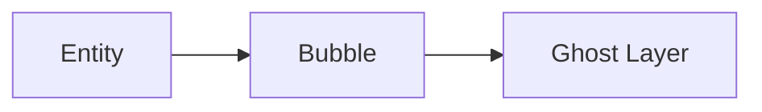

# Documentation Standards

**Last Updated**: 2026-02-07
**Status**: Active
**Owner**: Project Maintainers

## Purpose

This document defines documentation standards for the Luciferase project to ensure consistency, maintainability, and discoverability across all documentation artifacts.

---

## 1. Required Headers

All major documentation files MUST include these headers:

```markdown
# Document Title

**Last Updated**: YYYY-MM-DD
**Status**: Draft | Active | Deprecated
**Owner**: Team/Individual responsible
```

### Applicability

Required for:
- README.md files
- CLAUDE.md files
- Architecture documents (`*ARCHITECTURE*.md`)
- API documentation (`*_API.md`)
- ADRs (Architecture Decision Records)
- Technical specifications
- Runbooks and operational guides

Optional for:
- Meeting notes
- Temporary planning documents
- Changelog entries

---

## 2. Document Structure

### 2.1 Standard Sections

All major documents SHOULD include:

1. **Purpose/Overview**: What this document describes
2. **Scope**: What is and isn't covered
3. **Content**: The main body organized by topic
4. **References**: Links to related documents
5. **Revision History** (for ADRs and specifications)

### 2.2 Table of Contents

Documents >500 lines MUST include a table of contents:

```markdown
## Table of Contents

- [Section 1](#section-1)
- [Section 2](#section-2)
  - [Subsection 2.1](#subsection-21)
```

---

## 3. Linking Conventions

### 3.1 Internal Links

**Relative paths from document location**:

```markdown
[Related Document](../othermodule/doc/ARCHITECTURE.md)
[Section](#section-name)
[File Reference](../../src/main/java/com/example/Class.java)
```

**Anchor format**: Use lowercase with hyphens for multi-word sections:
- `#architecture-overview` (correct)
- `#ArchitectureOverview` (incorrect)

### 3.2 External Links

Always use full URLs for external resources:

```markdown
[GitHub Issue #123](https://github.com/Hellblazer/Luciferase/issues/123)
[Maven Central](https://central.sonatype.com/)
```

### 3.3 Code References

Format: `ClassName.java:lineNumber` or `ClassName.java:methodName()`

```markdown
See `CrossProcessMigration.java:257` for RecoveryState implementation.
See `Clock.fixed()` method for details.
```

---

## 4. Terminology Standards

### 4.1 Approved Terms

Use these terms consistently:

| Approved | Avoid | Context |
|----------|-------|---------|
| distributed support | distributed trees | Forest/multi-bubble features |
| forest management | tree forest | Multiple spatial index coordination |
| ghost layer | ghost sync | Boundary entity visibility |
| spatial index | tree structure | Generic reference to Octree/Tetree/Prism |

### 4.2 Module-Specific Terms

- **lucien**: Octree, Tetree, Prism, SFCArrayIndex, Forest
- **render**: ESVO, DAG, beam optimization, voxel traversal
- **simulation**: Bubble, entity, ghost, migration, causality
- **sentry**: Delaunay, kinetic points, tetrahedralization
- **portal**: JavaFX, 3D visualization, inspector

---

## 5. Update Policy

### 5.1 Update Triggers

Update "Last Updated" date when:
- Changing implementation details
- Adding/removing sections
- Updating performance metrics
- Fixing errors or clarifications

Do NOT update for:
- Typo fixes
- Formatting adjustments
- Link updates (unless broken)

### 5.2 Review Cycle

**Performance/Metrics Documents**: Review every 6 months
**Architecture Documents**: Review on major version changes
**ADRs**: Immutable after approval (create new ADR for changes)
**Runbooks**: Review after each incident or quarterly

### 5.3 Deprecation

Mark outdated documents as:

```markdown
**Status**: Deprecated
**Superseded By**: [New Document](path/to/new.md)
**Deprecation Date**: YYYY-MM-DD
```

---

## 6. Code Examples

### 6.1 Format

Use triple backticks with language identifier:

````markdown
```java
public void example() {
    // Code here
}
```
````

### 6.2 Validation

All code examples SHOULD:
- Compile without errors
- Include necessary imports/context
- Use project coding standards
- Match actual implementation (for snippets from codebase)

### 6.3 Example Conventions

Mark examples as:
- `// Correct` vs `// Incorrect` for comparisons
- `// Example` for demonstration code
- `// From ClassName.java:123` for actual code snippets

---

## 7. Validation

### 7.1 Automated Checks

The `scripts/validate-documentation.sh` script validates:
1. Required headers present
2. No broken internal links
3. Performance docs updated (<6 months)
4. No deprecated terminology
5. Critical documents exist
6. Java class references valid

### 7.2 Pre-Commit

Run validation before committing:

```bash
./scripts/validate-documentation.sh
```

Fix mode available for automatic corrections:

```bash
./scripts/validate-documentation.sh --fix
```

### 7.3 CI Integration

Documentation validation runs on all PRs via GitHub Actions workflow `Documentation Checks`.

---

## 8. Special Document Types

### 8.1 ADRs (Architecture Decision Records)

Follow the format in `simulation/doc/ADR_001_MIGRATION_CONSENSUS_ARCHITECTURE.md`:
- Title: `ADR_NNN_TITLE.md` (numbered)
- Status: Draft → Proposed → Accepted → Superseded
- Sections: Context, Decision, Alternatives Considered, Consequences, References

ADRs are immutable once accepted. Create a new ADR to revise decisions.

### 8.2 Runbooks

Follow the format in `simulation/doc/RUNBOOK_ROLLBACK_RECOVERY.md`:
- Operational focus (detection → diagnosis → recovery)
- Step-by-step procedures with commands
- Alert configurations
- Escalation paths
- Validation checklists

### 8.3 Architecture Documents

Follow the format in `lucien/doc/LUCIEN_ARCHITECTURE.md`:
- Module overview
- Core abstractions
- Design patterns used
- Key algorithms
- Performance characteristics
- Cross-references to implementation

### 8.4 Test Framework Guides

Follow the format in `simulation/doc/TEST_FRAMEWORK_GUIDE.md`:
- Testing philosophy
- Test patterns and anti-patterns
- CI/CD integration
- Environment-specific behavior
- Troubleshooting procedures

---

## 9. Tools

### 9.1 Recommended

- **Markdown editors**: VSCode with Markdown All in One, IntelliJ IDEA Markdown plugin
- **Link validation**: `scripts/validate-documentation.sh`
- **Diagram tools**: Mermaid (inline), PlantUML, Graphviz
- **Spell check**: Enable in IDE/editor

### 9.2 Diagram Standards

**Inline Mermaid** (preferred for simple diagrams):

````markdown

````

**External diagrams**: Place in `doc/diagrams/` directory as SVG or PNG.

---

## 10. Migration Guide

### 10.1 Existing Documents

Documents missing required headers:
1. Add headers at top of file
2. Set "Last Updated" to current date
3. Set "Status" to "Active" (or "Deprecated" if outdated)
4. Identify owner/responsible team

### 10.2 Broken Links

Fix broken links identified by validation script:
1. Run `./scripts/validate-documentation.sh`
2. Update or remove broken links
3. Use relative paths for internal docs
4. Archive or delete documents with >5 broken links

---

## 11. Examples

### 11.1 Complete Header Example

```markdown
# Cross-Process Migration Architecture

**Last Updated**: 2026-02-06
**Status**: Active
**Owner**: Simulation Team

## Overview

This document describes the 2PC-based entity migration protocol...
```

### 11.2 Link Example

```markdown
See [ADR-001](./simulation/doc/ADR_001_MIGRATION_CONSENSUS_ARCHITECTURE.md)
for the original design decision.

Implementation: `CrossProcessMigration.java:123-456`

Related: [RecoveryState API](#recoverystate-api)
```

### 11.3 Code Example

````markdown
```java
// From CrossProcessMigration.java:257
public record RecoveryState(
    Set<String> orphanedEntities,
    int activeTransactions,
    long rollbackFailures,
    int concurrentMigrations
) {}
```
````

---

## References

- **Validation Script**: `scripts/validate-documentation.sh`
- **CI Workflow**: `.github/workflows/documentation-checks.yml`
- **Example ADR**: `simulation/doc/ADR_001_MIGRATION_CONSENSUS_ARCHITECTURE.md`
- **Example Runbook**: `simulation/doc/RUNBOOK_ROLLBACK_RECOVERY.md`
- **Example Architecture**: `lucien/doc/LUCIEN_ARCHITECTURE.md`
- **Example Test Guide**: `simulation/doc/TEST_FRAMEWORK_GUIDE.md`

---

## Revision History

| Version | Date | Author | Changes |
|---------|------|--------|---------|
| 1.0 | 2026-02-07 | Simulation Team | Initial version based on existing patterns |
