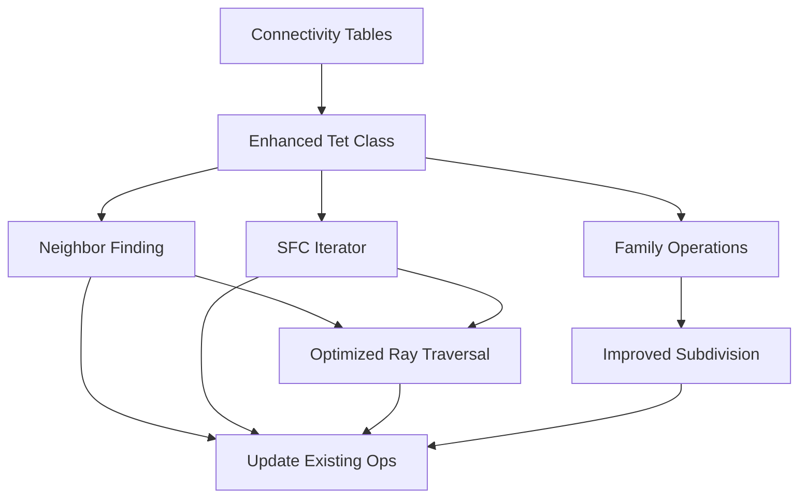

# Tetree Parity Implementation Plan

**Date**: June 2025  
**Goal**: Bring Java Tetree implementation to parity with t8code reference implementation  
**Priority**: Start with traversal and neighbor operations as requested

## Phase 1: Foundation - Connectivity and Data Structures (Week 1)

### 1.1 Create Connectivity Tables ⏱️ 2 days
Create a new class `TetreeConnectivity` with precomputed lookup tables:

```java
public class TetreeConnectivity {
    // Parent type to child type mappings (6 parent types × 8 children)
    static final byte[][] PARENT_TYPE_TO_CHILD_TYPE = new byte[6][8];
    
    // Face corner indices (6 types × 4 faces × 3 corners)
    static final byte[][][] FACE_CORNERS = new byte[6][4][3];
    
    // Child indices at each face (6 types × 4 faces × 4 children max)
    static final byte[][][] CHILDREN_AT_FACE = new byte[6][4][4];
    
    // Face-to-face mappings between parent and child
    static final byte[][][] FACE_CHILD_FACE = new byte[6][8][4];
    
    // Sibling relationships
    static final byte[][] SIBLING_INDICES = new byte[8][8];
}
```

**Deliverables:**
- `TetreeConnectivity.java` with all lookup tables
- Unit tests validating table correctness
- Documentation of Bey refinement scheme

### 1.2 Enhance Tet Class ⏱️ 1 day
Add missing core operations to the `Tet` record:

```java
public record Tet(int x, int y, int z, byte l, byte type) {
    // Existing methods...
    
    // New methods matching t8code
    public Tet parent();
    public Tet child(int childIndex);
    public Tet sibling(int siblingIndex);
    public Tet faceNeighbor(int face);
    public boolean isValid();
    public boolean isFamily(Tet[] tets);
    public int compareElements(Tet other);
    public long firstDescendant(byte level);
    public long lastDescendant(byte level);
}
```

## Phase 2: Traversal Algorithms (Week 1-2)

### 2.1 SFC-Based Tree Iterator ⏱️ 3 days
Create proper tree traversal using space-filling curve properties:

```java
public class TetreeIterator implements Iterator<TetreeNode> {
    public enum TraversalOrder {
        DEPTH_FIRST_PRE,
        DEPTH_FIRST_POST,
        BREADTH_FIRST,
        SFC_ORDER
    }
    
    // Iterator state
    private final Tetree tree;
    private final TraversalOrder order;
    private final byte minLevel, maxLevel;
    private Tet current;
    
    // Core iteration methods
    public boolean hasNext();
    public TetreeNode next();
    public void skipSubtree();
}
```

**Key Algorithms to Implement:**
- SFC successor computation using t8code's approach
- Level-restricted traversal
- Subtree skipping for efficiency
- Memory-efficient state management

### 2.2 Optimized Ray Traversal ⏱️ 2 days
Replace brute-force ray traversal with SFC-guided algorithm:

```java
public class TetreeSFCRayTraversal {
    // Use SFC properties to efficiently find intersecting tetrahedra
    public Stream<Long> traverseRay(Ray3D ray, Tetree tree) {
        // 1. Find entry tetrahedron using ray origin
        // 2. Use neighbor finding to follow ray path
        // 3. Skip non-intersecting subtrees via SFC bounds
        // 4. Return ordered stream of intersections
    }
}
```

## Phase 3: Neighbor Finding Operations (Week 2)

### 3.1 Face Neighbor Algorithm ⏱️ 3 days
Implement t8code's face neighbor finding:

```java
public class TetreeNeighborFinder {
    // Find neighbor across a specific face
    public Tet findFaceNeighbor(Tet tet, int faceIndex);
    
    // Find all neighbors (face-adjacent)
    public List<Tet> findAllNeighbors(Tet tet);
    
    // Find neighbors at different refinement levels
    public List<Tet> findNeighborsAtLevel(Tet tet, byte targetLevel);
    
    // Check if two tets are neighbors
    public boolean areNeighbors(Tet tet1, Tet tet2);
}
```

**Implementation Details:**
- Use connectivity tables for face mappings
- Handle boundary cases (domain edges)
- Support cross-level neighbor queries
- Optimize with caching for repeated queries

### 3.2 Enhanced addNeighboringNodes ⏱️ 1 day
Refactor existing method to use proper neighbor finding:

```java
@Override
protected void addNeighboringNodes(long tetIndex, Queue<Long> toVisit, 
                                 Set<Long> visitedNodes) {
    Tet currentTet = Tet.tetrahedron(tetIndex);
    
    // Use new neighbor finder instead of grid-based approach
    List<Tet> neighbors = neighborFinder.findAllNeighbors(currentTet);
    
    for (Tet neighbor : neighbors) {
        long neighborIndex = neighbor.index();
        if (!visitedNodes.contains(neighborIndex) && 
            spatialIndex.containsKey(neighborIndex)) {
            toVisit.add(neighborIndex);
        }
    }
}
```

## Phase 4: Family Relationships and Refinement (Week 2-3)

### 4.1 Family Operations ⏱️ 2 days
Implement tetrahedron family relationships:

```java
public class TetreeFamily {
    // Check if 8 tetrahedra form a refinement family
    public static boolean isFamily(Tet[] tets);
    
    // Get all siblings of a tetrahedron
    public static Tet[] getSiblings(Tet tet);
    
    // Get complete family from any member
    public static Tet[] getFamily(Tet tet);
    
    // Validate parent-child relationships
    public static boolean isParentOf(Tet parent, Tet child);
}
```

### 4.2 Improved Subdivision ⏱️ 2 days
Enhance subdivision to use proper Bey refinement:

```java
@Override
protected void handleNodeSubdivision(long parentTetIndex, byte parentLevel, 
                                   TetreeNodeImpl<ID> parentNode) {
    Tet parentTet = Tet.tetrahedron(parentTetIndex);
    
    // Generate all 8 children using Bey refinement
    Tet[] children = new Tet[8];
    for (int i = 0; i < 8; i++) {
        children[i] = parentTet.child(i);
    }
    
    // Verify family relationship
    assert TetreeFamily.isFamily(children);
    
    // Distribute entities to children
    distributeEntitiesToChildren(parentNode, children);
}
```

## Phase 5: Performance Optimizations (Week 3)

### 5.1 Bitwise Operations ⏱️ 2 days
Port t8code's bitwise optimizations:

```java
public class TetreeBits {
    // Efficient level extraction from packed index
    public static byte extractLevel(long packedIndex);
    
    // Efficient type extraction
    public static byte extractType(long packedIndex);
    
    // Coordinate manipulations using bit shifts
    public static int parentCoordinate(int childCoord, int level);
    
    // Fast comparison using XOR
    public static int compareTets(long tet1, long tet2);
}
```

### 5.2 Validation Framework ⏱️ 1 day
Add comprehensive validation matching t8code:

```java
public class TetreeValidator {
    // Validate individual tetrahedron
    public static boolean isValidTet(Tet tet);
    
    // Validate tree structure
    public static boolean isValidTree(Tetree tree);
    
    // Validate SFC ordering
    public static boolean isValidSFCOrder(List<Tet> tets);
    
    // Debug helpers
    public static String describeTet(Tet tet);
    public static void assertValidTet(Tet tet);
}
```

## Phase 6: Integration and Testing (Week 3-4)

### 6.1 Update Existing Operations ⏱️ 2 days
Integrate new algorithms into existing Tetree methods:

- Update `spatialRangeQuery` to use SFC traversal
- Enhance `findKNearestNeighbors` with proper neighbor finding
- Improve `getRayTraversalOrder` with SFC-guided algorithm
- Optimize `entitiesInRegion` using connectivity

### 6.2 Comprehensive Test Suite ⏱️ 3 days
Create tests validating parity with t8code:

```java
public class TetreeParityTest {
    @Test
    public void testNeighborFinding();
    
    @Test
    public void testFamilyRelationships();
    
    @Test
    public void testSFCTraversal();
    
    @Test
    public void testRefinementConsistency();
    
    @Test
    public void performanceComparison();
}
```

## Implementation Priority and Dependencies



## Success Metrics

1. **Functional Completeness**
   - All t8code core algorithms implemented
   - Passes validation test suite
   - Maintains backward compatibility

2. **Performance Targets**
   - Neighbor finding: < 1μs per operation
   - SFC traversal: 10x faster than current brute force
   - Ray traversal: 5x improvement over current
   - Memory usage: < 2x current implementation

3. **Code Quality**
   - 90% test coverage on new code
   - Comprehensive documentation
   - Performance benchmarks included

## Risk Mitigation

1. **Bey Refinement Complexity**
   - Study t8code implementation carefully
   - Create visual debugging tools
   - Validate against reference implementation

2. **Performance Regression**
   - Benchmark each phase
   - Keep old implementations during transition
   - Profile memory usage

3. **API Breaking Changes**
   - Use adapter pattern where needed
   - Deprecate rather than remove
   - Provide migration guide

## Recommended Starting Point

Begin with **Phase 1.1: Connectivity Tables** as it:
- Provides foundation for all other work
- Is well-defined with clear reference
- Offers immediate performance benefits
- Has minimal dependencies

Then proceed to **Phase 2.1: SFC Iterator** and **Phase 3.1: Face Neighbors** in parallel, as these are the most critical missing pieces for traversal operations.

## Timeline Summary

- **Week 1**: Connectivity tables, enhanced Tet class, begin SFC iterator
- **Week 2**: Complete traversal algorithms, implement neighbor finding
- **Week 3**: Family relationships, refinement, performance optimizations
- **Week 4**: Integration, testing, benchmarking

Total estimated effort: **4 weeks** for core parity with t8code traversal and neighbor operations.