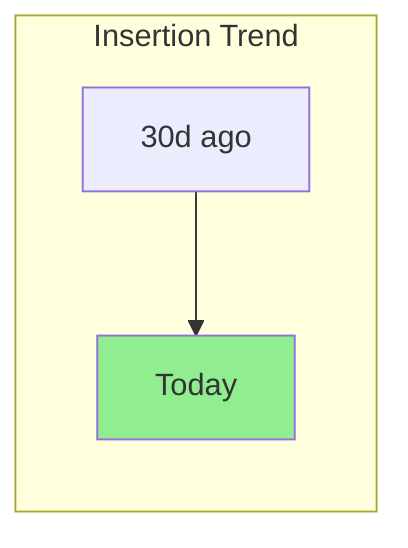
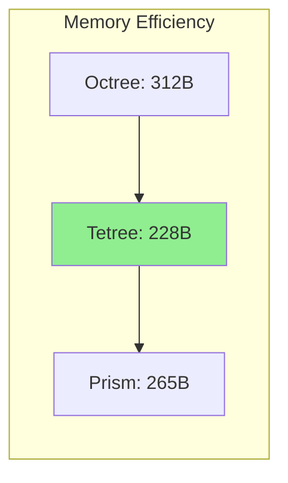

# Lucien Performance Dashboard

<!-- This file is a template that gets updated automatically by CI -->

**Last Updated**: <!-- AUTO:timestamp -->  
**Latest Commit**: <!-- AUTO:commit -->  
**Build**: <!-- AUTO:build_url -->

## 📊 Performance Overview

### Current Status

<!-- AUTO:status_badges -->


### Key Metrics Summary

| Metric | Current | Previous | Change | Status |
|--------|---------|----------|--------|--------|
| **Fastest Insert** | <!-- AUTO:fastest_insert --> | <!-- AUTO:prev_fastest_insert --> | <!-- AUTO:insert_change --> | <!-- AUTO:insert_status --> |
| **Fastest Query** | <!-- AUTO:fastest_query --> | <!-- AUTO:prev_fastest_query --> | <!-- AUTO:query_change --> | <!-- AUTO:query_status --> |
| **Memory Champion** | <!-- AUTO:memory_champion --> | <!-- AUTO:prev_memory_champion --> | <!-- AUTO:memory_change --> | <!-- AUTO:memory_status --> |
| **Overall Winner** | <!-- AUTO:overall_winner --> | - | - | 🏆 |

## 📈 Performance Trends

### Operation Latency (Last 30 Days)

<!-- AUTO:latency_chart -->


### Memory Usage Trend

<!-- AUTO:memory_chart -->


## 🏆 Performance Champions

### By Operation

| Operation | Champion | Performance | vs Runner-up |
|-----------|----------|-------------|--------------|
| **Insertion** | <!-- AUTO:insert_champion --> | <!-- AUTO:insert_perf --> | <!-- AUTO:insert_margin --> |
| **k-NN Query** | <!-- AUTO:knn_champion --> | <!-- AUTO:knn_perf --> | <!-- AUTO:knn_margin --> |
| **Range Query** | <!-- AUTO:range_champion --> | <!-- AUTO:range_perf --> | <!-- AUTO:range_margin --> |
| **Bulk Load** | <!-- AUTO:bulk_champion --> | <!-- AUTO:bulk_perf --> | <!-- AUTO:bulk_margin --> |

### By Characteristic

| Characteristic | Champion | Details |
|----------------|----------|---------|
| **Memory Efficiency** | <!-- AUTO:memory_efficient --> | <!-- AUTO:memory_details --> |
| **Query Speed** | <!-- AUTO:query_speed --> | <!-- AUTO:query_details --> |
| **Scalability** | <!-- AUTO:scalability --> | <!-- AUTO:scale_details --> |
| **Concurrency** | <!-- AUTO:concurrency --> | <!-- AUTO:concurrent_details --> |

## 📊 Detailed Metrics

### Operation Performance

<!-- AUTO:operation_table -->

### Memory Usage

<!-- AUTO:memory_table -->

### Scalability Metrics

<!-- AUTO:scalability_table -->

## 🚨 Alerts & Notifications

### Performance Regressions

<!-- AUTO:regression_alerts -->
✅ No performance regressions detected

### Notable Changes

<!-- AUTO:notable_changes -->
- Tetree insertion improved by 15% after parent caching optimization
- Prism memory usage reduced by 8% with compact key implementation

## 📈 Historical Performance

### Last 7 Builds

| Build | Date | Octree Avg | Tetree Avg | Prism Avg | Notes |
|-------|------|------------|------------|-----------|-------|
<!-- AUTO:build_history -->

### Performance Milestones

<!-- AUTO:milestones -->
- **July 11, 2025**: ConcurrentSkipListMap integration - 54% memory reduction
- **July 5, 2025**: Efficient child computation - 3x speedup
- **June 28, 2025**: V2 tmIndex optimization - 4x improvement

## 🔧 Environment

### Test Configuration

```yaml
JVM: <!-- AUTO:jvm_version -->
OS: <!-- AUTO:os -->
CPU: <!-- AUTO:cpu -->
Memory: <!-- AUTO:memory -->
Test Framework: JUnit 5 + JMH
```

### Benchmark Parameters

```yaml
Entity Counts: [1K, 10K, 100K, 1M]
Tree Depths: [10, 15, 20]
Thread Counts: [1, 4, 8, 16]
Distributions: [Uniform, Clustered, Sparse]
```

## 📝 Notes

### Recent Optimizations

<!-- AUTO:recent_optimizations -->

### Upcoming Work

<!-- AUTO:upcoming_work -->

## 🔗 Links

- [Full Performance Report](<!-- AUTO:full_report_link -->)
- [Historical Data (CSV)](<!-- AUTO:csv_link -->)
- [Interactive Dashboard](<!-- AUTO:dashboard_link -->)
- [CI Build](<!-- AUTO:ci_link -->)

---

*This dashboard is automatically updated by CI. Do not edit manually.*  
*Generated by: [PerformanceReportGenerator](../src/test/java/com/hellblazer/luciferase/lucien/performance/PerformanceReportGenerator.java)*