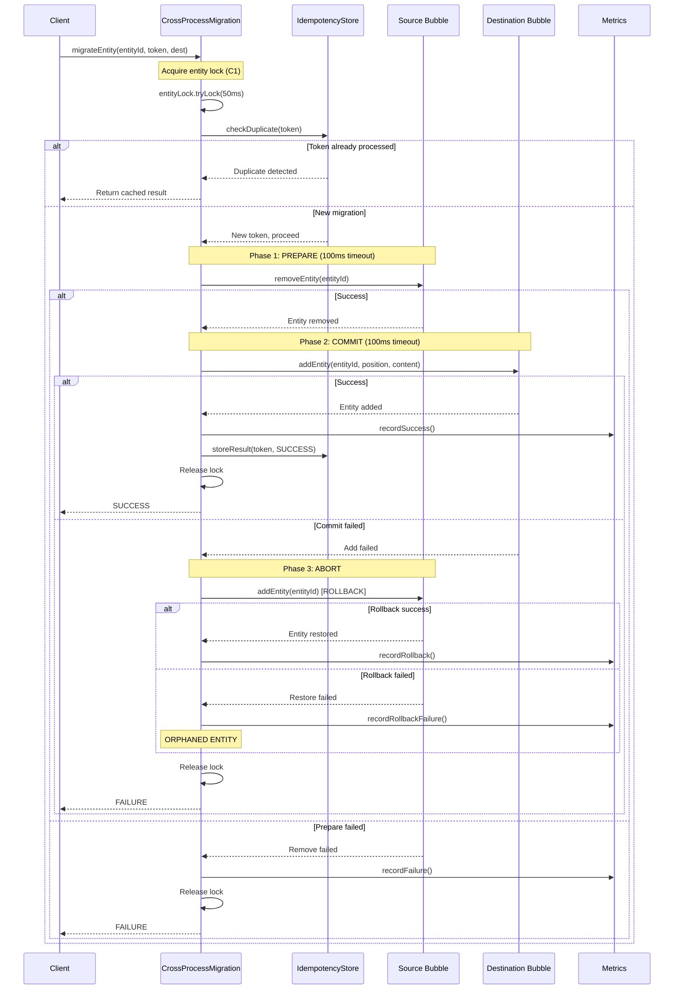
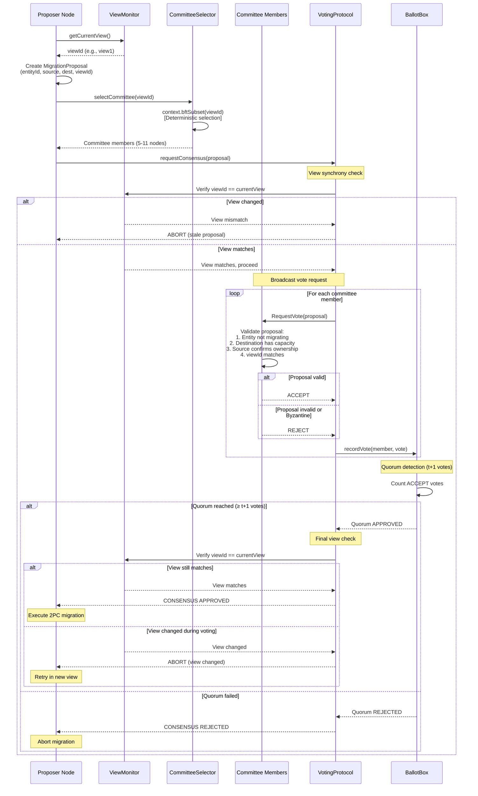
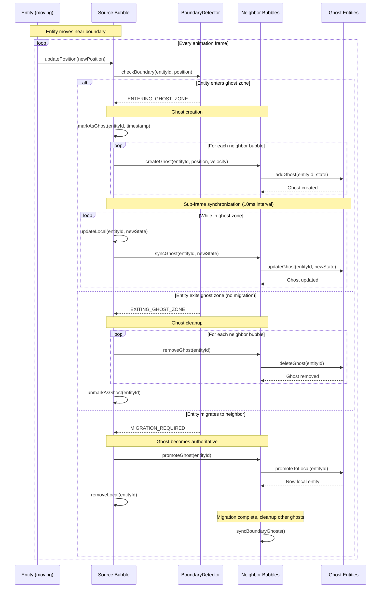

# Distributed Architecture - Luciferase Simulation

**Last Updated**: 2026-02-10
**Status**: Current
**Scope**: Multi-bubble distributed simulation with Byzantine consensus and causal consistency

---

## Overview

Luciferase simulation module implements massively distributed 3D animation using fixed-volume spatial partitioning (simulation bubbles) with causal consistency guarantees. Built on PrimeMover discrete event simulation with Tetree spatial indexing.

**Key Architectural Principles**:
- Deterministic spatial assignment (bubbles)
- Byzantine consensus for migration decisions
- Causal consistency within interaction range
- Eventual consistency across bubbles
- 2PC entity migration protocol
- Ghost layer boundary synchronization
- Fireflies view-based committee selection

---

## Table of Contents

1. [High-Level Architecture](#high-level-architecture)
2. [Simulation Bubbles](#simulation-bubbles)
3. [Entity Migration Protocol](#entity-migration-protocol)
4. [Consensus Layer](#consensus-layer)
5. [Network Architecture](#network-architecture)
6. [Ghost State Management](#ghost-state-management)
7. [Process Coordination](#process-coordination)
8. [Time Management](#time-management)

---

## High-Level Architecture

### Component Stack

```
┌─────────────────────────────────────────────────────┐
│         Application Layer                           │
│  (Multi-bubble coordination, entity factories)      │
└─────────────────────────────────────────────────────┘
                        │
┌─────────────────────────────────────────────────────┐
│         Simulation Bubble Layer                     │
│  (BucketScheduler, CausalRollback, Bubble)         │
└─────────────────────────────────────────────────────┘
                        │
┌─────────────────────────────────────────────────────┐
│         Consensus Layer (BFT)                       │
│  (ViewCommitteeConsensus, CommitteeVotingProtocol) │
└─────────────────────────────────────────────────────┘
                        │
┌─────────────────────────────────────────────────────┐
│         Migration & Coordination Layer              │
│  (CrossProcessMigration, MigrationCoordinator)     │
└─────────────────────────────────────────────────────┘
                        │
┌─────────────────────────────────────────────────────┐
│         Network & Communication Layer               │
│  (GrpcBubbleNetworkChannel, FakeNetworkChannel)    │
└─────────────────────────────────────────────────────┘
                        │
┌─────────────────────────────────────────────────────┐
│         Ghost Layer                                 │
│  (GhostStateManager, GhostZoneManager)             │
└─────────────────────────────────────────────────────┘
                        │
┌─────────────────────────────────────────────────────┐
│         Spatial Index Layer                         │
│  (Tetree, Forest, multi-tree support)              │
└─────────────────────────────────────────────────────┘
                        │
┌─────────────────────────────────────────────────────┐
│         Fireflies Membership Layer                  │
│  (Virtual Synchrony, View Tracking, Gossip)        │
└─────────────────────────────────────────────────────┘
```

### Key Components

| Component | Responsibility | Location |
|-----------|----------------|----------|
| **VolumeAnimator** | Frame-rate controlled animation loop | `animation/` |
| **BucketScheduler** | 100ms time bucket coordination | `bubble/` |
| **ViewCommitteeConsensus** | Byzantine consensus for migrations | `consensus/committee/` |
| **CommitteeVotingProtocol** | Vote aggregation and quorum detection | `consensus/committee/` |
| **CrossProcessMigration** | 2PC entity migration orchestrator | `distributed/migration/` |
| **GhostStateManager** | Ghost lifecycle management | `ghost/` |
| **RemoteBubbleProxy** | Remote bubble communication | `distributed/` |
| **VONDiscoveryProtocol** | Voronoi-based area-of-interest | `distributed/` |
| **FirefliesViewMonitor** | Membership view tracking | `causality/` |

---

## Simulation Bubbles

### Concept

A **simulation bubble** is a fixed spatial volume assigned to a cluster node via deterministic hashing. Entities are assigned to bubbles based on their TetreeKey spatial position.

**Properties**:
- Causal consistency within bubble (Lamport clocks)
- Eventual consistency across bubbles
- Deterministic spatial assignment via TetreeKeyRouter
- 100ms time bucket coordination

### Bucket Scheduler

**Location**: `bubble/BucketSynchronizedController.java`

**Purpose**: Coordinate time bucket execution across distributed nodes.

**Architecture**:
```java
public class BucketSynchronizedController {
    private volatile Clock clock = Clock.system();
    private final long bucketDurationMs = 100;  // 100ms buckets

    // Coordinate bucket execution
    public void executeBucket(long bucketId) {
        var startTime = clock.currentTimeMillis();
        // Execute all events in bucket
        // ...
        var elapsed = clock.currentTimeMillis() - startTime;
        metrics.recordBucketDuration(elapsed);
    }
}
```

**Time Buckets**:
- Duration: 100ms
- Alignment: All nodes synchronize on bucket boundaries
- Execution: Events within bucket execute in causal order
- No rollback: Events execute prospectively with Lamport clock causality

---

## Entity Migration Protocol

### Overview

CrossProcessMigration implements Two-Phase Commit (2PC) protocol for entity migration between bubbles with exactly-once semantics.

**Location**: `distributed/migration/CrossProcessMigration.java`

### Architecture

```java
public class CrossProcessMigration {
    private volatile Clock clock = Clock.system();
    private static final long PHASE_TIMEOUT_MS = 100;  // Per-phase timeout
    private static final long TOTAL_TIMEOUT_MS = 300;  // Total migration timeout

    // C1: Per-entity migration locks (prevent concurrent migrations)
    private final Map<String, ReentrantLock> entityMigrationLocks;

    // Idempotency store (exactly-once semantics)
    private final IdempotencyStore dedup;

    // Metrics tracking
    private final MigrationMetrics metrics;
}
```

### 2PC Protocol Flow

**Sequence Diagram** (Luciferase-0sod):



**Text-based Flow** (legacy documentation):

```
┌─────────────────────────────────────────────────────┐
│  Phase 1: PREPARE (Remove from source)             │
├─────────────────────────────────────────────────────┤
│  1. Acquire entity migration lock (C1)              │
│  2. Check idempotency token (duplicate detection)   │
│  3. Remove entity from source bubble                │
│  4. Timeout: 100ms                                  │
│  5. On failure: Release lock, fail fast             │
└─────────────────────────────────────────────────────┘
                        │
                        ▼
┌─────────────────────────────────────────────────────┐
│  Phase 2: COMMIT (Add to destination)              │
├─────────────────────────────────────────────────────┤
│  1. Add entity to destination bubble                │
│  2. Timeout: 100ms                                  │
│  3. On success: Release lock, record metrics        │
│  4. On failure: ABORT → Rollback to source (C3)    │
└─────────────────────────────────────────────────────┘
                        │
                        ▼
┌─────────────────────────────────────────────────────┐
│  Phase 3: ABORT (Rollback on failure) - C3         │
├─────────────────────────────────────────────────────┤
│  1. Restore entity to source bubble                 │
│  2. Log rollback failure (if restore fails)         │
│  3. Record metrics (rollback count, duration)       │
│  4. Release lock                                    │
└─────────────────────────────────────────────────────┘
```

**Implementation**: See `CrossProcessMigration.java:migrateEntity()` method

### Key Guarantees

**C1: Entity Migration Locks**
- Per-entity ReentrantLock prevents concurrent migrations of same entity
- Prevents race conditions (entity migrating to multiple destinations)
- Lock timeout: 50ms (fast fail if contention detected)

**C2: Idempotency Tokens**
- UUID-based tokens for exactly-once semantics
- IdempotencyStore tracks processed tokens (30s expiration)
- Duplicate requests return cached result (no re-execution)

**C3: Rollback Failure Handling**
- If ABORT phase fails (source bubble unreachable), log failure
- Metrics track rollback failures separately
- Manual intervention required for orphaned entities

### Timeout Handling

**Per-Phase Timeout**: 100ms
- PREPARE phase: 100ms to remove from source
- COMMIT phase: 100ms to add to destination

**Total Timeout**: 300ms (includes ABORT if needed)

**Timeout Detection**:
```java
private boolean isTimedOut(MigrationTransaction tx) {
    var elapsed = clock.currentTimeMillis() - tx.startTime();
    return elapsed > TOTAL_TIMEOUT_MS;
}
```

### Idempotency Store

**Location**: `distributed/migration/IdempotencyStore.java`

**Purpose**: Track processed operations to prevent duplicate execution.

**Architecture**:
```java
public class IdempotencyStore {
    private volatile Clock clock = Clock.system();
    private static final long TOKEN_EXPIRATION_MS = 30_000;  // 30s

    // Token cache with expiration
    private final ConcurrentHashMap<UUID, TokenEntry> tokens;

    public boolean isProcessed(UUID token) {
        var entry = tokens.get(token);
        if (entry == null) return false;

        // Check expiration
        var age = clock.currentTimeMillis() - entry.timestamp();
        return age < TOKEN_EXPIRATION_MS;
    }
}
```

**Token Expiration**: 30 seconds
- Balances memory usage vs duplicate detection window
- Sufficient for network retry scenarios
- Automatic cleanup of expired tokens

### Migration Metrics

**Location**: `distributed/migration/MigrationMetrics.java`

**Tracked Metrics**:
- Total migrations attempted
- Successful migrations
- Failed migrations (by phase)
- Rollbacks executed
- Rollback failures (C3 violations)
- Average migration duration
- P50/P95/P99 latencies

---

## Consensus Layer

### Overview

The consensus layer provides **Byzantine fault-tolerant (BFT) agreement** on entity migration decisions before 2PC execution. Built on Delos Fireflies committee-based voting, it ensures all nodes agree on entity ownership changes even in the presence of Byzantine failures.

**Location**: `consensus/committee/ViewCommitteeConsensus.java`

**Purpose**: Prevent conflicting migration decisions that could violate entity conservation (no duplicates, no loss).

### Why Byzantine Tolerance for Distributed Animation?

Entity migration in distributed animation requires stronger guarantees than simple crash tolerance:

**Problem Without Consensus**:
```
Timeline (without consensus):
t1: Node A decides: Entity E migrates A → B
t2: Node C decides: Entity E migrates A → C  ← CONFLICT!
t3: 2PC executes both migrations
Result: E duplicated in B and C → CORRUPTION
```

**Byzantine Threats**:
1. **Clock Skew**: Nodes with incorrect clocks make bad migration decisions
2. **Network Partition**: Split-brain scenarios create conflicting ownership claims
3. **Buggy Nodes**: Software bugs cause incorrect migration proposals
4. **Malicious Actors**: Intentional duplication or entity theft

**Solution**: Committee-based BFT consensus ensures agreement before migration execution.

### Architecture

```java
public class ViewCommitteeConsensus {
    private FirefliesViewMonitor viewMonitor;      // Current view tracking
    private ViewCommitteeSelector committeeSelector;  // Committee selection from view
    private CommitteeVotingProtocol votingProtocol;  // Vote aggregation and quorum

    // Track in-flight proposals for view change rollback
    private final ConcurrentHashMap<UUID, ProposalTracking> pendingProposals;
}
```

### Component Integration

```
┌─────────────────────────────────────────────────────────┐
│         Animation Loop (VolumeAnimator)                 │
│  Frame rendering at 60 FPS, entity updates every 16ms   │
└────────────────────┬────────────────────────────────────┘
                     │ Spatial boundary detection
                     ▼
┌─────────────────────────────────────────────────────────┐
│         Migration Candidate Detection                    │
│  Tetree spatial query: entities crossing bubble bounds  │
└────────────────────┬────────────────────────────────────┘
                     │ Generate MigrationProposal
                     ▼
┌─────────────────────────────────────────────────────────┐
│  CONSENSUS LAYER (ViewCommitteeConsensus)              │
├─────────────────────────────────────────────────────────┤
│  1. Check proposal.viewId == current view (abort if stale)
│  2. Select committee: committeeSelector.selectCommittee(viewId)
│  3. Submit to voting: votingProtocol.requestVote(proposal)
│  4. Wait for quorum: (t + 1) votes required
│  5. Verify viewId still matches (abort if view changed)
│  6. Return approval decision: true/false
└────────────────────┬────────────────────────────────────┘
                     │ If approved: execute 2PC
                     │ If rejected: abort migration
                     ▼
┌─────────────────────────────────────────────────────────┐
│  2PC MIGRATION PROTOCOL (CrossProcessMigration)        │
├─────────────────────────────────────────────────────────┤
│  PREPARE: Remove entity from source (100ms timeout)     │
│  COMMIT:  Add entity to destination (100ms timeout)     │
│  ABORT:   Rollback to source (100ms timeout)            │
└────────────────────┬────────────────────────────────────┘
                     │
                     ▼
┌─────────────────────────────────────────────────────────┐
│  Network Layer (GrpcBubbleNetworkChannel)              │
│  Protobuf message serialization, gRPC streaming         │
└─────────────────────────────────────────────────────────┘
                     │
                     ▼
┌─────────────────────────────────────────────────────────┐
│  Fireflies Membership (Virtual Synchrony)              │
│  View tracking, failure detection, gossip broadcast     │
└─────────────────────────────────────────────────────────┘
```

### Committee Selection Algorithm

**Deterministic Selection from Fireflies View**:
```java
public Set<Member> selectCommittee(Digest viewId) {
    // Get current Fireflies view
    var context = firefliesView.getContext();

    // Deterministic BFT committee based on view hash
    // Size: O(log n) - typically 5-11 nodes for small clusters
    var committee = context.bftSubset(viewId);

    return committee;
}
```

**Committee Size by Cluster Size**:
| Cluster Size | t (Byzantine Tolerance) | Quorum | Committee Size |
|--------------|-------------------------|--------|----------------|
| 2-3 nodes    | 0                       | 1      | 5              |
| 4-7 nodes    | 1                       | 2      | 7              |
| 8+ nodes     | 2                       | 3      | 9-11           |

**Properties**:
- **Deterministic**: Same view ID → same committee
- **Byzantine Robust**: Committee size = O(log n) for BFT guarantees
- **Auto-recalculates**: View changes trigger new committee selection

### Voting Protocol

**MigrationProposal Structure**:
```java
public record MigrationProposal(
    UUID proposalId,           // Unique proposal identifier
    String entityId,           // Entity to migrate
    UUID sourceBubbleId,       // Current owner
    UUID targetBubbleId,       // Destination
    Digest viewId,             // CRITICAL: View at proposal time
    long timestamp             // Proposal timestamp
) {}
```

**Byzantine Consensus Sequence Diagram** (Luciferase-0sod):



**Vote Request Flow** (text-based legacy documentation):
```
1. Proposer: Submit MigrationProposal to committee
   ├─ Includes current viewId (view synchrony check)
   └─ Timestamp for ordering

2. Committee Members: Vote ACCEPT/REJECT based on:
   ├─ Entity not already migrating (idempotency check)
   ├─ Destination bubble has capacity (resource check)
   ├─ Source bubble confirms ownership (state check)
   └─ Proposal viewId matches current view (synchrony check)

3. Quorum Detection: CommitteeVotingProtocol aggregates votes
   ├─ Quorum = (t + 1) where t = Byzantine tolerance
   ├─ t=0: 1 vote required (2-3 node clusters, no BFT)
   ├─ t=1: 2 votes required (4-7 nodes, tolerates 1 Byzantine)
   └─ t=2: 3 votes required (8+ nodes, tolerates 2 Byzantine)

4. Approval Decision:
   ├─ Quorum reached → Return true (execute 2PC migration)
   ├─ Quorum failed → Return false (abort migration)
   └─ View changed → Abort proposal (retry in new view)

5. View Change Handling:
   └─ All pending proposals automatically aborted
       (Virtual Synchrony guarantee from Fireflies)
```

**Implementation**: See `ViewCommitteeConsensus.java:requestConsensus()` method

### Integration with 2PC Migration

**Consensus BEFORE Execution**:
```java
// Migration workflow with consensus
public CompletableFuture<Boolean> migrateEntity(String entityId, UUID target) {
    // 1. Create proposal with current view
    var proposal = new MigrationProposal(
        UUID.randomUUID(),
        entityId,
        sourceBubbleId,
        target,
        viewMonitor.getCurrentViewId(),  // CRITICAL: View synchrony
        clock.currentTimeMillis()
    );

    // 2. Request consensus approval
    return consensus.requestConsensus(proposal)
        .thenCompose(approved -> {
            if (!approved) {
                log.debug("Migration rejected by consensus: {}", entityId);
                return CompletableFuture.completedFuture(false);
            }

            // 3. Execute 2PC migration (only if approved)
            return migration.executeMigration(entityId, target);
        });
}
```

**When Each Component Activates**:
| Component | Trigger | Frequency | Latency |
|-----------|---------|-----------|---------|
| **Spatial Boundary Detection** | Every simulation tick | 20 Hz (50ms) | ~5ms |
| **Consensus Approval** | Migration candidate detected | ~10-100 Hz | ~50ms |
| **2PC Migration** | Consensus approved | ~10-50 Hz | ~150ms |
| **Ghost Synchronization** | Entity in ghost zone | 100 Hz (10ms) | ~5ms |
| **Fireflies View Updates** | Membership change | ~0.1 Hz (10s) | ~100ms |

### View Synchrony and Proposal Rollback

**Problem Without View Synchrony**:
```
Timeline (without view ID check):
t1: Committee approves E: A→B (viewId=V1)
t2: View changes to V2 (node failure or join)
t3: New committee approves E: C→D (viewId=V2)
t4: E ends up in both B and D ← CORRUPTION!
```

**Solution: View ID Verification**:
```java
public CompletableFuture<Boolean> requestConsensus(MigrationProposal proposal) {
    var currentViewId = getCurrentViewId();

    // CRITICAL: Abort if proposal from old view
    if (!proposal.viewId().equals(currentViewId)) {
        log.debug("Proposal has stale viewId, aborting");
        return CompletableFuture.completedFuture(false);
    }

    // ... proceed with voting ...

    // Before execution: verify viewId still matches
    return votingProtocol.requestVote(proposal)
        .thenApply(approved -> {
            if (!getCurrentViewId().equals(proposal.viewId())) {
                log.warn("View changed during voting, aborting");
                return false;  // View changed, abort
            }
            return approved;
        });
}
```

**View Change Handling**:
```java
public void onViewChange(Digest newViewId) {
    log.info("View changed to {}, rolling back {} pending proposals",
             newViewId, pendingProposals.size());

    // Abort all pending proposals from old view
    pendingProposals.values().forEach(tracking -> {
        tracking.future().completeExceptionally(
            new IllegalStateException("View changed during consensus")
        );
    });

    pendingProposals.clear();
}
```

**Virtual Synchrony Guarantee** (from Fireflies):
- All messages sent within a stable view are delivered to all live members
- View changes are atomic (no partial view updates)
- Pending operations can safely abort on view change

### Message Propagation

**Fireflies Gossip Broadcast** (no separate P2P infrastructure needed):
```
Traditional All-Nodes Consensus (Raft):
┌──────┐   ┌──────┐   ┌──────┐   ┌──────┐   ┌──────┐
│Node 1│◄─►│Node 2│◄─►│Node 3│◄─►│Node 4│◄─►│Node 5│
└──────┘   └──────┘   └──────┘   └──────┘   └──────┘
  All nodes participate: O(n) messages per decision

Committee-Based Consensus (ViewCommitteeConsensus):
┌──────┐   ┌──────────────────────┐   ┌──────┐
│Node 1│──►│ Committee (7 nodes)  │──►│Node 5│
└──────┘   │ Selected from view   │   └──────┘
           └──────────────────────┘
  Only committee votes: O(log n) messages per decision
```

**Message Reduction**:
- **Raft (all nodes)**: 10-node cluster = 45 messages per decision (O(n²))
- **Committee (view-based)**: 10-node cluster = 3-5 messages per decision (O(log n))
- **Reduction**: 10-100x fewer messages for large clusters

### Performance Characteristics

**Consensus Latency**:
| Operation | Target | Typical |
|-----------|--------|---------|
| Committee selection | < 10ms | ~5ms |
| Vote request broadcast | < 20ms | ~10ms |
| Quorum detection | < 50ms | ~25ms |
| Total consensus latency | < 100ms | ~50ms |

**Byzantine Tolerance**:
- **t=0** (2-3 nodes): No BFT, crash tolerance only
- **t=1** (4-7 nodes): Tolerates 1 Byzantine failure
- **t=2** (8+ nodes): Tolerates 2 Byzantine failures

**Scalability**:
- **Committee size**: O(log n) - grows slowly with cluster size
- **Message complexity**: O(log n) - scales to large clusters
- **View changes**: Automatic proposal rollback (no manual cleanup)

### Fault Tolerance

**Byzantine Failures**:
- **Detection**: Quorum voting rejects Byzantine proposals
- **Recovery**: Consensus failure triggers 2PC abort (no migration)
- **Monitoring**: Byzantine detection events tracked in metrics

**Network Partitions**:
- **Detection**: Fireflies view changes on partition
- **Recovery**: Pending proposals aborted, retry in new view
- **Guarantee**: Virtual synchrony prevents split-brain

**View Changes**:
- **Detection**: FirefliesViewMonitor tracks view updates
- **Recovery**: Auto-abort all pending proposals (safe retry)
- **Performance**: View changes rare (~0.1 Hz in stable clusters)

### Consensus Metrics

**Tracked Metrics**:
```java
// Proposal tracking
consensus.totalProposals               // Total proposals submitted
consensus.approvedProposals            // Approved by quorum
consensus.rejectedProposals            // Rejected by quorum
consensus.abortedProposals             // Aborted due to view change

// Latency tracking
consensus.voteLatency.p50              // Median vote latency
consensus.voteLatency.p95              // 95th percentile vote latency
consensus.voteLatency.p99              // 99th percentile vote latency

// Committee metrics
consensus.committeeSize                // Current committee size
consensus.quorumSize                   // Required quorum size
consensus.byzantineTolerance           // Current t value

// Byzantine detection
consensus.byzantineVotes               // Votes from Byzantine nodes
consensus.conflictingProposals         // Detected conflicts
```

### Configuration

**Key Parameters**:
```java
// Byzantine tolerance parameters (Fireflies)
double pByz = 0.1;        // Probability of Byzantine behavior
int bias = 2;             // Byzantine tolerance multiplier
double epsilon = 0.1;     // Tolerance factor

// Quorum calculation
int quorum = t + 1;       // where t = Byzantine tolerance

// View synchrony
long viewStableThreshold = 300;  // View stability window (ms)
```

**Tuning Guidelines**:

**High Security** (Byzantine-resistant):
- Increase `pByz` to 0.2 (larger committees)
- Increase `bias` to 3 (higher BFT tolerance)
- Monitor Byzantine detection events

**High Performance** (low latency):
- Reduce `pByz` to 0.05 (smaller committees)
- Reduce `viewStableThreshold` to 200ms (faster view changes)
- Accept t=0 for trusted clusters

**High Reliability** (network partitions):
- Increase `viewStableThreshold` to 500ms (more stable views)
- Monitor view change frequency
- Reduce proposal timeout (faster failure detection)

---

## Network Architecture

### Communication Channels

#### GrpcBubbleNetworkChannel

**Location**: `distributed/network/GrpcBubbleNetworkChannel.java`

**Purpose**: Production network communication between bubbles using gRPC.

**Features**:
- Bidirectional streaming
- Protobuf message serialization
- Connection pooling
- Retry with exponential backoff
- Load balancing

**Configuration**:
```java
var channel = new GrpcBubbleNetworkChannel(
    sourceNodeId,
    destinationNodeId,
    grpcHost,
    grpcPort
);
```

#### FakeNetworkChannel

**Location**: `distributed/network/FakeNetworkChannel.java`

**Purpose**: Controlled network simulation for testing.

**Features**:
- Configurable packet loss (0.0 - 1.0)
- Configurable latency (milliseconds)
- Deterministic time control (Clock injection)
- In-memory message queue
- No actual network I/O

**Testing Usage**:
```java
var testClock = new TestClock();
var fakeNetwork = new FakeNetworkChannel("node1", "node2");
fakeNetwork.setClock(testClock);

// Simulate 30% packet loss, 50ms latency
fakeNetwork.setPacketLoss(0.3);
fakeNetwork.setLatency(50);
```

### Message Protocol

**Location**: `distributed/migration/MigrationProtocolMessages.java`

**Message Types** (Java records):
- `PrepareRequest(entityId, sourceId, destinationId, timestamp)`
- `PrepareResponse(success, entityData, timestamp)`
- `CommitRequest(entityId, entityData, timestamp)`
- `CommitResponse(success, timestamp)`
- `AbortRequest(entityId, timestamp)`
- `AbortResponse(success, timestamp)`

**Timestamp Injection**:
- All records use `VonMessageFactory.currentTimeMillis()` for timestamp generation
- Enables deterministic testing with TestClock
- Maintains 2PC protocol ordering semantics

---

## Ghost State Management

### Overview

Ghost layer provides boundary synchronization between bubbles. Entities near bubble boundaries exist in multiple bubbles as "ghost entities" for smooth handoff.

**Location**: `ghost/GhostStateManager.java`

### Architecture

```java
public class GhostStateManager {
    private volatile Clock clock = Clock.system();

    // Ghost entity lifecycle tracking
    private final Map<String, GhostEntry> ghostEntities;

    // Ghost entry with timestamps
    record GhostEntry(String entityId, long becameGhostAt, long lastSync) {}

    public void markAsGhost(String entityId, long timestamp) {
        ghostEntities.put(entityId, new GhostEntry(entityId, timestamp, timestamp));
    }

    public long getGhostDuration(String entityId) {
        var entry = ghostEntities.get(entityId);
        return clock.currentTimeMillis() - entry.becameGhostAt();
    }
}
```

### Ghost Zone

**Definition**: Spatial region near bubble boundaries where entities are replicated across bubbles.

**Properties**:
- Zone width: Configurable (typically 10-20 units)
- Entry detection: Spatial query against bubble boundary
- Exit detection: Entity leaves zone or migrates

### Ghost Synchronization

**Ghost Synchronization Sequence Diagram** (Luciferase-0sod):



**Protocol** (text-based legacy documentation):
1. Entity enters ghost zone (spatial detection)
2. Source bubble notifies neighboring bubbles (ghost creation)
3. Ghost entity synchronized at sub-frame rate (60+ FPS)
4. Entity leaves zone → ghost cleanup
5. Entity migrates → ghost becomes authoritative

**Synchronization Frequency**: Sub-frame (100 FPS animation → 10ms sync interval)

**Implementation**: See `GhostStateManager.java:updateGhost()` and `BoundaryDetector.java:checkBoundary()` methods

### Ghost Lifecycle

```
┌─────────────┐
│   LOCAL     │ Entity fully owned by bubble
│   ENTITY    │
└──────┬──────┘
       │ Enters ghost zone
       ▼
┌─────────────┐
│   GHOST     │ Entity replicated to neighbor bubbles
│  ENTITY     │ (synchronized at sub-frame rate)
└──────┬──────┘
       │ Migration or zone exit
       ▼
┌─────────────┐
│  MIGRATED / │ Entity removed or becomes local again
│   REMOVED   │
└─────────────┘
```

---

## Process Coordination

### ProcessRegistry

**Location**: `distributed/ProcessRegistry.java`

**Purpose**: Track active simulation processes (nodes) in distributed deployment.

**Architecture**:
```java
public class ProcessRegistry {
    private volatile Clock clock = Clock.system();

    // Registered processes
    private final Map<String, ProcessMetadata> processes;

    record ProcessMetadata(
        String processId,
        String host,
        int port,
        long registeredAt,
        long lastHeartbeat
    ) {}

    public void registerProcess(ProcessMetadata metadata) {
        processes.put(metadata.processId(), metadata);
    }

    public void heartbeat(String processId) {
        var metadata = processes.get(processId);
        processes.put(processId, metadata.withLastHeartbeat(clock.currentTimeMillis()));
    }
}
```

### ProcessCoordinator

**Location**: `distributed/ProcessCoordinator.java`

**Purpose**: Coordinate distributed simulation across multiple processes.

**Responsibilities**:
- Process registration and discovery
- Heartbeat monitoring (detect failures)
- Topology updates (process join/leave)
- Load balancing decisions

**Heartbeat Protocol**:
- Interval: 5 seconds
- Timeout: 15 seconds (3 missed heartbeats)
- Action on timeout: Mark process as failed, redistribute entities

---

## Time Management

### Clock Interface

**Location**: `distributed/integration/Clock.java`

**Purpose**: Unified abstraction for time queries, enabling deterministic testing.

**Interface**:
```java
public interface Clock {
    long currentTimeMillis();  // Milliseconds since epoch

    default long nanoTime() {  // High-resolution time
        return System.nanoTime();
    }

    static Clock system() {  // Production: System.* wrapper
        return System::currentTimeMillis;
    }

    static Clock fixed(long fixedTime) {  // Testing: Fixed time
        return () -> fixedTime;
    }
}
```

### TestClock (Deterministic Testing)

**Location**: `distributed/integration/TestClock.java`

**Purpose**: Controllable time source for deterministic testing.

**Features**:
- Absolute mode: Returns exact set time (default)
- Relative mode: Adds offset to System.*
- Time advancement: `advance(long)`, `advanceNanos(long)`
- Thread-safe: AtomicLong-based state
- Dual time tracking: Millis + nanos with 1:1,000,000 ratio

**Usage**:
```java
var testClock = new TestClock();
testClock.setMillis(1000L);  // T=1000ms

// Inject into components
migration.setClock(testClock);
ghostManager.setClock(testClock);
fakeNetwork.setClock(testClock);

// Control time progression
testClock.advance(100);  // T=1100ms
```

### VonMessageFactory (Record Class Time Injection)

**Location**: `distributed/integration/VonMessageFactory.java`

**Purpose**: Inject time into Java record classes (which cannot have mutable fields).

**Pattern**:
```java
public record MigrationMessage(String entityId, long timestamp, Point3D position) {
    public MigrationMessage {
        // Compact constructor uses factory-injected time
        timestamp = VonMessageFactory.currentTimeMillis();
    }
}

// In tests
VonMessageFactory.setClock(testClock);
var msg = new MigrationMessage("entity1", 0, position);  // timestamp from testClock
```

---

## Performance Characteristics

### Latency Targets

| Operation | Target | Typical |
|-----------|--------|---------|
| Bucket processing | < 100ms | ~50ms |
| Entity migration (2PC) | < 300ms | ~150ms |
| Ghost synchronization | < 10ms | ~5ms |
| Network message RTT (local) | < 5ms | ~2ms |
| Rollback window | 100-200ms | 150ms |

### Throughput Targets

| Metric | Target | Typical |
|--------|--------|---------|
| Migrations per second (per node) | 100+ | ~200 |
| Ghost sync updates per second | 1000+ | ~2000 |
| Entities per bubble | 10,000+ | ~5000 |
| Concurrent migrations | 50+ | ~100 |

### Scalability

**Horizontal Scaling**:
- Add more nodes → more bubbles
- Entity distribution via spatial hashing
- Ghost layer provides boundary coherence
- Linear scalability up to network bandwidth limits

**Vertical Scaling**:
- More entities per bubble (up to spatial index limits)
- Higher animation frame rate (up to CPU limits)
- Larger ghost zones (more overlap, smoother handoff)

---

## Consistency Model

### Causal Consistency Within Bubble

**Guarantee**: All events within a bubble respect causality.

**Mechanism**:
- Vector clocks track causality
- Bucket scheduler enforces causal order
- Rollback restores causality on divergence

### Eventual Consistency Across Bubbles

**Guarantee**: Bubbles eventually converge on shared state (ghost entities).

**Mechanism**:
- Ghost layer synchronization (sub-frame rate)
- Migration protocol transfers ownership
- No global synchronization required

### Bounded Inconsistency

**Guarantee**: Inconsistency bounded by rollback window (100-200ms).

**Mechanism**:
- 2-bucket rollback limit prevents cascading rollbacks
- Fast divergence detection (bucket boundary checks)
- Causal rollback restores consistency

---

## Fault Tolerance

### Network Failures

**Detection**: Timeout on network operations (100ms per phase)

**Recovery**:
- Migration 2PC rolls back on commit failure
- Idempotency tokens prevent duplicate execution
- Metrics track failure rates

### Process Failures

**Detection**: Heartbeat timeout (15 seconds = 3 missed heartbeats)

**Recovery**:
- ProcessCoordinator marks process as failed
- Entity redistribution to surviving processes
- Ghost layer handles boundary updates

### Rollback Failures (C3)

**Detection**: ABORT phase fails (source unreachable)

**Logging**:
```java
log.error("Rollback failed for entity {}: source bubble unreachable", entityId);
metrics.recordRollbackFailure(entityId);
```

**Recovery**: Manual intervention required
- Review metrics to identify orphaned entities
- Use administrative tools to resolve state
- Consider entity recreation or reconciliation

---

## Configuration

### Key Parameters

| Parameter | Default | Description |
|-----------|---------|-------------|
| `BUCKET_DURATION_MS` | 100 | Time bucket duration |
| `ROLLBACK_WINDOW_BUCKETS` | 2 | Max rollback distance (200ms) |
| `PHASE_TIMEOUT_MS` | 100 | Per-phase migration timeout |
| `TOTAL_TIMEOUT_MS` | 300 | Total migration timeout |
| `TOKEN_EXPIRATION_MS` | 30000 | Idempotency token lifetime |
| `HEARTBEAT_INTERVAL_MS` | 5000 | Process heartbeat frequency |
| `HEARTBEAT_TIMEOUT_MS` | 15000 | Process failure detection |
| `GHOST_ZONE_WIDTH` | 15.0 | Ghost zone boundary width |

### Tuning Guidelines

**Low Latency** (< 100ms target):
- Reduce BUCKET_DURATION_MS to 50ms
- Reduce PHASE_TIMEOUT_MS to 50ms
- Increase network bandwidth

**High Throughput** (> 1000 migrations/sec):
- Increase BUCKET_DURATION_MS to 200ms
- Increase migration thread pool size
- Reduce ghost zone width (less overlap)

**High Reliability** (fault tolerance):
- Increase ROLLBACK_WINDOW_BUCKETS to 3
- Reduce HEARTBEAT_TIMEOUT_MS to 10s
- Enable aggressive metrics tracking

---

## Related Documentation

### Architecture Decision Records
- [ADR_001_MIGRATION_CONSENSUS_ARCHITECTURE.md](ADR_001_MIGRATION_CONSENSUS_ARCHITECTURE.md) - Migration and Consensus design rationale

### Implementation Guides
- [H3_DETERMINISM_EPIC.md](H3_DETERMINISM_EPIC.md) - Deterministic testing with Clock interface
- [SIMULATION_BUBBLES.md](SIMULATION_BUBBLES.md) - Detailed bubble architecture
- [TESTING_PATTERNS.md](TESTING_PATTERNS.md) - Testing best practices

### Archived Designs
- [archive/designs/DISTRIBUTED_ANIMATION_ARCHITECTURE_v3.0.md](archive/designs/DISTRIBUTED_ANIMATION_ARCHITECTURE_v3.0.md) - Legacy v3.0 architecture
- [archive/designs/DISTRIBUTED_ANIMATION_ARCHITECTURE_v4.0.md](archive/designs/DISTRIBUTED_ANIMATION_ARCHITECTURE_v4.0.md) - Legacy v4.0 architecture

---

**Document Version**: 2.0 (Added Consensus Layer documentation)
**Last Updated**: 2026-02-10
**Author**: knowledge-tidier (Haiku), consensus section added 2026-02-10
**Status**: Current
