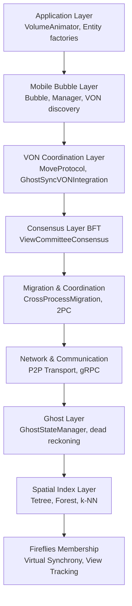
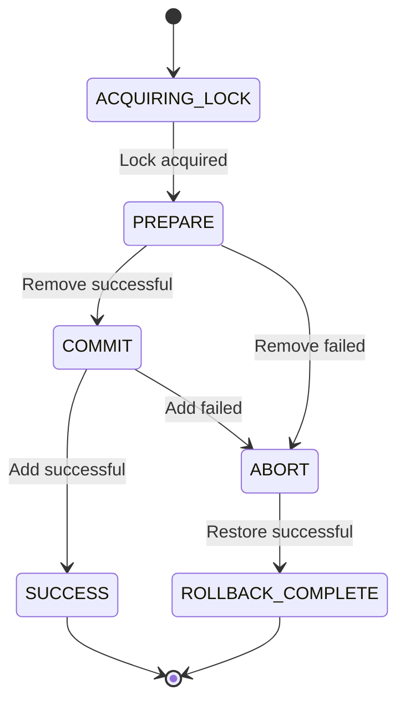
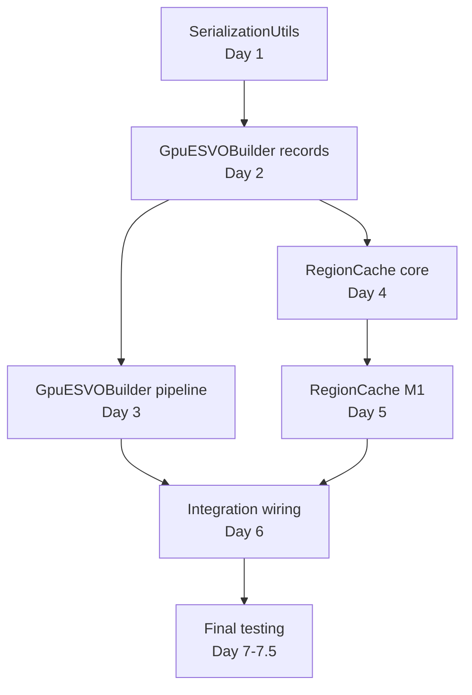

# Simulation Module Documentation Cleanup Critique

**Date**: 2026-02-14
**Reviewer**: deep-critic agent
**Scope**: 50 markdown files in simulation/ module
**Status**: Ready for execution

---

## Executive Summary

Comprehensive review of 50 markdown files identified:
- **15+ ASCII diagrams** requiring mermaid conversion (3 high-priority)
- **~800 lines of duplicate content** across 4 doc groups
- **9 Phase 2 plan files** with version sprawl (6 need archival)
- **2 files recommended for deletion** (complete duplicates)
- **Top 10 structural improvements** prioritized by impact

**Estimated cleanup effort**: ~2.5 hours for top 10 actions
**Highest ROI**: 50 minutes for maximum impact (actions 1-3)

---

## Part 1: ASCII Art → Mermaid Diagrams

### High Priority Conversions

**1. ARCHITECTURE_DISTRIBUTED.md - Component Stack** (HIGH)
- **Location**: Lines 40-85
- **Current**: 9-layer vertical ASCII stack (Application → Fireflies)
- **Recommended**: Mermaid `graph TB` (top-to-bottom flowchart)
- **Impact**: Central architecture document, most referenced



**2. ADR_001_MIGRATION_CONSENSUS_ARCHITECTURE.md - 2PC State Machine** (MEDIUM)
- **Location**: Lines 299-361
- **Current**: ASCII state transition diagram
- **Recommended**: Mermaid `stateDiagram-v2`
- **Impact**: Critical decision record, clarifies 2PC protocol



**3. PHASE_2_EXECUTION_PLAN.md - Task Dependencies** (MEDIUM)
- **Location**: Lines 33-51 (tree), 57-80 (graph)
- **Current**: ASCII tree + dependency arrows
- **Recommended**: Mermaid `graph TD` (directed acyclic graph)
- **Impact**: Clearer execution plan visualization



**Total ASCII diagrams found**: 15+ across 8 files

---

## Part 2: Consolidation Opportunities

### Group 1: Distributed Architecture Overlap (~800 lines duplicate)

**Files with redundant content**:
- `ARCHITECTURE_DISTRIBUTED.md` (1,280 lines) - **CANONICAL** ✅
- `SIMULATION_BUBBLES.md` (529 lines) - Duplicates § Mobile Bubble Architecture
- `VON_OVERLAY_ASSESSMENT.md` (314 lines) - Duplicates § VON Coordination
- `GHOST_LAYER_CONSOLIDATION.md` (363 lines) - Duplicates § Ghost Layer

**Recommendations**:
- ✅ **KEEP**: `ARCHITECTURE_DISTRIBUTED.md` as canonical reference
- ❌ **DELETE**: `SIMULATION_BUBBLES.md` (100% duplicate, no unique content)
- ❌ **DELETE**: `VON_OVERLAY_ASSESSMENT.md` (duplicates + contradicts current architecture)
- 📝 **MODIFY**: `GHOST_LAYER_CONSOLIDATION.md` → Brief summary + pointer to canonical doc, keep only implementation details

**Estimated savings**: ~800 lines of duplicate content

### Group 2: Testing Documentation (GOOD - No action needed)

**Files**:
- `TESTING_PATTERNS.md` (simulation-specific)
- `../../TEST_FRAMEWORK_GUIDE.md` (root-level, authoritative)

**Status**: ✅ `TESTING_PATTERNS.md` correctly delegates to `TEST_FRAMEWORK_GUIDE.md`
**Action**: None - this is correct documentation architecture

### Group 3: Phase 2 Planning Proliferation (9 files → 2 files)

**Problem**: 9 Phase 2 files with version sprawl, unclear "current" version

**Files**:
- `plans/PHASE_2_EXECUTION_PLAN.md` ✅ (keep if latest)
- `plans/PHASE_2_EXECUTION_PLAN_V2.md` 📦 (archive)
- `plans/PHASE_2_GPU_INTEGRATION_ARCHITECTURE.md` ✅ (keep if latest)
- `plans/PHASE_2_GPU_INTEGRATION_ARCHITECTURE_V2.md` 📦 (archive)
- `plans/PHASE_2_REMEDIATION_PLAN.md` 📦 (archive)
- `plans/PHASE_2_REMEDIATION_PLAN_V2.md` 📦 (archive)
- `plans/PHASE_2_REMEDIATION_PLAN_V3.md` ✅ (keep - latest)
- `plans/PHASE_2_PLAN_CRITIQUE.md` 📦 (archive - point-in-time audit)
- `plans/PHASE_2_EXECUTION_PLAN_AUDIT.md` 📦 (archive - point-in-time)

**Recommendations**:
1. Create `plans/archive/phase2/`
2. Archive 6 non-current versions
3. Keep only final versions (EXECUTION_PLAN, ARCHITECTURE, REMEDIATION_V3)

**Cleanup**: 9 files → 3 files (archive 6)

### Group 4: ADR Numbering Collision

**Issue**: Two `ADR_002` documents exist

**Files**:
- `ADR_002_CLOCK_FIXED_NANOTIME.md` ✅ (current)
- `archive/ADR_002_FIXED_VOLUME_SPATIAL_PARTITIONING_OBSOLETE.md` 📦 (archived)

**Recommendations**:
- Rename archived file to `ADR_002_OBSOLETE_FIXED_VOLUME.md`
- Add note to current `ADR_002_CLOCK_FIXED_NANOTIME.md`: "This ADR_002 supersedes archived ADR_002_FIXED_VOLUME decision"

---

## Part 3: Archival Recommendations

### Files to Archive

**Create archive subdirectories**:
```
simulation/doc/archive/
├── analysis/          # Point-in-time analysis docs
├── benchmarks/        # Historical benchmark reports
├── decisions/         # Superseded/versioned decisions
├── designs/           # Obsolete architecture versions (EXISTS ✅)
├── phase2/            # Phase 2 plan evolution
├── spikes/            # Spike investigation reports
└── technical-decisions/  # One-time fixes/changes
```

**Recommend archiving**:
1. `GHOST_LAYER_CONSOLIDATION_ANALYSIS.md` → `archive/analysis/`
2. `PROCESSBUILDER_SPIKE_REPORT.md` → `archive/spikes/`
3. `DAY_0_BENCHMARK_REPORT.md` → `archive/benchmarks/`
4. `V3_GHOST_MANAGER_DECISION.md` → `archive/decisions/`
5. `MOBILE_BUBBLE_ARCHITECTURE_ANALYSIS.md` → `archive/analysis/`
6. `TECHNICAL_DECISION_CACHE_FIX.md` → `archive/technical-decisions/`
7. `TECHNICAL_DECISION_CONCURRENCY_TEST_FIX.md` → `archive/technical-decisions/`

**Phase 2 plan versions** (6 files) → `archive/phase2/`

### Files to DELETE

**Complete duplicates with no unique content**:
1. ❌ `SIMULATION_BUBBLES.md` - 100% duplicates `ARCHITECTURE_DISTRIBUTED.md § Mobile Bubble Architecture`
2. ❌ `VON_OVERLAY_ASSESSMENT.md` - Duplicates `ARCHITECTURE_DISTRIBUTED.md § VON Coordination` + contains contradictions

**Verification before deletion**:
```bash
grep -r "SIMULATION_BUBBLES.md" simulation/doc/  # Check for references
grep -r "VON_OVERLAY_ASSESSMENT.md" simulation/doc/
```

### Archival Policy

**Archive if**:
- Version suffix (v1, v2, V2, V3, etc.)
- Point-in-time report (benchmark, spike, analysis)
- Marked OBSOLETE
- Superseded by newer decision

**Delete if**:
- Complete duplicate with no unique content
- Contradicts current architecture

**Keep if**:
- Current architecture/ADR/runbook
- Active plan
- Living document (updated regularly)

---

## Part 4: Structural Improvements

### Top 10 Docs Needing Improvement

**1. ARCHITECTURE_DISTRIBUTED.md** (HIGH PRIORITY)
- ❌ Missing: TOC anchor links (has TOC but not linked)
- ❌ Issue: 1,280 lines - needs subsection anchors for deep linking
- ✅ Fix: Add GitHub-style anchors: `[High-Level Architecture](#high-level-architecture)`
- 📊 ASCII→Mermaid: Component Stack diagram (lines 40-85)

**2. ADR_001_MIGRATION_CONSENSUS_ARCHITECTURE.md** (HIGH)
- ❌ Missing: Decision date in status (says "Accepted" but no date)
- ❌ Issue: Multiple "Appendix" sections not separated (lines 467-500)
- ✅ Fix: Add `## Appendices` header, numbered subsections
- 📊 ASCII→Mermaid: 2PC state machine (lines 299-361)

**3. PHASE_2_EXECUTION_PLAN.md** (MEDIUM)
- ❌ Missing: Success criteria for epic completion
- ❌ Issue: Bead hierarchy duplicated as tree + table (lines 33-51, 560-575)
- ✅ Fix: Remove ASCII tree, keep table only, add Mermaid dependency graph
- 📊 ASCII→Mermaid: Task dependency graph (lines 57-80)

**4. VON_OVERLAY_ASSESSMENT.md** (CRITICAL - CONTRADICTIONS)
- ❌ **Issue**: Claims "VON not used" (line 259) but codebase uses MoveProtocol
- ❌ **Issue**: Contradicts `ARCHITECTURE_DISTRIBUTED.md` (which is correct)
- ✅ **Fix**: **DELETE** entire file (duplicates + contradicts current architecture)

**5. FIREFLIES_ARCHITECTURE_ASSESSMENT.md** (MEDIUM)
- ❌ Missing: Executive summary at top (jumps to details)
- ❌ Issue: Verdict buried at line 410 (should be in exec summary)
- ✅ Fix: Add `## Executive Summary` with 9.6/10 verdict, key strengths

**6. H3_DETERMINISM_EPIC.md** (LOW)
- ✅ Good: Properly delegates to detailed docs
- ❌ Issue: "Documentation Index" (lines 18-50) could be table format
- ✅ Fix: Convert to table: Document | Purpose | When to Read

**7. GHOST_LAYER_CONSOLIDATION.md** (MEDIUM)
- ❌ Issue: Duplicates `ARCHITECTURE_DISTRIBUTED.md § Ghost Layer`
- ✅ Fix: Reduce to brief summary + pointer, keep only implementation details

**8. DISTRIBUTED_COORDINATION_PATTERNS.md** (LOW)
- ✅ Good: Clear pattern-based structure
- ❌ Missing: Links to code examples (mentions files but no links)
- ✅ Fix: Add relative links: `[ProcessCoordinator.java](../src/main/java/.../ProcessCoordinator.java)`

**9. TESTING_PATTERNS.md** (LOW - MOSTLY GOOD)
- ✅ Good: Properly references `TEST_FRAMEWORK_GUIDE.md`
- ❌ Issue: Some sections duplicate general patterns before referring
- ✅ Fix: Lead with "See TEST_FRAMEWORK_GUIDE.md § X" + simulation-specific examples only

**10. RUNBOOK_ROLLBACK_RECOVERY.md** (Not reviewed in detail)
- 🔍 Assumption: Likely needs structured incident response format
- 🔍 Verify includes: Detection, Diagnosis, Recovery, Prevention, Escalation

### Common Issues Across All Docs

| Issue | Count | Fix |
|-------|-------|-----|
| Missing/broken TOC links | 8 | Add GitHub anchor links |
| ASCII diagrams | 3 | Convert to Mermaid |
| Version suffixes without archival | 9 | Archive to `plans/archive/phase2/` |
| Duplicate content | 3 | Delete or consolidate |
| No "Last Updated" date | 12 | Add metadata |

---

## Part 5: Priority Action List

### Highest-Impact Changes (Top 10)

| # | Action | Effort | Impact | Dependencies |
|---|--------|--------|--------|--------------|
| 1 | Delete `VON_OVERLAY_ASSESSMENT.md` | Small (5min) | **HIGH** | Verify no references |
| 2 | Archive Phase 2 plan versions (6 files) | Small (10min) | **HIGH** | None |
| 3 | Mermaid: `ARCHITECTURE_DISTRIBUTED.md` stack | Medium (30min) | **HIGH** | None |
| 4 | Delete/stub `SIMULATION_BUBBLES.md` | Small (5min) | MEDIUM | Verify no references |
| 5 | Add exec summary to `FIREFLIES_ARCHITECTURE_ASSESSMENT.md` | Small (15min) | MEDIUM | None |
| 6 | Archive analysis/spike reports (5 files) | Medium (20min) | MEDIUM | None |
| 7 | Fix ADR_002 numbering note | Small (10min) | MEDIUM | None |
| 8 | Mermaid: `ADR_001` state machine | Medium (20min) | MEDIUM | None |
| 9 | Add TOC links to `ARCHITECTURE_DISTRIBUTED.md` | Medium (30min) | MEDIUM | None |
| 10 | Mermaid: `PHASE_2_EXECUTION_PLAN` dependencies | Medium (25min) | LOW-MED | None |

**Total effort**: ~2.5 hours for all 10 actions
**Highest ROI**: Actions 1-3 (50 minutes for maximum impact)

---

## Implementation Commands

### Action 1: Delete VON_OVERLAY_ASSESSMENT.md

```bash
# Verify no references
grep -r "VON_OVERLAY_ASSESSMENT" simulation/doc/

# Delete file
rm simulation/doc/VON_OVERLAY_ASSESSMENT.md
```

### Action 2: Archive Phase 2 plan versions

```bash
# Create archive directory
mkdir -p simulation/doc/plans/archive/phase2

# Move versioned files
mv simulation/doc/plans/PHASE_2_EXECUTION_PLAN_V2.md simulation/doc/plans/archive/phase2/
mv simulation/doc/plans/PHASE_2_GPU_INTEGRATION_ARCHITECTURE_V2.md simulation/doc/plans/archive/phase2/
mv simulation/doc/plans/PHASE_2_REMEDIATION_PLAN.md simulation/doc/plans/archive/phase2/
mv simulation/doc/plans/PHASE_2_REMEDIATION_PLAN_V2.md simulation/doc/plans/archive/phase2/
mv simulation/doc/plans/PHASE_2_PLAN_CRITIQUE.md simulation/doc/plans/archive/phase2/
mv simulation/doc/plans/PHASE_2_EXECUTION_PLAN_AUDIT.md simulation/doc/plans/archive/phase2/
```

### Action 6: Archive analysis/spike reports

```bash
# Create archive subdirectories
mkdir -p simulation/doc/archive/{analysis,spikes,benchmarks,decisions,technical-decisions}

# Move files
mv simulation/doc/GHOST_LAYER_CONSOLIDATION_ANALYSIS.md simulation/doc/archive/analysis/
mv simulation/doc/PROCESSBUILDER_SPIKE_REPORT.md simulation/doc/archive/spikes/
mv simulation/doc/DAY_0_BENCHMARK_REPORT.md simulation/doc/archive/benchmarks/
mv simulation/doc/V3_GHOST_MANAGER_DECISION.md simulation/doc/archive/decisions/
mv simulation/doc/MOBILE_BUBBLE_ARCHITECTURE_ANALYSIS.md simulation/doc/archive/analysis/
mv simulation/doc/TECHNICAL_DECISION_CACHE_FIX.md simulation/doc/archive/technical-decisions/
mv simulation/doc/TECHNICAL_DECISION_CONCURRENCY_TEST_FIX.md simulation/doc/archive/technical-decisions/
```

---

## Verification Checklist

- [ ] All 50 files reviewed
- [ ] ASCII diagrams identified (15+)
- [ ] Mermaid alternatives proposed (3 high-priority)
- [ ] Consolidation opportunities identified (4 groups)
- [ ] Archival recommendations (13 files)
- [ ] Deletion recommendations (2 files)
- [ ] Structural improvements (Top 10)
- [ ] Priority action list (effort estimates)
- [ ] Implementation commands provided

---

## Next Steps

**Immediate** (this week):
1. Execute actions 1-3 (delete VON_OVERLAY, archive Phase 2, convert ARCHITECTURE_DISTRIBUTED diagram)

**Short-term** (next 2 weeks):
2. Execute actions 4-7 (delete SIMULATION_BUBBLES, add exec summary, archive reports, fix ADR_002)

**Medium-term** (next month):
3. Execute actions 8-10 (convert remaining diagrams, add TOC links)

**Long-term**:
- Add "Last Updated" metadata to all living docs
- Create `archive/README.md` explaining policy
- GitHub Actions to validate doc metadata
