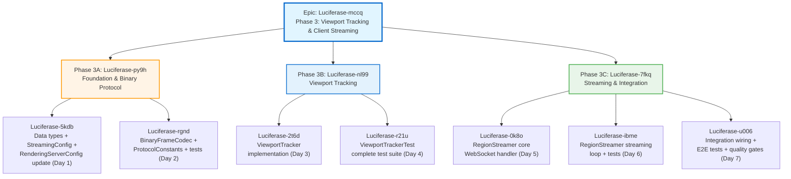
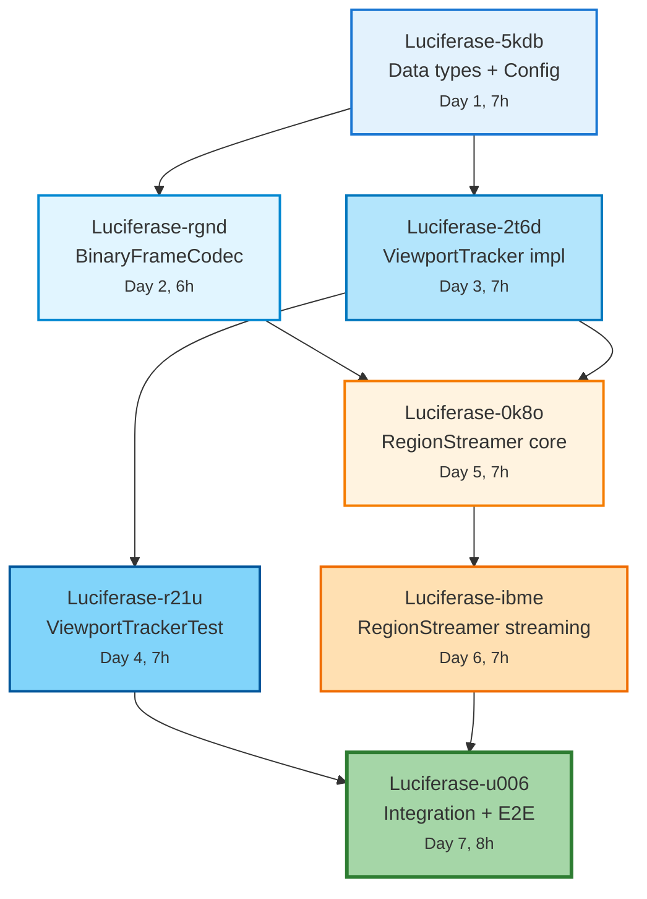

# Phase 3: Viewport Tracking & Client Streaming -- Execution Plan

**Date**: 2026-02-14
**Author**: strategic-planner
**Status**: AUDITED - APPROVED (2026-02-14, fixes applied from audit report)
**Duration**: 7 working days (1 week)
**Epic Bead**: Luciferase-mccq

**Architecture**: `simulation/doc/plans/PHASE_3_VIEWPORT_STREAMING_ARCHITECTURE.md`
**Parent Architecture**: `simulation/doc/plans/GPU_RENDERING_SERVICE_ARCHITECTURE.md`
**Phase 2 Execution Plan**: `simulation/doc/plans/PHASE_2_EXECUTION_PLAN.md`

---

## 1. Executive Summary

Phase 3 adds per-client viewport tracking with frustum culling, LOD assignment,
and WebSocket region streaming to the GPU-Accelerated ESVO/ESVT Rendering Service.
This plan breaks the architecture into 7 working days across 3 sub-phases (3A, 3B, 3C)
with 7 task beads, each containing complete TDD execution context.

**Scope**: 8 new production files, 5 new test files, 2 modified production files,
~19 existing test constructor calls updated (plus 3 production factory methods).
**Estimated**: ~1,175 LOC production, ~1,540 LOC test, ~41 tests.

**Phase 2 Baseline**: 17 production files, 14 test files, all tests passing.

---

## 2. Bead Hierarchy



---

## 3. Dependency Graph



**Critical Path** (highlighted in red): 5kdb -> 2t6d -> 0k8o -> ibme -> u006 (5 sequential steps)

**Parallel Opportunities**:
- Day 2 (rgnd) can run in parallel with Day 3 (2t6d) since both only depend on Day 1 (5kdb)
- Day 4 (r21u) runs on the ViewportTracker path while Day 5 (0k8o) could overlap if Day 2 finishes early

---

## 4. Day-by-Day Task Breakdown

### Day 1: Data Types + StreamingConfig + RenderingServerConfig Update (Luciferase-5kdb)

**Objective**: Create all Phase 3 data types and update RenderingServerConfig without breaking any existing tests.

**Hours**: 7h total
- 1.5h: Create 5 data type records + ProtocolConstants
- 1.5h: Create StreamingConfig record with validation and factories
- 1.0h: Add StreamingConfig to RenderingServerConfig (8th field)
- 2.0h: Update all existing test call sites (19 direct constructor calls + RenderingServerConfigExtensions helper)
- 1.0h: Run full test suite, fix any compilation or test failures

**Files to Create** (6 new):
| File | LOC | Description |
|------|-----|-------------|
| `ClientViewport.java` | ~50 | Camera parameters record with validation |
| `VisibleRegion.java` | ~20 | Region + LOD + distance, Comparable |
| `ViewportDiff.java` | ~30 | Diff result: added/removed/lodChanged |
| `StreamingConfig.java` | ~60 | Streaming configuration with defaults/testing |
| `protocol/ProtocolConstants.java` | ~25 | Magic number, format codes, header size |
| `ClientViewportTest.java` | ~40 | Record validation edge cases |

**Files to Modify** (1 production + ~8 test files):
| File | Change | LOC Delta |
|------|--------|-----------|
| `RenderingServerConfig.java` | Add `StreamingConfig streaming` as 8th field | +15 |
| `RenderingServerConfig.java` | Update `testing()`, `defaults()`, `secureDefaults()` | +6 |
| `RenderingServerTest.java` | Update ~12 `new RenderingServerConfig(...)` calls | ~12 lines |
| `RenderingServerIntegrationTest.java` | Update ~4 `new RenderingServerConfig(...)` calls | ~4 lines |
| `RenderingServerConfigTest.java` | Update ~6 `new RenderingServerConfig(...)` calls | ~6 lines |
| `AdaptiveRegionManagerTest.java` | Uses `testing()` -- auto-updated | 0 |
| `EntityStreamConsumerTest.java` | Uses `testing()` -- auto-updated | 0 |
| `BuildIntegrationTest.java` | Uses `testing()` -- auto-updated | 0 |
| `RateLimiterTest.java` | Verify no direct constructor usage | 0 |

**TDD Sequence**:
1. RED: Create record stubs with compilation errors for missing types
2. GREEN: Implement records one by one: ProtocolConstants -> ClientViewport -> VisibleRegion -> ViewportDiff -> StreamingConfig
3. RED: Add StreamingConfig to RenderingServerConfig (all direct constructor calls break)
4. GREEN: Update `testing()`, `defaults()`, `secureDefaults()` factory methods
5. GREEN: Update all 19 direct constructor call sites in test files (including RenderingServerConfigExtensions.withUpstreams helper)
6. VERIFY: `mvn test -pl simulation` -- all existing tests pass

**Implementation Details**:

The RenderingServerConfig record currently has 7 parameters:
```java
public record RenderingServerConfig(
    int port,
    List<UpstreamConfig> upstreams,
    int regionLevel,
    SecurityConfig security,
    CacheConfig cache,
    BuildConfig build,
    int maxEntitiesPerRegion,
    StreamingConfig streaming       // NEW: 8th parameter
) { ... }
```

Updating `testing()`:
```java
public static RenderingServerConfig testing() {
    return new RenderingServerConfig(
        0, List.of(), 2,
        SecurityConfig.permissive(),
        CacheConfig.testing(),
        BuildConfig.testing(),
        1_000,
        StreamingConfig.testing()    // NEW
    );
}
```

All tests using `RenderingServerConfig.testing()` (20+ call sites) update automatically.
Only the ~19 direct `new RenderingServerConfig(...)` calls need manual update
(plus the `RenderingServerConfigExtensions.withUpstreams()` helper at IntegrationTest line 299-310).

**Verified Call Site Counts** (from grep):
- `RenderingServerTest.java`: 11 direct constructor calls + 6 `testing()` calls
- `RenderingServerIntegrationTest.java`: 3 direct constructor + 1 helper (withUpstreams, line 301) + 2 `testing()` calls
- `RenderingServerConfigTest.java`: 5 direct constructor + 1 `testing()` + 1 `defaults()` call
- `BuildIntegrationTest.java`: 10 `testing()` calls (auto-updated)
- `AdaptiveRegionManagerTest.java`: 10 `testing()` calls (auto-updated)
- `EntityStreamConsumerTest.java`: 1 `testing()` call (auto-updated)
- `RegionBuilderTest.java`: 0 calls (uses BuildConfig directly)
- `RegionCacheTest.java`: 0 calls (uses constructor directly)

**Acceptance Criteria**:
- [ ] All 6 new files compile
- [ ] ClientViewport validates nearPlane > 0, farPlane > nearPlane, fovY in (0, pi)
- [ ] StreamingConfig validates ascending lodThresholds, maxLodLevel == thresholds.length
- [ ] StreamingConfig.testing() and StreamingConfig.defaults() return valid instances
- [ ] ProtocolConstants.FRAME_MAGIC == 0x45535652
- [ ] ClientViewportTest passes (3 tests: valid construction, invalid parameters, testDefault)
- [ ] All existing tests pass (`mvn test -pl simulation`)

**Entry Criteria**: Phase 2 complete, `mvn test -pl simulation` passes all tests.
**Exit Criteria**: All records compile, ClientViewportTest passes, all existing tests pass.

**Risks**:
| Risk | Severity | Likelihood | Mitigation |
|------|----------|------------|------------|
| Missing constructor call site causes compilation error | Low | Medium | grep-based call site inventory above is exhaustive |
| RenderingServerConfigExtensions helper in integration test | Low | Low | Check for withUpstreams() and similar patterns |

---

### Day 2: BinaryFrameCodec + ProtocolConstants Tests (Luciferase-rgnd)

**Objective**: Implement the binary frame encoder/decoder with complete round-trip tests.

**Hours**: 6h total
- 1.5h: Write BinaryFrameCodecTest (7 tests, TDD-first)
- 2.0h: Implement BinaryFrameCodec (encode, decodeHeader, extractPayload)
- 1.0h: Implement FrameHeader record
- 1.0h: Edge case testing (invalid magic, truncated frames, byte order)
- 0.5h: Buffer for debugging byte order issues

**Files to Create** (2 new):
| File | LOC | Description |
|------|-----|-------------|
| `protocol/BinaryFrameCodec.java` | ~120 | Encode/decode binary WebSocket frames |
| `protocol/BinaryFrameCodecTest.java` | ~200 | 7 round-trip and error tests |

**TDD Sequence**:
1. RED: Write testRoundtrip_ESVO -- create mock BuiltRegion, encode, decode, assert fields match
2. GREEN: Implement BinaryFrameCodec.encode() and decodeHeader()
3. RED: Write testPayloadExtraction -- encode, extractPayload, verify matches original
4. GREEN: Implement extractPayload()
5. RED: Write testInvalidMagic_returnsNull, testTruncatedFrame_returnsNull
6. GREEN: Add validation to decodeHeader()
7. RED: Write testByteOrder_littleEndian -- manually inspect first 4 bytes
8. GREEN: Verify ByteOrder.LITTLE_ENDIAN throughout
9. VERIFY: `mvn test -pl simulation -Dtest=BinaryFrameCodecTest`

**Test Details** (7 tests):

| # | Test Name | Input | Expected |
|---|-----------|-------|----------|
| 1 | testRoundtrip_ESVO | BuiltRegion(ESVO, LOD=0, 100 bytes) | decode header matches all fields |
| 2 | testRoundtrip_ESVT | BuiltRegion(ESVT, LOD=2, 200 bytes) | decode header matches all fields |
| 3 | testMagicNumber | Any encoded frame | bytes[0..3] == 0x52, 0x56, 0x53, 0x45 (LE) |
| 4 | testPayloadExtraction | Encoded frame | extractPayload matches original data |
| 5 | testInvalidMagic_returnsNull | Corrupted bytes[0] | decodeHeader returns null |
| 6 | testTruncatedFrame_returnsNull | byte[20] (< 24) | decodeHeader returns null |
| 7 | testByteOrder_littleEndian | Known mortonCode=0x0102030405060708L | bytes at offset 8-15 match LE layout |

**Helper for Creating Test BuiltRegion**:
```java
private RegionBuilder.BuiltRegion testBuiltRegion(RegionBuilder.BuildType type, int lod, int dataSize) {
    var data = new byte[dataSize];
    ThreadLocalRandom.current().nextBytes(data);
    return new RegionBuilder.BuiltRegion(
        new RegionId(12345L, 4), lod, type, data, true, 1_000_000L, System.nanoTime()
    );
}
```

**Acceptance Criteria**:
- [ ] BinaryFrameCodec.encode() produces 24 + N byte frames
- [ ] decodeHeader() correctly parses all header fields
- [ ] extractPayload() returns exact payload bytes
- [ ] Invalid magic returns null (not exception)
- [ ] Truncated frame returns null (not exception)
- [ ] All 7 BinaryFrameCodecTest tests pass

**Entry Criteria**: Day 1 complete (Luciferase-5kdb). ProtocolConstants exists.
**Exit Criteria**: All 7 tests pass.

**Risks**:
| Risk | Severity | Likelihood | Mitigation |
|------|----------|------------|------------|
| ByteBuffer byte order confusion | Low | Medium | Explicit LITTLE_ENDIAN in both encode and decode |
| BuiltRegion constructor API change | Low | Low | Verified record shape: (RegionId, int, BuildType, byte[], boolean, long, long) |

---

### Day 3: ViewportTracker Implementation (Luciferase-2t6d)

**Objective**: Implement the core ViewportTracker class with frustum culling, LOD calculation, and viewport diffing.

**Hours**: 7h total
- 0.5h: Verify Frustum3D API with small test (createPerspective + intersectsAABB)
- 1.5h: Implement ViewportTracker constructor, registerClient, removeClient, clientCount
- 1.5h: Implement updateViewport (Frustum3D construction from ClientViewport)
- 1.5h: Implement visibleRegions (frustum culling loop + LOD assignment)
- 1.0h: Implement diffViewport (HashMap-based set comparison)
- 0.5h: Implement allVisibleRegions (union across clients)
- 0.5h: Basic smoke test -- create tracker, register client, update viewport, query visible

**Files to Create** (1 new):
| File | LOC | Description |
|------|-----|-------------|
| `ViewportTracker.java` | ~300 | Per-client viewport state, frustum culling, LOD, diff |

**Implementation Plan**:

1. **ClientViewportState inner class** (~30 LOC):
   - Immutable per-client state holder
   - Fields: clientId, viewport, frustum, lastVisible (List<VisibleRegion>), lastUpdateMs
   - Replaced atomically via ConcurrentHashMap.put()

2. **Constructor** (~10 LOC):
   - Accept AdaptiveRegionManager, StreamingConfig
   - Initialize ConcurrentHashMap<String, ClientViewportState>

3. **Client lifecycle** (~30 LOC):
   - registerClient: put empty state
   - removeClient: remove from map
   - clientCount: return map size

4. **updateViewport** (~30 LOC):
   - Construct Point3f eye, lookAt; Vector3f up from ClientViewport
   - Call Frustum3D.createPerspective(eye, lookAt, up, fovY, aspectRatio, near, far)
   - Replace client state atomically

5. **visibleRegions** (~40 LOC):
   - Get client state and frustum
   - Iterate regionManager.getAllRegions()
   - For each: get bounds, test frustum.intersectsAABB(6 floats)
   - If visible: compute distance, assign LOD, add to list
   - Sort by distance
   - Update client state with new visible set

6. **lodForDistance** (~10 LOC):
   - Linear scan of StreamingConfig.lodThresholds()
   - Return index of first threshold > distance, or maxLodLevel

7. **diffViewport** (~40 LOC):
   - Get old visible set from client state
   - Compute new visible set (calls visibleRegions)
   - HashMap comparison: added, removed, lodChanged
   - Sort added and lodChanged by distance

8. **allVisibleRegions** (~15 LOC):
   - Iterate all client states, union visible region IDs into Set

9. **Clock injection** (~5 LOC):
   - volatile Clock field, setClock() method

**Frustum3D Integration** (verified API):
```java
// From lucien/src/main/java/.../Frustum3D.java:205
public static Frustum3D createPerspective(
    Point3f cameraPosition, Point3f lookAt, Vector3f up,
    float fovy, float aspectRatio, float nearDistance, float farDistance
);

// From lucien/src/main/java/.../Frustum3D.java:394
public boolean intersectsAABB(
    float minX, float minY, float minZ,
    float maxX, float maxY, float maxZ
);
```

**RegionBounds API** (verified):
```java
// From RegionBounds record
public float minX(), minY(), minZ(), maxX(), maxY(), maxZ();
public float centerX(), centerY(), centerZ();
```

**Acceptance Criteria**:
- [ ] ViewportTracker compiles with all dependencies
- [ ] registerClient/removeClient/clientCount work correctly
- [ ] updateViewport constructs Frustum3D from ClientViewport
- [ ] visibleRegions returns sorted list of regions in frustum
- [ ] lodForDistance returns correct LOD for each distance range
- [ ] diffViewport correctly identifies added/removed/lodChanged
- [ ] allVisibleRegions returns union across clients
- [ ] No `synchronized` blocks (ConcurrentHashMap + immutable records)
- [ ] Clock injection via setClock()
- [ ] Basic smoke test passes

**Entry Criteria**: Day 1 complete (Luciferase-5kdb). ClientViewport and StreamingConfig exist.
**Exit Criteria**: ViewportTracker compiles, basic smoke test passes.

**Risks**:
| Risk | Severity | Likelihood | Mitigation |
|------|----------|------------|------------|
| Frustum3D positive-coordinate constraint | High | Medium | World coords are [0, 1024], all positive. Test explicitly. |
| Frustum3D API mismatch | Low | Low | Verified exact signature in codebase |
| RegionBounds missing centerX/Y/Z methods | Medium | Medium | If missing, compute: (min + max) / 2 |

---

### Day 4: ViewportTrackerTest Complete Test Suite (Luciferase-r21u)

**Objective**: Write comprehensive tests for ViewportTracker covering frustum culling, LOD, diffing, concurrency, and edge cases.

**Hours**: 7h total
- 2.0h: Frustum culling tests (5 tests) with known region positions
- 1.5h: LOD calculation tests (5 tests) with exact threshold values
- 2.0h: Viewport diff tests (4 tests) with camera movement scenarios
- 1.0h: Concurrent access and client management tests (2 tests)
- 0.5h: Run full suite, fix any failures

**Files to Create** (1 new):
| File | LOC | Description |
|------|-----|-------------|
| `ViewportTrackerTest.java` | ~500 | 16 tests across frustum, LOD, diff, concurrency |

**Test Setup**:
```java
// Shared test infrastructure
private AdaptiveRegionManager regionManager;
private StreamingConfig config;
private ViewportTracker tracker;

@BeforeEach
void setUp() {
    var serverConfig = RenderingServerConfig.testing(); // regionLevel=2, 64 regions
    regionManager = new AdaptiveRegionManager(serverConfig);
    config = StreamingConfig.testing(); // thresholds: [50, 150, 350], maxLod=3
    tracker = new ViewportTracker(regionManager, config);

    // Populate some regions with entities so getAllRegions() returns non-empty
    populateTestRegions();
}

private void populateTestRegions() {
    // Add entities at known positions to create regions
    // regionLevel=2 means 4 regions per axis = 64 total
    // World is [0, 1024], region size = 256
    regionManager.updateEntity("e1", 128f, 128f, 128f, "PREY");  // Region at (0,0,0)
    regionManager.updateEntity("e2", 384f, 128f, 128f, "PREY");  // Region at (1,0,0)
    regionManager.updateEntity("e3", 640f, 128f, 128f, "PREY");  // Region at (2,0,0)
    regionManager.updateEntity("e4", 896f, 128f, 128f, "PREY");  // Region at (3,0,0)
    regionManager.updateEntity("e5", 128f, 640f, 128f, "PREY");  // Far region
}
```

**Test Details** (16 tests):

**Frustum Culling Tests (5)**:

| # | Test Name | Setup | Expected |
|---|-----------|-------|----------|
| 1 | testVisibleRegions_cameraLookingAtCenter | Camera at (512,512,100) looking at (512,512,512), 60deg FOV | Some regions visible, regions behind camera excluded |
| 2 | testVisibleRegions_allRegionsInFrustum | Camera at center, very wide FOV (170deg), far plane=5000 | All populated regions visible |
| 3 | testVisibleRegions_noRegionsInFrustum | Camera at (512,512,100) looking at (512,512,-100) (away from world) | Empty visible list |
| 4 | testVisibleRegions_partialVisibility | Camera at (0,0,0) looking at (512,512,512), narrow FOV (30deg) | Only regions along camera direction |
| 5 | testVisibleRegions_sortedByDistance | Any viewport with multiple visible regions | List sorted by distance ascending |

**LOD Calculation Tests (5)**:

| # | Test Name | Distance | Expected LOD |
|---|-----------|----------|-------------|
| 6 | testLodForDistance_closestRegion | 25.0f | 0 (< 50) |
| 7 | testLodForDistance_midRange | 100.0f | 1 (50 <= d < 150) |
| 8 | testLodForDistance_farRange | 250.0f | 2 (150 <= d < 350) |
| 9 | testLodForDistance_farthest | 500.0f | 3 (>= 350) |
| 10 | testLodForDistance_exactThreshold | 50.0f | 1 (threshold is exclusive: < 50 is LOD 0) |

**Viewport Diff Tests (4)**:

| # | Test Name | Scenario | Expected |
|---|-----------|----------|----------|
| 11 | testDiffViewport_firstViewport | First viewport update, no prior state | All visible = added, none removed |
| 12 | testDiffViewport_cameraMove_addAndRemove | Move camera from front to side | New regions added, old ones removed |
| 13 | testDiffViewport_cameraZoom_lodChange | Move camera closer (same direction) | Some regions change LOD level |
| 14 | testDiffViewport_noChange | Same viewport twice | Empty diff |

**Client Management & Concurrency Tests (2)**:

| # | Test Name | Scenario | Expected |
|---|-----------|----------|----------|
| 15 | testRegisterAndRemoveClient | Register, update, query, remove | Clean lifecycle, no residual state |
| 16 | testConcurrentClientRegistration | 10 threads register/query simultaneously | No exceptions, consistent state |

**TDD Sequence**:
1. RED: Write all 16 test method signatures with assertions
2. For each test category:
   - Write test body with specific assertions
   - Run test, verify it fails for the right reason
   - If ViewportTracker bugs found, fix in implementation
3. VERIFY: `mvn test -pl simulation -Dtest=ViewportTrackerTest`

**Acceptance Criteria**:
- [ ] All 16 ViewportTrackerTest tests pass
- [ ] Frustum culling correctly identifies visible/invisible regions
- [ ] LOD thresholds match StreamingConfig values exactly
- [ ] Viewport diff correctly tracks added/removed/lodChanged
- [ ] Concurrent access does not cause exceptions or data corruption
- [ ] All existing tests still pass

**Entry Criteria**: Day 3 complete (Luciferase-2t6d). ViewportTracker implemented.
**Exit Criteria**: All 16 tests pass, no regressions.

**Risks**:
| Risk | Severity | Likelihood | Mitigation |
|------|----------|------------|------------|
| RegionBounds missing centerX/Y/Z | Medium | Medium | Compute manually in test: (min+max)/2 |
| Frustum culling false positives near edges | Low | Medium | Test with generous margins, not exact boundary positions |
| Concurrent test flakiness | Low | Medium | Use CountDownLatch for synchronization, small thread count |

---

### Day 5: RegionStreamer Core WebSocket Handler (Luciferase-0k8o)

**Objective**: Implement the RegionStreamer class with WebSocket lifecycle handlers, JSON message protocol, and client session management.

**Hours**: 7h total
- 1.0h: Implement ClientSession inner class and ClientSessionState enum
- 1.5h: Implement onConnect (client limit enforcement, session creation)
- 2.0h: Implement onMessage (JSON dispatch: subscribe, viewport, ping)
- 1.0h: Implement onClose (cleanup, unpin regions)
- 1.0h: Implement onError handler
- 0.5h: Add setClock(), connectedClientCount(), close() lifecycle

**Files to Create** (1 new):
| File | LOC | Description |
|------|-----|-------------|
| `RegionStreamer.java` | ~400 (core, streaming loop deferred to Day 6) | WebSocket handler with JSON protocol |

**Implementation Plan**:

1. **ClientSession inner class** (~40 LOC):
   - Fields: sessionId, wsContext, state (volatile), preferredFormat, lastViewportUpdateMs, lastActivityMs, pendingSends, sentRegions (ConcurrentHashMap.KeySetView), protocolVersion
   - Constructor initializes defaults

2. **ClientSessionState enum** (~10 LOC):
   - CONNECTED -> SUBSCRIBED -> STREAMING -> DISCONNECTING

3. **Constructor** (~20 LOC):
   - Accept ViewportTracker, RegionCache, AdaptiveRegionManager, StreamingConfig
   - Initialize ConcurrentHashMap<String, ClientSession>, ScheduledExecutorService, AtomicBoolean streaming

4. **onConnect** (~25 LOC):
   - Check sessions.size() >= maxClientsPerServer
   - If full: ctx.closeSession(4001, "Server full"), return
   - Create ClientSession, put in sessions map
   - Register with viewportTracker

5. **onMessage** (~60 LOC):
   - Parse JSON, extract "type" field
   - Dispatch: "subscribe" -> handleSubscribe, "viewport" -> handleViewportUpdate, "ping" -> handlePing
   - Update lastActivityMs on every message

6. **handleSubscribe** (~30 LOC):
   - Extract protocolVersion, format, clientCapabilities
   - Set session.preferredFormat and protocolVersion
   - Transition state CONNECTED -> SUBSCRIBED
   - Send capabilities response JSON

7. **handleViewportUpdate** (~30 LOC):
   - Extract eye, lookAt, up, fov, aspect, near, far from JSON
   - Construct ClientViewport record
   - Call viewportTracker.updateViewport(sessionId, viewport)
   - Transition state SUBSCRIBED -> STREAMING (or stay STREAMING)
   - Throttle check: maxViewportUpdatesPerSecond

8. **handlePing** (~10 LOC):
   - Extract timestamp, send pong with serverTime

9. **onClose** (~30 LOC):
   - Remove session from sessions map
   - Set state = DISCONNECTING
   - Unpin sent regions (use viewportTracker.allVisibleRegions() for authoritative check)
   - Remove from viewportTracker

10. **onError** (~10 LOC):
    - Log error, attempt cleanup

11. **Lifecycle methods** (~20 LOC):
    - startStreaming/stopStreaming stubs (implementation Day 6)
    - close(): stop streaming, clear sessions
    - connectedClientCount(): return sessions.size()
    - setClock()

**JSON Protocol** (ObjectMapper usage):
```java
private static final ObjectMapper JSON_MAPPER = new ObjectMapper();

// Parse incoming message
var json = JSON_MAPPER.readTree(message);
var type = json.get("type").asText();

// Send capabilities response
var capabilities = Map.of(
    "type", "capabilities",
    "protocolVersion", ProtocolConstants.PROTOCOL_VERSION,
    "formats", List.of("esvo", "esvt"),
    "maxLodLevel", config.maxLodLevel(),
    "lodThresholds", config.lodThresholds()
);
ctx.send(JSON_MAPPER.writeValueAsString(capabilities));
```

**Acceptance Criteria**:
- [ ] RegionStreamer compiles with all dependencies
- [ ] onConnect enforces maxClientsPerServer limit
- [ ] onMessage dispatches subscribe/viewport/ping correctly
- [ ] subscribe response includes capabilities JSON
- [ ] viewport update calls ViewportTracker.updateViewport
- [ ] onClose cleans up session state and unpins regions
- [ ] ClientSessionState transitions follow correct sequence
- [ ] No `synchronized` blocks
- [ ] Clock injection via setClock()

**Entry Criteria**: Day 2 (Luciferase-rgnd) and Day 3 (Luciferase-2t6d) complete.
**Exit Criteria**: RegionStreamer compiles, manual lifecycle verification passes.

**Risks**:
| Risk | Severity | Likelihood | Mitigation |
|------|----------|------------|------------|
| Javalin WsContext API differences | Medium | Medium | Check Javalin 6 docs for exact method signatures |
| Jackson JSON parsing edge cases | Low | Low | Wrap in try-catch, log and skip invalid messages |
| WsContext.send() thread safety | Medium | Medium | Use synchronized sendSafe() wrappers to prevent frame corruption |

---

### Day 6: RegionStreamer Streaming Loop + Tests (Luciferase-ibme)

**Objective**: Implement the streaming loop, binary frame delivery, backpressure, and write the complete RegionStreamerTest.

**Hours**: 7h total
- 1.5h: Implement streamingCycle() method
- 1.0h: Implement sendRegionData (region_meta JSON + binary frame)
- 0.5h: Implement sendRegionEvict
- 0.5h: Implement onRegionBuilt callback
- 3.0h: Write RegionStreamerTest (12 tests)
- 0.5h: Run all tests, fix failures

**Streaming Loop Implementation** (~80 LOC):

1. **startStreaming** (~15 LOC):
   - AtomicBoolean guard
   - scheduleAtFixedRate on streamScheduler

2. **streamingCycle** (~60 LOC):
   - For each session in STREAMING state:
     - Skip if pendingSends >= maxPendingSendsPerClient (backpressure)
     - Check client timeout
     - Compute viewport diff
     - Process removed regions: send region_evict JSON, unpin (use viewportTracker.allVisibleRegions())
     - Process added + lodChanged: pin, get from cache, send or trigger build

3. **sendRegionData** (~20 LOC):
   - Build region_meta JSON from BuiltRegion metadata
   - Encode binary frame via BinaryFrameCodec.encode()
   - Increment pendingSends, use sendSafe() wrapper, decrement

4. **sendRegionEvict** (~10 LOC):
   - Build JSON: {"type": "region_evict", "regionId": {...}, "reason": "..."}
   - Send via sendSafe() wrapper (thread-safe)

5. **onRegionBuilt** (~20 LOC):
   - Find clients viewing this region
   - Send binary frame to each via sendSafe() wrapper

**Thread-Safe Send Wrappers** (~10 LOC):
   - sendSafe(ClientSession, String): synchronized send for JSON
   - sendSafe(ClientSession, ByteBuffer): synchronized send for binary
   - Prevents frame corruption from concurrent sends (streaming loop + build callbacks)

**RegionStreamerTest** (12 tests):

**Test Infrastructure**:
```java
// Mock WsContext for testing
private WsContext mockContext(String sessionId) {
    // Use Mockito or hand-rolled mock
    var mock = mock(WsContext.class);
    when(mock.sessionId()).thenReturn(sessionId);
    // Capture send() calls for verification
    return mock;
}
```

**Protocol Tests (5)**:

| # | Test Name | Input | Expected |
|---|-----------|-------|----------|
| 1 | testSubscribeMessage_validESVO | {"type":"subscribe","protocolVersion":1,"format":"esvo"} | capabilities response sent |
| 2 | testSubscribeMessage_validESVT | {"type":"subscribe","protocolVersion":1,"format":"esvt"} | capabilities with esvt format |
| 3 | testViewportUpdate_transitionsToStreaming | subscribe then viewport JSON | session state == STREAMING |
| 4 | testPingPong | {"type":"ping","timestamp":1000} | pong with server timestamp |
| 5 | testUnknownMessageType_ignored | {"type":"foobar"} | No crash, no response |

**Connection Management Tests (3)**:

| # | Test Name | Scenario | Expected |
|---|-----------|----------|----------|
| 6 | testMaxClientsEnforced | Connect maxClients+1 | Last rejected with status 4001 |
| 7 | testClientDisconnect_cleansUpState | Connect, subscribe, disconnect | Session removed, client count 0 |
| 8 | testClientTimeout_disconnected | Connect, advance clock past timeout | Session closed with 4003 |

**Streaming Tests (3)**:

| # | Test Name | Scenario | Expected |
|---|-----------|----------|----------|
| 9 | testStreamingCycle_sendsVisibleRegions | Client with viewport, cached regions in frustum | Binary frames sent for visible |
| 10 | testStreamingCycle_evictsRemovedRegions | Move camera, trigger cycle | region_evict JSON for removed |
| 11 | testBackpressure_skipsOverloadedClient | pendingSends at max | No new sends to that client |

**Region Build Notification Test (1)**:

| # | Test Name | Scenario | Expected |
|---|-----------|----------|----------|
| 12 | testOnRegionBuilt_sendsToViewingClients | Client viewing R1, R1 build completes | Binary frame sent |

**Acceptance Criteria**:
- [ ] Streaming loop runs at configured interval
- [ ] Backpressure skips clients with too many pending sends
- [ ] Client timeout disconnects inactive clients
- [ ] region_evict sent for regions leaving frustum
- [ ] Binary frames sent for newly visible cached regions
- [ ] onRegionBuilt delivers to viewing clients
- [ ] All 12 RegionStreamerTest tests pass
- [ ] All existing tests still pass

**Entry Criteria**: Day 5 complete (Luciferase-0k8o). RegionStreamer core exists.
**Exit Criteria**: All 12 tests pass, streaming loop verified.

**Risks**:
| Risk | Severity | Likelihood | Mitigation |
|------|----------|------------|------------|
| WsContext mock complexity | Medium | Medium | Keep mocks simple, verify send() calls only |
| ScheduledExecutor timing in tests | Medium | Medium | Use TestClock, manually invoke streamingCycle() |
| Streaming loop exceptions | Low | Medium | Wrap in try-catch, log and continue |

---

### Day 7: Integration Wiring + E2E Tests + Quality Gates (Luciferase-u006)

**Objective**: Wire Phase 3 components into RenderingServer, write end-to-end integration tests, verify all quality gates.

**Hours**: 8h total
- 2.0h: Modify RenderingServer (start/stop/setClock, replace WS stub)
- 0.5h: Add setRegionStreamer() to AdaptiveRegionManager
- 3.0h: Write EndToEndStreamingTest (3 tests)
- 1.5h: Run full test suite, fix regressions
- 1.0h: Quality gate checklist verification

**Files to Modify** (2 production):
| File | Change | LOC Delta |
|------|--------|-----------|
| `RenderingServer.java` | Add ViewportTracker/RegionStreamer fields, update start/stop/setClock, replace WS stub | +40 LOC |
| `AdaptiveRegionManager.java` | Add setRegionStreamer() for build notifications | +15 LOC |

**Files to Create** (1 new):
| File | LOC | Description |
|------|-----|-------------|
| `EndToEndStreamingTest.java` | ~400 | 3 full-stack integration tests |

**RenderingServer Modifications**:

1. **New fields** (+4 LOC):
```java
private ViewportTracker viewportTracker;
private RegionStreamer regionStreamer;
```

2. **start() modifications** (+20 LOC):
```java
// After Phase 2 component creation:
viewportTracker = new ViewportTracker(regionManager, config.streaming());
viewportTracker.setClock(clock);

regionStreamer = new RegionStreamer(viewportTracker, regionCache, regionManager, config.streaming());
regionStreamer.setClock(clock);

// Replace WebSocket stub:
app.ws("/ws/render", ws -> {
    ws.onConnect(ctx -> regionStreamer.onConnect(ctx));
    ws.onMessage(ctx -> regionStreamer.onMessage(ctx, ctx.message()));
    ws.onClose(ctx -> regionStreamer.onClose(ctx, ctx.statusCode(), ctx.reason()));
    ws.onError(ctx -> regionStreamer.onError(ctx));
});

// After app.start():
regionStreamer.startStreaming();
```

3. **stop() modifications** (+10 LOC):
```java
// Before existing shutdown:
if (regionStreamer != null) {
    regionStreamer.stopStreaming();
    regionStreamer.close();
    regionStreamer = null;
}
```

4. **setClock() modifications** (+4 LOC):
```java
if (viewportTracker != null) viewportTracker.setClock(clock);
if (regionStreamer != null) regionStreamer.setClock(clock);
```

5. **New accessor methods** (+8 LOC):
```java
public ViewportTracker getViewportTracker() { return viewportTracker; }
public RegionStreamer getRegionStreamer() { return regionStreamer; }
```

**AdaptiveRegionManager Modification** (+15 LOC):
```java
private volatile RegionStreamer regionStreamer;

public void setRegionStreamer(RegionStreamer regionStreamer) {
    this.regionStreamer = regionStreamer;
}

// In scheduleBuild completion callback:
if (regionStreamer != null) {
    regionStreamer.onRegionBuilt(region, builtRegion.lodLevel());
}
```

**EndToEndStreamingTest** (3 tests):

**Test Infrastructure**:
```java
private RenderingServer server;
private int port;

@BeforeEach
void setUp() {
    var config = RenderingServerConfig.testing();
    server = new RenderingServer(config);
    server.start();
    port = server.port();

    // Add entities to create regions with data
    var manager = server.getRegionManager();
    for (int i = 0; i < 20; i++) {
        float x = 128f + (i * 40f);
        manager.updateEntity("e" + i, x, 128f, 128f, "PREY");
    }

    // Wait for builds to complete
    Thread.sleep(500);
}

@AfterEach
void tearDown() {
    if (server != null) server.close();
}
```

**WebSocket Client Helper**:
```java
// Use Java 11+ HttpClient WebSocket API
private WebSocket connectAndSubscribe() throws Exception {
    var client = HttpClient.newHttpClient();
    var messages = new CopyOnWriteArrayList<String>();
    var binaryFrames = new CopyOnWriteArrayList<ByteBuffer>();
    var latch = new CountDownLatch(1); // For capabilities response

    var ws = client.newWebSocketBuilder()
        .buildAsync(URI.create("ws://localhost:" + port + "/ws/render"),
            new WebSocket.Listener() {
                public CompletionStage<?> onText(WebSocket ws, CharSequence data, boolean last) {
                    messages.add(data.toString());
                    if (data.toString().contains("capabilities")) latch.countDown();
                    return WebSocket.Listener.super.onText(ws, data, last);
                }
                public CompletionStage<?> onBinary(WebSocket ws, ByteBuffer data, boolean last) {
                    binaryFrames.add(data);
                    return WebSocket.Listener.super.onBinary(ws, data, last);
                }
            })
        .join();

    // Send subscribe
    ws.sendText("{\"type\":\"subscribe\",\"protocolVersion\":1,\"format\":\"esvo\"}", true);
    assertTrue(latch.await(2, TimeUnit.SECONDS), "Did not receive capabilities response");

    return ws;
}
```

| # | Test Name | Scenario | Verification |
|---|-----------|----------|-------------|
| 1 | testFullStreamingFlow | Connect, subscribe, send viewport, wait for frames | capabilities response received, at least 1 binary frame received, frame decodes correctly |
| 2 | testMultipleClients_independentViewports | 2 clients with opposite-facing cameras | Each receives different (possibly overlapping) region sets |
| 3 | testViewportUpdate_regionDiffStreamed | Connect, viewport, receive regions, move camera, verify evicts + new frames | region_evict messages for removed, new binary frames for added |

**Quality Gate Checklist**:
- [ ] No `synchronized` blocks in any Phase 3 code
- [ ] Clock injection via setClock() on ViewportTracker and RegionStreamer
- [ ] Dynamic port (port 0) in all tests via `RenderingServerConfig.testing()`
- [ ] SLF4J logging with `{}` placeholders throughout
- [ ] All Phase 1 tests pass (no regressions)
- [ ] All Phase 2 tests pass (no regressions)
- [ ] All Phase 3 tests pass
- [ ] Frustum3D reused from lucien (no new geometry code)
- [ ] Thread pools use daemon threads
- [ ] No blocking in streaming loop hot path
- [ ] WebSocket handler uses binary frames for region data

**Verification Commands**:
```bash
# All Phase 3 tests
mvn test -pl simulation -Dtest="ClientViewportTest,BinaryFrameCodecTest,ViewportTrackerTest,RegionStreamerTest,EndToEndStreamingTest"

# Full regression suite
mvn test -pl simulation

# No synchronized blocks
grep -rn "synchronized" simulation/src/main/java/.../viz/render/ViewportTracker.java simulation/src/main/java/.../viz/render/RegionStreamer.java simulation/src/main/java/.../viz/render/StreamingConfig.java
```

**Acceptance Criteria**:
- [ ] RenderingServer creates and wires Phase 3 components in start()
- [ ] RenderingServer stops Phase 3 components in stop()
- [ ] WebSocket /ws/render routes to RegionStreamer handlers
- [ ] EndToEndStreamingTest: client connects, subscribes, receives binary frames
- [ ] EndToEndStreamingTest: multiple clients receive independent region sets
- [ ] EndToEndStreamingTest: viewport update triggers evict + new frame delivery
- [ ] All quality gates pass

**Entry Criteria**: Day 4 (Luciferase-r21u) and Day 6 (Luciferase-ibme) complete.
**Exit Criteria**: All ~41 Phase 3 tests pass, all existing tests pass, all quality gates met.

**Risks**:
| Risk | Severity | Likelihood | Mitigation |
|------|----------|------------|------------|
| Integration breaks existing WS stub tests | Medium | High | The WS stub in RenderingServer is replaced, not extended |
| Timing-dependent E2E tests | Medium | Medium | Use generous timeouts (2-5s), TestClock where possible |
| Build completion race in E2E | Medium | Medium | Thread.sleep(500) after entity updates, or use CompletableFuture.get |
| AdaptiveRegionManager scheduleBuild callback | Low | Medium | Wire setRegionStreamer in start() after regionStreamer is created |

---

## 5. Test Strategy

### 5.1 Test Distribution

| Test Class | Tests | Day | Sub-Phase | Focus |
|------------|-------|-----|-----------|-------|
| ClientViewportTest | 3 | 1 | 3A | Record validation, edge cases |
| BinaryFrameCodecTest | 7 | 2 | 3A | Binary encode/decode round-trip |
| ViewportTrackerTest | 16 | 3-4 | 3B | Frustum culling, LOD, diff, concurrency |
| RegionStreamerTest | 12 | 5-6 | 3C | Protocol, connection, streaming |
| EndToEndStreamingTest | 3 | 7 | 3C | Full WebSocket integration |
| **Total Phase 3** | **41** | | | |
| Phase 1+2 (unchanged) | ~60+ | | | Regression verification |
| **Grand Total** | **~100+** | | | |

### 5.2 Critical Behavior Tests

| Behavior | Test | Why Critical |
|----------|------|-------------|
| Frustum culling correctness | ViewportTrackerTest::testVisibleRegions_* | Determines what clients see |
| LOD threshold accuracy | ViewportTrackerTest::testLodForDistance_* | Controls data quality/bandwidth |
| Viewport diff correctness | ViewportTrackerTest::testDiffViewport_* | Drives incremental streaming |
| Binary frame integrity | BinaryFrameCodecTest::testRoundtrip_* | Data corruption = client crash |
| Client limit enforcement | RegionStreamerTest::testMaxClientsEnforced | Prevents server overload |
| Backpressure | RegionStreamerTest::testBackpressure_skipsOverloadedClient | Prevents slow client from blocking |
| Client timeout | RegionStreamerTest::testClientTimeout_disconnected | Prevents resource leak |
| End-to-end delivery | EndToEndStreamingTest::testFullStreamingFlow | Validates full pipeline |

### 5.3 Test Infrastructure

- **TestClock**: Used for timeout tests and deterministic timing
- **RenderingServerConfig.testing()**: Port 0, StreamingConfig.testing()
- **Mock WsContext**: Mockito or hand-rolled for RegionStreamerTest
- **Java HttpClient WebSocket**: For EndToEndStreamingTest
- **Future timeouts**: 2-5 second timeout on all async operations
- **Dynamic ports**: All tests use port 0

### 5.4 Performance Validation (within tests)

Tests should verify O(N) complexity does not regress:

| Metric | Target | Test |
|--------|--------|------|
| Frustum cull 64 regions | < 10ms | ViewportTrackerTest (implicit) |
| Binary frame encode 1KB | < 1ms | BinaryFrameCodecTest (implicit) |
| Viewport diff 64 regions | < 5ms | ViewportTrackerTest (implicit) |
| Client connect to first frame | < 2s | EndToEndStreamingTest (timeout) |

---

## 6. File Layout (After Phase 3)

```
simulation/src/main/java/com/hellblazer/luciferase/simulation/viz/render/
    [Phase 1-2 unchanged]
    RenderingServerConfig.java            (modified: +StreamingConfig field)
    RenderingServer.java                  (modified: +Phase 3 wiring)
    AdaptiveRegionManager.java            (modified: +setRegionStreamer)

    [Phase 3 new]
    ClientViewport.java                   ~50 LOC
    VisibleRegion.java                    ~20 LOC
    ViewportDiff.java                     ~30 LOC
    StreamingConfig.java                  ~60 LOC
    ViewportTracker.java                  ~300 LOC
    RegionStreamer.java                   ~500 LOC
    protocol/
        ProtocolConstants.java            ~25 LOC
        BinaryFrameCodec.java             ~120 LOC

simulation/src/test/java/com/hellblazer/luciferase/simulation/viz/render/
    [Phase 1-2 modified for config]
    RenderingServerTest.java              (11 constructor calls updated)
    RenderingServerIntegrationTest.java   (3 constructor calls + 1 withUpstreams helper updated)
    RenderingServerConfigTest.java        (5 constructor calls updated)

    [Phase 3 new]
    ClientViewportTest.java               ~40 LOC (3 tests)
    ViewportTrackerTest.java              ~500 LOC (16 tests)
    RegionStreamerTest.java               ~400 LOC (12 tests)
    EndToEndStreamingTest.java            ~400 LOC (3 tests)
    protocol/
        BinaryFrameCodecTest.java         ~200 LOC (7 tests)
```

**Total Phase 3 Production**: ~1,105 LOC new + ~70 LOC modified = ~1,175 LOC
**Total Phase 3 Tests**: ~1,540 LOC across 41 tests
**Total Phase 3**: ~2,715 LOC

---

## 7. Risk Register

| # | Risk | Severity | Likelihood | Mitigation | Day |
|---|------|----------|------------|------------|-----|
| R1 | RenderingServerConfig change breaks 19+ constructor calls | Medium | HIGH | Systematic grep-based inventory (19 test + 3 factory + 1 helper), update all before running tests | 1 |
| R2 | Frustum3D positive-coordinate constraint fails with test positions | High | Medium | World coords [0,1024], camera at (512,512,100) -- all positive | 3 |
| R3 | RegionBounds missing centerX/Y/Z methods | Low | LOW | VERIFIED: centerX(), centerY(), centerZ() exist at RegionBounds.java:33-48 | 3 |
| R4 | Javalin WsContext API mismatch (v6 vs docs) | Medium | Medium | Check actual Javalin version in pom.xml, verify WsContext methods | 5 |
| R5 | WsContext mock complexity in RegionStreamerTest | Medium | Medium | Use Mockito for simple mocks, capture send() arguments | 6 |
| R6 | Streaming loop timing in tests | Medium | Medium | Use TestClock, invoke streamingCycle() directly | 6 |
| R7 | E2E test timing race (build not complete when WS connects) | Medium | Medium | Thread.sleep(500) after entity creation, or poll health endpoint | 7 |
| R8 | Replacing WS stub breaks existing WS tests in RenderingServerTest | Medium | HIGH | Verify existing WS tests are minimal (connect/disconnect only) | 7 |
| R9 | AdaptiveRegionManager.scheduleBuild callback wiring order | Low | Medium | Wire setRegionStreamer after both objects created in start() | 7 |
| R10 | Binary frame byte order mismatch between encode and decode | Low | Medium | Explicit ByteOrder.LITTLE_ENDIAN on both sides, verify in test | 2 |

---

## 8. Parallel Execution Guidance

For each task bead, the java-developer agent should:

1. **Use sequential thinking** (mcp__sequential-thinking__sequentialthinking) for analyzing existing API compatibility before writing new code
2. **Write tests FIRST** (TDD) -- test compiles with stubs, then implement to pass
3. **Spawn sub-agents** for independent test verification if working on multiple test classes
4. **Check compilation frequently** -- `mvn compile -pl simulation` between logical units
5. **Run tests incrementally** -- `mvn test -pl simulation -Dtest=ClassName` for current class
6. **Search knowledge bases** before starting each task:
   - ChromaDB: search for Phase 2 decisions, Frustum3D patterns
   - mgrep: `mgrep search "Frustum3D createPerspective usage" --store delos -a -m 10`
   - mgrep: `mgrep search "Javalin WebSocket handler pattern" --store delos -a -m 10`

### Parallelization Opportunities

| Combination | When | Benefit |
|-------------|------|---------|
| Day 2 (rgnd) + Day 3 (2t6d) | After Day 1 (5kdb) | Both independent, saves 1 day |
| Day 4 (r21u) + Day 5 (0k8o) | If Day 2 and Day 3 both done | Tests + new component in parallel |
| Regression testing + quality gates | During Day 7 | Run tests while checking gates |

If Day 2 and Day 3 are parallelized:
- **Optimistic schedule**: 6 days instead of 7
- **Conservative**: Keep 7 days for buffer

---

## 9. Integration Points with Phase 4

Phase 3 exit criteria establish the foundation for Phase 4 (GPU Acceleration):

1. **RegionStreamer streaming loop** -- Phase 4 adds GPU-accelerated builds
2. **ViewportTracker LOD** -- Phase 4 may add GPU-based LOD mesh simplification
3. **Binary frame protocol** -- Phase 4 unchanged (same frame format)
4. **Client session management** -- Phase 4 may add WebGPU capability negotiation

---

## 10. Quality Gates (Phase 3 Complete)

All must pass before proceeding to Phase 4:

- [ ] Clients connect via WebSocket and negotiate capabilities
- [ ] Viewport updates trigger frustum-based visibility computation
- [ ] Binary frames containing valid ESVO/ESVT data are received by clients
- [ ] Region evict messages sent when regions leave frustum
- [ ] Multiple clients receive independent visible region sets
- [ ] Backpressure skips overloaded clients (pendingSends check)
- [ ] Client timeout disconnects inactive clients
- [ ] LOD levels match configured thresholds
- [ ] ViewportDiff correctly identifies added/removed/lodChanged
- [ ] All Phase 1 tests pass (no regressions)
- [ ] All Phase 2 tests pass (no regressions)
- [ ] All Phase 3 tests pass (~41 tests)
- [ ] No `synchronized` blocks (concurrent collections only)
- [ ] Clock injection for all time-dependent code
- [ ] Dynamic ports in all tests (port 0)
- [ ] SLF4J logging with `{}` placeholders

---

## Appendix A: Bead Quick Reference

| Bead ID | Title | Day | Hours | Depends On | Status |
|---------|-------|-----|-------|------------|--------|
| Luciferase-mccq | Epic: Phase 3 Viewport & Streaming | - | - | (parent) | OPEN |
| Luciferase-py9h | Phase 3A: Foundation & Binary Protocol | 1-2 | 13h | mccq | OPEN |
| Luciferase-nl99 | Phase 3B: Viewport Tracking | 3-4 | 14h | py9h | OPEN |
| Luciferase-7fkq | Phase 3C: Streaming & Integration | 5-7 | 22h | nl99 | OPEN |
| Luciferase-5kdb | Data types + StreamingConfig + config update | 1 | 7h | (none - first task) | OPEN |
| Luciferase-rgnd | BinaryFrameCodec + ProtocolConstants + tests | 2 | 6h | 5kdb | OPEN |
| Luciferase-2t6d | ViewportTracker implementation | 3 | 7h | 5kdb | OPEN |
| Luciferase-r21u | ViewportTrackerTest complete test suite | 4 | 7h | 2t6d | OPEN |
| Luciferase-0k8o | RegionStreamer core WebSocket handler | 5 | 7h | rgnd, 2t6d | OPEN |
| Luciferase-ibme | RegionStreamer streaming loop + tests | 6 | 7h | 0k8o | OPEN |
| Luciferase-u006 | Integration wiring + E2E tests + quality gates | 7 | 8h | r21u, ibme | OPEN |

## Appendix B: Command Reference

```bash
# Start Phase 3
bd update Luciferase-mccq --status in_progress

# Start Day 1
bd update Luciferase-5kdb --status in_progress

# Complete a task
bd close Luciferase-5kdb --reason "Data types + StreamingConfig + config update complete, 3 tests pass"

# Check what's ready
bd ready

# Run Phase 3 tests only
mvn test -pl simulation -Dtest="ClientViewportTest,BinaryFrameCodecTest,ViewportTrackerTest,RegionStreamerTest,EndToEndStreamingTest"

# Run all tests (full regression)
mvn test -pl simulation

# Run single test class
mvn test -pl simulation -Dtest=ViewportTrackerTest

# Verify no synchronized blocks
grep -rn "synchronized" simulation/src/main/java/com/hellblazer/luciferase/simulation/viz/render/ViewportTracker.java simulation/src/main/java/com/hellblazer/luciferase/simulation/viz/render/RegionStreamer.java

# Compile check (fast feedback)
mvn compile -pl simulation
```

## Appendix C: Verified API Dependencies

All Phase 3 dependencies verified against the actual codebase:

| Class | Module | File (line) | API Verified |
|-------|--------|-------------|-------------|
| Frustum3D | lucien | Frustum3D.java:205 | createPerspective(Point3f, Point3f, Vector3f, float, float, float, float) |
| Frustum3D | lucien | Frustum3D.java:394 | intersectsAABB(float x6) |
| RegionCache | simulation | RegionCache.java:111 | get(CacheKey): Optional<CachedRegion> |
| RegionCache | simulation | RegionCache.java:168 | pin(CacheKey): boolean |
| RegionCache | simulation | RegionCache.java:212 | unpin(CacheKey): boolean |
| RegionCache.CacheKey | simulation | RegionCache.java:473 | record(RegionId, int lodLevel) |
| RegionCache.CachedRegion | simulation | RegionCache.java:493 | record(BuiltRegion, long, long, long) |
| RegionBuilder.BuiltRegion | simulation | RegionBuilder.java:489 | record(RegionId, int, BuildType, byte[], boolean, long, long) |
| RegionBuilder.BuildType | simulation | RegionBuilder.java:512 | enum { ESVO, ESVT } |
| AdaptiveRegionManager | simulation | AdaptiveRegionManager.java:411 | getAllRegions(): Set<RegionId> |
| AdaptiveRegionManager | simulation | AdaptiveRegionManager.java:368 | boundsForRegion(RegionId): RegionBounds |
| AdaptiveRegionManager | simulation | AdaptiveRegionManager.java:125 | scheduleBuild(RegionId, boolean): void |
| AdaptiveRegionManager | simulation | AdaptiveRegionManager.java:90 | setClock(Clock) |
| AdaptiveRegionManager | simulation | AdaptiveRegionManager.java:99 | setBuilder(RegionBuilder) |
| AdaptiveRegionManager | simulation | AdaptiveRegionManager.java:109 | setCache(RegionCache) |
| Clock | simulation | distributed/integration/Clock.java | currentTimeMillis(): long |
| RegionBounds | simulation | RegionBounds.java | minX(), minY(), minZ(), maxX(), maxY(), maxZ() |
