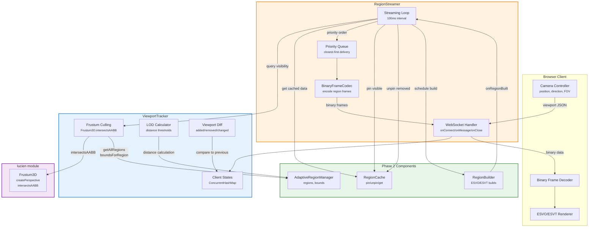

# Phase 3: Viewport Tracking & Client Streaming -- Detailed Architecture

**Date**: 2026-02-14
**Author**: java-architect-planner
**Status**: READY FOR AUDIT
**Predecessor**: Phase 2 complete (RegionBuilder, RegionCache, SerializationUtils)
**Architecture**: `simulation/doc/plans/GPU_RENDERING_SERVICE_ARCHITECTURE.md`
**Successor**: java-developer (Phase 3 implementation)

---

## 1. Executive Summary

Phase 3 adds per-client viewport tracking with frustum culling, LOD assignment, and
WebSocket region streaming to the GPU-Accelerated ESVO/ESVT Rendering Service. Clients
connect via WebSocket, send camera parameters, and receive priority-ordered binary frames
containing compressed ESVO/ESVT voxel data for only the regions visible in their frustum.

**Key Insight from Code Analysis**: The lucien module provides a proven `Frustum3D` class
with `createPerspective()` and `intersectsAABB()` methods that can be directly reused for
frustum culling against `RegionBounds` AABBs. No new geometry code is needed -- only a
thin adapter layer (ViewportTracker) that wires Frustum3D queries to RegionBounds AABBs
and adds LOD assignment and viewport diffing.

**Deliverables:**
1. `ViewportTracker` -- per-client frustum culling, LOD assignment, viewport diff
2. `RegionStreamer` -- Javalin WebSocket handler with binary frame protocol
3. `StreamingConfig` -- streaming configuration record (follows BuildConfig pattern)
4. `ClientViewport` -- camera parameters record
5. `protocol/BinaryFrameCodec` -- encode/decode binary region frames
6. `protocol/ProtocolConstants` -- magic numbers, format codes, version
7. Integration wiring into existing `RenderingServer`

**Code Reuse:**
- `Frustum3D.createPerspective()` + `intersectsAABB()` from lucien (direct import)
- `RegionCache.pin()` / `unpin()` / `get()` from Phase 2 (direct API call)
- `AdaptiveRegionManager.getAllRegions()` + `boundsForRegion()` from Phase 1
- `RegionBuilder.BuiltRegion.serializedData` for binary frame payloads
- `SerializationUtils.compress()` / `decompress()` for data verification
- Javalin WebSocket handler pattern from existing `/ws/render` stub

---

## 2. Component Overview

### 2.1 Architecture Diagram



### 2.2 Component Responsibilities

| Component | Responsibility | Thread Safety |
|-----------|---------------|---------------|
| `ViewportTracker` | Per-client viewport state, frustum culling, LOD, diff | ConcurrentHashMap + immutable records |
| `RegionStreamer` | WebSocket lifecycle, JSON/binary protocol, streaming loop | ConcurrentHashMap for sessions, ScheduledExecutor for loop |
| `StreamingConfig` | Configuration for LOD thresholds, intervals, limits | Immutable record |
| `ClientViewport` | Camera parameters (eye, direction, up, FOV, near, far) | Immutable record |
| `BinaryFrameCodec` | Encode/decode binary WebSocket frames | Stateless utility |
| `ProtocolConstants` | Magic numbers, format codes, protocol version | Static final constants |

### 2.3 Public API Summary

**ViewportTracker:**
```java
public class ViewportTracker {
    void registerClient(String clientId);
    void updateViewport(String clientId, ClientViewport viewport);
    void removeClient(String clientId);
    List<VisibleRegion> visibleRegions(String clientId);
    Set<RegionId> allVisibleRegions();
    ViewportDiff diffViewport(String clientId);
    int lodForDistance(float distance);
    int clientCount();
}
```

**RegionStreamer:**
```java
public class RegionStreamer implements AutoCloseable {
    void onConnect(WsContext ctx);
    void onMessage(WsContext ctx, String message);
    void onBinaryMessage(WsContext ctx, byte[] data, int offset, int length);
    void onClose(WsContext ctx, int statusCode, String reason);
    void onError(WsContext ctx, Throwable error);
    void onRegionBuilt(RegionId regionId, int lodLevel);
    void startStreaming();
    void stopStreaming();
    int connectedClientCount();
}
```

---

## 3. Data Types

### 3.1 ClientViewport

```java
package com.hellblazer.luciferase.simulation.viz.render;

/**
 * Camera parameters for a client viewport.
 *
 * <p>Defines the camera frustum for frustum culling and LOD determination.
 * Eye position and look-at point define the camera's position and orientation.
 * FOV, aspect ratio, near, and far define the frustum shape.
 *
 * <p>Thread-safe: immutable record.
 *
 * @param eyeX     Camera eye X position
 * @param eyeY     Camera eye Y position
 * @param eyeZ     Camera eye Z position
 * @param lookAtX  Look-at target X position
 * @param lookAtY  Look-at target Y position
 * @param lookAtZ  Look-at target Z position
 * @param upX      Up vector X component
 * @param upY      Up vector Y component
 * @param upZ      Up vector Z component
 * @param fovY     Vertical field of view in radians
 * @param aspectRatio Width / Height ratio
 * @param nearPlane Near clipping plane distance (positive)
 * @param farPlane  Far clipping plane distance (positive, > nearPlane)
 */
public record ClientViewport(
    float eyeX, float eyeY, float eyeZ,
    float lookAtX, float lookAtY, float lookAtZ,
    float upX, float upY, float upZ,
    float fovY, float aspectRatio,
    float nearPlane, float farPlane
) {
    /**
     * Compact constructor with validation.
     */
    public ClientViewport {
        if (nearPlane <= 0) throw new IllegalArgumentException("nearPlane must be positive");
        if (farPlane <= nearPlane) throw new IllegalArgumentException("farPlane must be > nearPlane");
        if (fovY <= 0 || fovY >= Math.PI) throw new IllegalArgumentException("fovY must be in (0, pi)");
        if (aspectRatio <= 0) throw new IllegalArgumentException("aspectRatio must be positive");
    }

    /**
     * Calculate distance from eye to a point.
     */
    public float distanceTo(float x, float y, float z) {
        var dx = x - eyeX;
        var dy = y - eyeY;
        var dz = z - eyeZ;
        return (float) Math.sqrt(dx * dx + dy * dy + dz * dz);
    }

    /**
     * Create default viewport for testing.
     * Camera at (512, 512, 100) looking at center (512, 512, 512).
     */
    public static ClientViewport testDefault() {
        return new ClientViewport(
            512f, 512f, 100f,    // eye at front of world
            512f, 512f, 512f,    // looking at center
            0f, 1f, 0f,          // Y-up
            (float)(Math.PI / 3), // 60 degree FOV
            16f / 9f,             // 16:9 aspect
            0.1f, 2000f           // near/far
        );
    }
}
```

### 3.2 VisibleRegion

```java
/**
 * A region visible to a client with LOD and distance metadata.
 *
 * <p>Implements Comparable for priority ordering (closest regions first).
 *
 * @param regionId Region identifier (Morton code + level)
 * @param lodLevel Level of detail (0 = highest, maxLod = lowest)
 * @param distance Distance from camera eye to region center
 */
public record VisibleRegion(
    RegionId regionId,
    int lodLevel,
    float distance
) implements Comparable<VisibleRegion> {

    @Override
    public int compareTo(VisibleRegion other) {
        return Float.compare(this.distance, other.distance);
    }
}
```

### 3.3 ViewportDiff

```java
/**
 * Difference between two viewport visibility computations.
 *
 * <p>Represents what changed since the last viewport query for a client:
 * regions that became visible, regions that left the frustum, and regions
 * whose LOD level changed due to camera movement.
 *
 * @param added      Regions newly visible (sorted closest-first)
 * @param removed    Regions no longer visible
 * @param lodChanged Regions with changed LOD level (sorted closest-first)
 */
public record ViewportDiff(
    List<VisibleRegion> added,
    List<RegionId> removed,
    List<VisibleRegion> lodChanged
) {
    /** Compact constructor with defensive copy. */
    public ViewportDiff {
        added = List.copyOf(added);
        removed = List.copyOf(removed);
        lodChanged = List.copyOf(lodChanged);
    }

    /** True if no regions changed. */
    public boolean isEmpty() {
        return added.isEmpty() && removed.isEmpty() && lodChanged.isEmpty();
    }

    /** Total number of changes. */
    public int changeCount() {
        return added.size() + removed.size() + lodChanged.size();
    }

    /** Empty diff (no changes). */
    public static ViewportDiff empty() {
        return new ViewportDiff(List.of(), List.of(), List.of());
    }
}
```

### 3.4 StreamingConfig

```java
/**
 * Configuration for viewport tracking and region streaming.
 *
 * <p>Follows the composition pattern used by BuildConfig and CacheConfig.
 *
 * <p><strong>LOD Threshold Scale Dependence:</strong> The {@code lodThresholds}
 * are specified in world coordinates and are scale-dependent. The default thresholds
 * [100, 300, 700] assume world coordinates in the range [0, 1024]. If the world scale
 * changes (e.g., to [0, 10240]), thresholds must be recalibrated proportionally
 * (e.g., [1000, 3000, 7000]).
 *
 * <p><strong>Future Enhancement (Phase 4):</strong> Logarithmic LOD calculation
 * ({@code floor(log2(distance/base))}) may replace threshold tables for
 * scale-independent behavior.
 *
 * @param streamingIntervalMs       Interval between streaming cycles (default 100ms = 10 FPS)
 * @param maxClientsPerServer       Maximum concurrent WebSocket clients (default 50)
 * @param maxPendingSendsPerClient  Backpressure threshold per client (default 50)
 * @param lodThresholds             Distance thresholds in world units (scale-dependent, ascending order)
 * @param maxLodLevel               Maximum LOD level (0 = highest detail)
 * @param clientTimeoutMs           Disconnect clients inactive for this duration (default 30s)
 * @param maxViewportUpdatesPerSecond Throttle viewport update frequency (default 30)
 */
public record StreamingConfig(
    long streamingIntervalMs,
    int maxClientsPerServer,
    int maxPendingSendsPerClient,
    float[] lodThresholds,
    int maxLodLevel,
    long clientTimeoutMs,
    int maxViewportUpdatesPerSecond
) {
    /** Compact constructor with validation and defensive copy. */
    public StreamingConfig {
        if (streamingIntervalMs < 16) throw new IllegalArgumentException("streamingIntervalMs must be >= 16");
        if (maxClientsPerServer < 1) throw new IllegalArgumentException("maxClientsPerServer must be >= 1");
        lodThresholds = lodThresholds.clone();
        for (int i = 1; i < lodThresholds.length; i++) {
            if (lodThresholds[i] <= lodThresholds[i - 1]) {
                throw new IllegalArgumentException("lodThresholds must be strictly ascending");
            }
        }
        if (maxLodLevel != lodThresholds.length) {
            throw new IllegalArgumentException("maxLodLevel must equal lodThresholds.length");
        }
    }

    /** Default production configuration. */
    public static StreamingConfig defaults() {
        return new StreamingConfig(
            100,                          // 100ms = 10 FPS streaming
            50,                           // 50 clients max
            50,                           // 50 pending sends before backpressure
            new float[]{100f, 300f, 700f}, // LOD distance thresholds
            3,                            // LOD 0-3
            30_000L,                      // 30s timeout
            30                            // 30 viewport updates/sec
        );
    }

    /** Test configuration with relaxed limits. */
    public static StreamingConfig testing() {
        return new StreamingConfig(
            50,                            // 50ms for faster test cycles
            10,                            // 10 clients
            20,                            // 20 pending sends
            new float[]{50f, 150f, 350f},  // Smaller thresholds for test world
            3,                             // LOD 0-3
            5_000L,                        // 5s timeout
            60                             // 60 updates/sec
        );
    }
}
```

### 3.5 RenderingServerConfig Modification

Add `StreamingConfig streaming` field:

```java
public record RenderingServerConfig(
    int port,
    List<UpstreamConfig> upstreams,
    int regionLevel,
    SecurityConfig security,
    CacheConfig cache,
    BuildConfig build,
    int maxEntitiesPerRegion,
    StreamingConfig streaming       // NEW: Phase 3 streaming configuration
) {
    // ... existing methods updated to include streaming parameter

    public static RenderingServerConfig testing() {
        return new RenderingServerConfig(
            0, List.of(), 2,
            SecurityConfig.permissive(),
            CacheConfig.testing(),
            BuildConfig.testing(),
            1_000,
            StreamingConfig.testing()    // NEW
        );
    }
}
```

**Backward Compatibility**: All existing call sites that construct `RenderingServerConfig`
must add the `StreamingConfig` parameter. The `testing()` and `defaults()` factory methods
provide defaults. All 14 existing tests will need their `RenderingServerConfig` constructors
updated to include `StreamingConfig.testing()` as the final argument.

---

## 4. Detailed Design: ViewportTracker

### 4.1 Class Structure

```java
package com.hellblazer.luciferase.simulation.viz.render;

import com.hellblazer.luciferase.lucien.Frustum3D;
import com.hellblazer.luciferase.lucien.Plane3D;
import javax.vecmath.Point3f;
import javax.vecmath.Vector3f;

/**
 * Tracks per-client viewports and determines visible regions with LOD levels.
 *
 * <p>Each connected client has a viewport (camera position, direction, FOV).
 * ViewportTracker constructs a Frustum3D from the client's camera parameters
 * and tests each active region's AABB for intersection. Visible regions are
 * assigned LOD levels based on distance from camera.
 *
 * <p>Reuses lucien's Frustum3D.createPerspective() and intersectsAABB() for
 * all geometric calculations. No new geometry code required.
 *
 * <p>Thread-safe: ConcurrentHashMap for client state, immutable records for results.
 */
public class ViewportTracker {

    private static final Logger log = LoggerFactory.getLogger(ViewportTracker.class);

    private final ConcurrentHashMap<String, ClientViewportState> clients;
    private final AdaptiveRegionManager regionManager;
    private final StreamingConfig config;

    // ---- Constructor ----

    public ViewportTracker(AdaptiveRegionManager regionManager, StreamingConfig config) {
        this.clients = new ConcurrentHashMap<>();
        this.regionManager = regionManager;
        this.config = config;
    }

    // ---- Fields ----

    // Per-client mutable state (replaced atomically via ConcurrentHashMap.put)
    private static class ClientViewportState {
        final String clientId;
        final ClientViewport viewport;          // null until first viewport update
        final Frustum3D frustum;                // null until first viewport update
        final List<VisibleRegion> lastVisible;  // empty until first query
        final long lastUpdateMs;                // timestamp of last viewport update

        // Constructor with all fields
        // ...
    }
}
```

### 4.2 Frustum Culling Algorithm

**Input**: ClientViewport (eye, lookAt, up, FOV, aspect, near, far)
**Output**: List<VisibleRegion> sorted by distance (closest first)

```java
/**
 * Compute visible regions for a client.
 *
 * <p>Algorithm:
 * <ol>
 *   <li>Construct Frustum3D from client's camera parameters</li>
 *   <li>For each active region in AdaptiveRegionManager:</li>
 *   <li>  Get RegionBounds (AABB)</li>
 *   <li>  Test frustum.intersectsAABB(min, max)</li>
 *   <li>  If visible: compute distance to region center, assign LOD</li>
 *   <li>Sort by distance (closest first)</li>
 * </ol>
 *
 * <p>Complexity: O(N) where N = number of active regions.
 * Each intersectsAABB test is O(1) (6 plane-vertex tests).
 *
 * @param clientId Client identifier
 * @return Visible regions sorted by distance, empty list if client has no viewport
 */
public List<VisibleRegion> visibleRegions(String clientId) {
    var state = clients.get(clientId);
    if (state == null || state.frustum == null) {
        return List.of();
    }

    var frustum = state.frustum;
    var viewport = state.viewport;
    var allRegions = regionManager.getAllRegions();
    var visible = new ArrayList<VisibleRegion>(allRegions.size() / 4); // Estimate 25% visibility

    for (var regionId : allRegions) {
        var bounds = regionManager.boundsForRegion(regionId);

        // Frustum-AABB intersection test (6 plane tests, O(1))
        if (frustum.intersectsAABB(bounds.minX(), bounds.minY(), bounds.minZ(),
                                   bounds.maxX(), bounds.maxY(), bounds.maxZ())) {
            // Compute distance from eye to region center
            float distance = viewport.distanceTo(
                bounds.centerX(), bounds.centerY(), bounds.centerZ());

            // Assign LOD based on distance
            int lod = lodForDistance(distance);

            visible.add(new VisibleRegion(regionId, lod, distance));
        }
    }

    // Sort by distance (closest first) for priority delivery
    visible.sort(null); // Uses VisibleRegion.compareTo (distance-based)

    // Update client state with new visible set
    var newState = new ClientViewportState(
        state.clientId, state.viewport, state.frustum,
        List.copyOf(visible), state.lastUpdateMs
    );
    clients.put(clientId, newState);

    return visible;
}
```

**Frustum Construction from ClientViewport:**

```java
/**
 * Update a client's viewport and reconstruct the frustum.
 *
 * <p>Constructs a Frustum3D using lucien's Frustum3D.createPerspective()
 * with the client's camera parameters. The frustum is cached in client state
 * and reused for all visibility queries until the next viewport update.
 */
public void updateViewport(String clientId, ClientViewport viewport) {
    // Construct lucien Frustum3D from camera parameters
    var eye = new Point3f(viewport.eyeX(), viewport.eyeY(), viewport.eyeZ());
    var lookAt = new Point3f(viewport.lookAtX(), viewport.lookAtY(), viewport.lookAtZ());
    var up = new Vector3f(viewport.upX(), viewport.upY(), viewport.upZ());

    var frustum = Frustum3D.createPerspective(
        eye, lookAt, up,
        viewport.fovY(), viewport.aspectRatio(),
        viewport.nearPlane(), viewport.farPlane()
    );

    var oldState = clients.get(clientId);
    var lastVisible = oldState != null ? oldState.lastVisible : List.<VisibleRegion>of();

    var newState = new ClientViewportState(
        clientId, viewport, frustum, lastVisible,
        clock.currentTimeMillis()
    );
    clients.put(clientId, newState);

    log.debug("Updated viewport for client {}: eye=({},{},{}), fov={}",
              clientId, viewport.eyeX(), viewport.eyeY(), viewport.eyeZ(), viewport.fovY());
}
```

### 4.3 LOD Calculation Algorithm

**Formula**: Threshold-based with configurable distance breakpoints.

```java
/**
 * Determine LOD level for a given distance from camera.
 *
 * <p>Uses configurable distance thresholds from StreamingConfig:
 * <pre>
 *   distance < lodThresholds[0]  -> LOD 0 (highest detail)
 *   distance < lodThresholds[1]  -> LOD 1
 *   distance < lodThresholds[2]  -> LOD 2
 *   distance >= lodThresholds[2] -> LOD 3 (lowest detail)
 * </pre>
 *
 * <p>Default thresholds: [100, 300, 700] world units.
 *
 * @param distance Distance from camera eye to region center
 * @return LOD level [0, maxLodLevel]
 */
public int lodForDistance(float distance) {
    var thresholds = config.lodThresholds();
    for (int i = 0; i < thresholds.length; i++) {
        if (distance < thresholds[i]) {
            return i;
        }
    }
    return config.maxLodLevel();
}
```

**LOD Table with Default Thresholds:**

| LOD | Distance Range | Detail Level | Typical Use |
|-----|---------------|--------------|-------------|
| 0 | < 100 | Highest | Close-up entities |
| 1 | 100 - 300 | High | Nearby regions |
| 2 | 300 - 700 | Medium | Mid-distance |
| 3 | >= 700 | Lowest | Far background |

### 4.4 Viewport Diff Algorithm

```java
/**
 * Compute the diff between current and previous visibility for a client.
 *
 * <p>Algorithm:
 * <ol>
 *   <li>Compute current visible regions (calls visibleRegions())</li>
 *   <li>Build lookup maps for old and new sets</li>
 *   <li>Added = in new set but NOT in old set</li>
 *   <li>Removed = in old set but NOT in new set</li>
 *   <li>LOD Changed = in BOTH sets but LOD differs</li>
 * </ol>
 *
 * <p>Complexity: O(N + M) where N = new visible count, M = old visible count.
 *
 * @param clientId Client identifier
 * @return ViewportDiff with added, removed, and LOD-changed regions
 */
public ViewportDiff diffViewport(String clientId) {
    var state = clients.get(clientId);
    if (state == null || state.frustum == null) {
        return ViewportDiff.empty();
    }

    var oldVisible = state.lastVisible;

    // Compute new visibility (also updates client state)
    var newVisible = visibleRegions(clientId);

    // Build lookup maps
    var oldMap = new HashMap<RegionId, VisibleRegion>(oldVisible.size());
    for (var vr : oldVisible) {
        oldMap.put(vr.regionId(), vr);
    }

    var newMap = new HashMap<RegionId, VisibleRegion>(newVisible.size());
    for (var vr : newVisible) {
        newMap.put(vr.regionId(), vr);
    }

    // Compute diff
    var added = new ArrayList<VisibleRegion>();
    var lodChanged = new ArrayList<VisibleRegion>();
    var removed = new ArrayList<RegionId>();

    // Find added and LOD-changed
    for (var vr : newVisible) {
        var old = oldMap.get(vr.regionId());
        if (old == null) {
            added.add(vr);
        } else if (old.lodLevel() != vr.lodLevel()) {
            lodChanged.add(vr);
        }
    }

    // Find removed
    for (var vr : oldVisible) {
        if (!newMap.containsKey(vr.regionId())) {
            removed.add(vr.regionId());
        }
    }

    // Sort added and LOD-changed by distance (closest first)
    added.sort(null);
    lodChanged.sort(null);

    return new ViewportDiff(added, removed, lodChanged);
}
```

### 4.5 Thread Safety Strategy

| Operation | Concurrency Mechanism | Guarantee |
|-----------|----------------------|-----------|
| Client registration/removal | `ConcurrentHashMap.put/remove` | Atomic key-level |
| Viewport update | `ConcurrentHashMap.put` (replace state) | Atomic per-client |
| Visible region query | Read from ConcurrentHashMap + iterate immutable region set | Snapshot consistency |
| Diff computation | Read + write client state | Eventually consistent (benign race: missed diff resolved next cycle) |
| allVisibleRegions() | Iterate all client states, merge visible sets | Snapshot (may miss concurrent updates) |

**No locks required.** All mutable per-client state is encapsulated in `ClientViewportState`
objects that are replaced atomically via `ConcurrentHashMap.put()`. The `lastVisible` list
within each state is an immutable `List.copyOf()` snapshot.

---

## 5. Detailed Design: RegionStreamer

### 5.1 Class Structure

```java
package com.hellblazer.luciferase.simulation.viz.render;

import io.javalin.websocket.WsContext;

/**
 * WebSocket handler for streaming ESVO/ESVT region data to clients.
 *
 * <p>Manages client connections, processes viewport updates via JSON messages,
 * and pushes binary WebSocket frames containing compressed voxel data.
 *
 * <p>Streaming Loop: Every streamingIntervalMs (default 100ms), the streaming
 * scheduler iterates all connected clients, computes viewport diffs, and sends
 * new/updated regions as binary frames in priority order (closest first).
 *
 * <p>Thread model:
 * <ul>
 *   <li>Javalin threads: handle onConnect/onMessage/onClose (WebSocket I/O)</li>
 *   <li>Streaming thread: ScheduledExecutorService, runs streaming loop</li>
 *   <li>Build callback thread: receives onRegionBuilt notifications</li>
 * </ul>
 *
 * <p>Thread-safe: ConcurrentHashMap for sessions, AtomicBoolean for state.
 */
public class RegionStreamer implements AutoCloseable {

    private static final Logger log = LoggerFactory.getLogger(RegionStreamer.class);

    // --- Dependencies ---
    private final ViewportTracker viewportTracker;
    private final RegionCache regionCache;
    private final AdaptiveRegionManager regionManager;
    private final StreamingConfig config;

    // --- Client Sessions ---
    private final ConcurrentHashMap<String, ClientSession> sessions;

    // --- Streaming State ---
    private final ScheduledExecutorService streamScheduler;
    private final AtomicBoolean streaming;

    // --- Clock ---
    private volatile Clock clock;

    // --- Constructor ---
    public RegionStreamer(
        ViewportTracker viewportTracker,
        RegionCache regionCache,
        AdaptiveRegionManager regionManager,
        StreamingConfig config
    ) { ... }
}
```

### 5.2 Client Session

```java
/**
 * Per-client WebSocket session state.
 *
 * <p>Mutable: uses AtomicLong and AtomicInteger for concurrent access from
 * Javalin I/O threads and the streaming scheduler thread.
 */
static class ClientSession {
    final String sessionId;
    final WsContext wsContext;
    volatile ClientSessionState state;
    volatile RegionBuilder.BuildType preferredFormat;
    final AtomicLong lastViewportUpdateMs;
    final AtomicLong lastActivityMs;
    final AtomicInteger pendingSends;

    // Regions that have been sent to this client (for diff tracking)
    final ConcurrentHashMap.KeySetView<RegionId, Boolean> sentRegions;

    // Protocol version negotiated during subscribe
    volatile int protocolVersion;

    ClientSession(String sessionId, WsContext wsContext, long currentTimeMs) {
        this.sessionId = sessionId;
        this.wsContext = wsContext;
        this.state = ClientSessionState.CONNECTED;
        this.preferredFormat = RegionBuilder.BuildType.ESVO;
        this.lastViewportUpdateMs = new AtomicLong(0);
        this.lastActivityMs = new AtomicLong(currentTimeMs);
        this.pendingSends = new AtomicInteger(0);
        this.sentRegions = ConcurrentHashMap.newKeySet();
        this.protocolVersion = 1;
    }
}

/**
 * Client session state machine.
 */
enum ClientSessionState {
    /** Connected but not yet subscribed. */
    CONNECTED,
    /** Subscribed (protocol negotiated) but no viewport received. */
    SUBSCRIBED,
    /** Viewport received, actively streaming regions. */
    STREAMING,
    /** Disconnecting (cleanup in progress). */
    DISCONNECTING
}
```

### 5.3 WebSocket Lifecycle Handlers

```java
/**
 * Handle new WebSocket connection.
 *
 * <p>Creates a ClientSession and registers with ViewportTracker.
 * Checks client limit from StreamingConfig.maxClientsPerServer.
 */
void onConnect(WsContext ctx) {
    var sessionId = ctx.sessionId();

    // Enforce client limit
    if (sessions.size() >= config.maxClientsPerServer()) {
        log.warn("Client limit reached ({}), rejecting connection {}",
                 config.maxClientsPerServer(), sessionId);
        ctx.closeSession(4001, "Server full");
        return;
    }

    var session = new ClientSession(sessionId, ctx, clock.currentTimeMillis());
    sessions.put(sessionId, session);
    viewportTracker.registerClient(sessionId);

    log.info("Client connected: {} (total: {})", sessionId, sessions.size());
}

/**
 * Handle incoming JSON message from client.
 *
 * <p>Dispatches based on "type" field:
 * <ul>
 *   <li>"subscribe" -> capability negotiation</li>
 *   <li>"viewport" -> viewport update</li>
 *   <li>"ping" -> respond with pong</li>
 * </ul>
 */
void onMessage(WsContext ctx, String message) {
    var sessionId = ctx.sessionId();
    var session = sessions.get(sessionId);
    if (session == null) return;

    session.lastActivityMs.set(clock.currentTimeMillis());

    try {
        var json = JSON_MAPPER.readTree(message);
        var type = json.get("type").asText();

        switch (type) {
            case "subscribe" -> handleSubscribe(session, json);
            case "viewport"  -> handleViewportUpdate(session, json);
            case "ping"      -> handlePing(session, json);
            default -> log.warn("Unknown message type '{}' from client {}", type, sessionId);
        }
    } catch (Exception e) {
        log.error("Failed to process message from client {}: {}", sessionId, e.getMessage());
    }
}

/**
 * Handle client disconnect.
 *
 * <p>Removes client from ViewportTracker, unpins all visible regions,
 * cleans up session state.
 */
void onClose(WsContext ctx, int statusCode, String reason) {
    var sessionId = ctx.sessionId();
    var session = sessions.remove(sessionId);

    if (session != null) {
        session.state = ClientSessionState.DISCONNECTING;

        // Unpin all regions that were sent to this client
        for (var regionId : session.sentRegions) {
            // Only unpin if no other client is viewing this region
            // Use authoritative ViewportTracker source instead of per-session check
            if (!viewportTracker.allVisibleRegions().contains(regionId)) {
                regionCache.unpin(new RegionCache.CacheKey(regionId, 0));
            }
        }

        viewportTracker.removeClient(sessionId);
        log.info("Client disconnected: {} (status: {}, reason: {})", sessionId, statusCode, reason);
    }
}
```

### 5.4 JSON Message Protocol

#### Client-to-Server Messages

**Subscribe (capability negotiation):**
```json
{
    "type": "subscribe",
    "protocolVersion": 1,
    "format": "esvo",
    "clientCapabilities": ["webgpu", "webgl2"]
}
```

**Viewport Update:**
```json
{
    "type": "viewport",
    "eye": [512.0, 512.0, 100.0],
    "lookAt": [512.0, 512.0, 512.0],
    "up": [0.0, 1.0, 0.0],
    "fov": 1.0472,
    "aspect": 1.7778,
    "near": 0.1,
    "far": 2000.0
}
```

**Ping:**
```json
{
    "type": "ping",
    "timestamp": 1707840000000
}
```

#### Server-to-Client Messages

**Capabilities Response:**
```json
{
    "type": "capabilities",
    "protocolVersion": 1,
    "formats": ["esvo", "esvt"],
    "maxLodLevel": 3,
    "regionLevel": 4,
    "lodThresholds": [100.0, 300.0, 700.0]
}
```

**Region Metadata (sent before each binary frame):**
```json
{
    "type": "region_meta",
    "regionId": {"mortonCode": 1234567890, "level": 4},
    "bounds": {"min": [0, 0, 0], "max": [64, 64, 64]},
    "lodLevel": 2,
    "buildVersion": 42,
    "dataSize": 8192
}
```

**Region Evict (notify client to discard cached region):**
```json
{
    "type": "region_evict",
    "regionId": {"mortonCode": 1234567890, "level": 4},
    "reason": "out_of_frustum"
}
```

**Pong:**
```json
{
    "type": "pong",
    "timestamp": 1707840000000,
    "serverTime": 1707840000005
}
```

### 5.5 Binary Frame Protocol

#### Frame Format

```
Offset  Size    Type    Field
0       4       uint32  Magic: 0x45535652 ("ESVR" in ASCII)
4       1       uint8   Format: 0x01 = ESVO, 0x02 = ESVT
5       1       uint8   LOD level (0-15)
6       2       uint16  Region level (octree depth)
8       8       int64   Region Morton code
16      4       uint32  Build version
20      4       uint32  Compressed data size (N)
24      N       bytes   Compressed ESVO/ESVT serialized data
```

**Total header size**: 24 bytes (aligned to 8-byte boundary)
**Byte order**: Little-endian (matches SerializationUtils convention)
**Maximum frame size**: 24 + 65536 bytes = ~64KB (configurable cap)

#### BinaryFrameCodec

```java
package com.hellblazer.luciferase.simulation.viz.render.protocol;

/**
 * Encodes and decodes binary WebSocket frames for ESVO/ESVT region data.
 *
 * <p>Stateless utility class. All methods are static.
 *
 * <p>Frame format: 24-byte header + N bytes compressed data.
 * See PHASE_3_VIEWPORT_STREAMING_ARCHITECTURE.md Section 5.5 for format specification.
 */
public final class BinaryFrameCodec {

    private BinaryFrameCodec() {} // Utility class

    /**
     * Encode a built region into a binary WebSocket frame.
     *
     * @param region Built region with serialized data
     * @param buildVersion Build version counter
     * @return ByteBuffer ready for sending (position=0, limit=total size)
     */
    public static ByteBuffer encode(RegionBuilder.BuiltRegion region, long buildVersion) {
        var data = region.serializedData();
        int totalSize = ProtocolConstants.FRAME_HEADER_SIZE + data.length;

        var buffer = ByteBuffer.allocate(totalSize);
        buffer.order(ByteOrder.LITTLE_ENDIAN);

        // Header
        buffer.putInt(ProtocolConstants.FRAME_MAGIC);
        buffer.put(formatCode(region.type()));
        buffer.put((byte) region.lodLevel());
        buffer.putShort((short) region.regionId().level());
        buffer.putLong(region.regionId().mortonCode());
        buffer.putInt((int) buildVersion);
        buffer.putInt(data.length);

        // Payload
        buffer.put(data);

        buffer.flip(); // Prepare for reading
        return buffer;
    }

    /**
     * Decode a binary WebSocket frame header.
     *
     * @param data Raw frame bytes
     * @return Decoded frame header, or null if frame is invalid
     */
    public static FrameHeader decodeHeader(byte[] data) {
        if (data.length < ProtocolConstants.FRAME_HEADER_SIZE) {
            return null;
        }

        var buffer = ByteBuffer.wrap(data);
        buffer.order(ByteOrder.LITTLE_ENDIAN);

        int magic = buffer.getInt();
        if (magic != ProtocolConstants.FRAME_MAGIC) {
            return null;
        }

        byte format = buffer.get();
        byte lodLevel = buffer.get();
        short regionLevel = buffer.getShort();
        long mortonCode = buffer.getLong();
        int buildVersion = buffer.getInt();
        int dataSize = buffer.getInt();

        return new FrameHeader(
            formatFromCode(format),
            lodLevel,
            new RegionId(mortonCode, regionLevel),
            buildVersion,
            dataSize
        );
    }

    /**
     * Extract payload data from a binary frame.
     *
     * @param data Raw frame bytes
     * @return Compressed region data (excludes header)
     */
    public static byte[] extractPayload(byte[] data) {
        if (data.length <= ProtocolConstants.FRAME_HEADER_SIZE) {
            return new byte[0];
        }
        int payloadSize = data.length - ProtocolConstants.FRAME_HEADER_SIZE;
        var payload = new byte[payloadSize];
        System.arraycopy(data, ProtocolConstants.FRAME_HEADER_SIZE, payload, 0, payloadSize);
        return payload;
    }

    private static byte formatCode(RegionBuilder.BuildType type) {
        return switch (type) {
            case ESVO -> ProtocolConstants.FORMAT_ESVO;
            case ESVT -> ProtocolConstants.FORMAT_ESVT;
        };
    }

    private static RegionBuilder.BuildType formatFromCode(byte code) {
        return switch (code) {
            case ProtocolConstants.FORMAT_ESVO -> RegionBuilder.BuildType.ESVO;
            case ProtocolConstants.FORMAT_ESVT -> RegionBuilder.BuildType.ESVT;
            default -> throw new IllegalArgumentException("Unknown format code: " + code);
        };
    }

    /**
     * Decoded binary frame header.
     */
    public record FrameHeader(
        RegionBuilder.BuildType format,
        int lodLevel,
        RegionId regionId,
        int buildVersion,
        int dataSize
    ) {}
}
```

#### ProtocolConstants

```java
package com.hellblazer.luciferase.simulation.viz.render.protocol;

/**
 * Protocol constants for the region streaming WebSocket protocol.
 */
public final class ProtocolConstants {

    private ProtocolConstants() {} // Utility class

    /** Protocol version. Increment on breaking changes. */
    public static final int PROTOCOL_VERSION = 1;

    /** Binary frame magic number: "ESVR" in ASCII (0x45535652). */
    public static final int FRAME_MAGIC = 0x45535652;

    /** Binary frame header size in bytes. */
    public static final int FRAME_HEADER_SIZE = 24;

    /** Format code: ESVO octree. */
    public static final byte FORMAT_ESVO = 0x01;

    /** Format code: ESVT tetree. */
    public static final byte FORMAT_ESVT = 0x02;

    /** Maximum binary frame payload size (64 KB). */
    public static final int MAX_PAYLOAD_SIZE = 65536;

    /** WebSocket close code: server full. */
    public static final int CLOSE_SERVER_FULL = 4001;

    /** WebSocket close code: protocol error. */
    public static final int CLOSE_PROTOCOL_ERROR = 4002;

    /** WebSocket close code: client timeout. */
    public static final int CLOSE_CLIENT_TIMEOUT = 4003;
}
```

### 5.6 Streaming Loop Algorithm

```java
/**
 * Start the streaming scheduler.
 *
 * <p>Runs a streaming cycle every streamingIntervalMs (default 100ms).
 * Each cycle iterates all connected clients, computes viewport diffs,
 * and sends new/updated regions as binary frames.
 */
public void startStreaming() {
    if (!streaming.compareAndSet(false, true)) {
        log.warn("Streaming already started");
        return;
    }

    streamScheduler.scheduleAtFixedRate(
        this::streamingCycle,
        config.streamingIntervalMs(),
        config.streamingIntervalMs(),
        TimeUnit.MILLISECONDS
    );

    log.info("Region streaming started (interval: {}ms)", config.streamingIntervalMs());
}

/**
 * Single streaming cycle: process all clients.
 *
 * <p>Algorithm per client:
 * <ol>
 *   <li>Skip if client state is not STREAMING</li>
 *   <li>Skip if client has too many pending sends (backpressure)</li>
 *   <li>Compute viewport diff (added/removed/LOD-changed)</li>
 *   <li>Send region_evict JSON for removed regions</li>
 *   <li>Unpin removed regions (if no other client views them)</li>
 *   <li>For added/LOD-changed regions (closest first):
 *       <ul>
 *         <li>Pin region in cache</li>
 *         <li>Get cached region data</li>
 *         <li>If cached: send region_meta JSON + binary frame</li>
 *         <li>If not cached: trigger build (sent on callback)</li>
 *       </ul>
 *   </li>
 *   <li>Check client timeout</li>
 * </ol>
 */
private void streamingCycle() {
    try {
        for (var session : sessions.values()) {
            if (session.state != ClientSessionState.STREAMING) {
                continue;
            }

            // Backpressure: skip if too many pending sends
            if (session.pendingSends.get() >= config.maxPendingSendsPerClient()) {
                log.debug("Backpressure: skipping client {} ({} pending sends)",
                          session.sessionId, session.pendingSends.get());
                continue;
            }

            // Check client timeout
            long inactiveMs = clock.currentTimeMillis() - session.lastActivityMs.get();
            if (inactiveMs > config.clientTimeoutMs()) {
                log.warn("Client {} timed out (inactive {}ms)", session.sessionId, inactiveMs);
                session.wsContext.closeSession(ProtocolConstants.CLOSE_CLIENT_TIMEOUT, "Timeout");
                continue;
            }

            // Compute viewport diff
            var diff = viewportTracker.diffViewport(session.sessionId);
            if (diff.isEmpty()) {
                continue; // No changes, skip this client
            }

            // Process removed regions
            for (var removedId : diff.removed()) {
                sendRegionEvict(session, removedId, "out_of_frustum");
                session.sentRegions.remove(removedId);

                // Unpin if no other client is viewing
                // Use authoritative ViewportTracker source instead of per-session check
                if (!viewportTracker.allVisibleRegions().contains(removedId)) {
                    regionCache.unpin(new RegionCache.CacheKey(removedId, 0));
                }
            }

            // Process added and LOD-changed regions (closest first)
            var toSend = new ArrayList<VisibleRegion>(diff.added().size() + diff.lodChanged().size());
            toSend.addAll(diff.added());
            toSend.addAll(diff.lodChanged());
            toSend.sort(null); // Sort by distance

            for (var visible : toSend) {
                var cacheKey = new RegionCache.CacheKey(visible.regionId(), visible.lodLevel());

                // Pin in cache
                regionCache.pin(cacheKey);

                // Try to get cached data
                var cached = regionCache.get(cacheKey);
                if (cached.isPresent()) {
                    sendRegionData(session, cached.get().builtRegion(), visible);
                    session.sentRegions.add(visible.regionId());
                } else {
                    // Trigger build -- region will be sent via onRegionBuilt callback
                    regionManager.scheduleBuild(visible.regionId(), true);
                }
            }
        }
    } catch (Exception e) {
        log.error("Error in streaming cycle", e);
    }
}
```

### 5.7 Backpressure Strategy

| Condition | Action | Threshold |
|-----------|--------|-----------|
| Pending sends > maxPendingSendsPerClient | Skip streaming cycle for client | 50 (default) |
| Client count > maxClientsPerServer | Reject new connection (4001) | 50 (default) |
| Client inactive > clientTimeoutMs | Disconnect client (4003) | 30s (default) |
| Viewport updates > maxViewportUpdatesPerSecond | Throttle (drop intermediate updates) | 30/sec (default) |

**Thread-Safe Send Wrappers:**

WsContext.send() is not thread-safe. Synchronize all sends per session to prevent frame interleaving between streaming loop thread and build callback thread.

```java
private void sendSafe(ClientSession session, String json) {
    synchronized (session.wsContext) {
        session.wsContext.send(json);
    }
}

private void sendSafe(ClientSession session, ByteBuffer binary) {
    synchronized (session.wsContext) {
        session.wsContext.send(binary);
    }
}
```

**Pending Send Tracking:**
```java
private void sendRegionData(ClientSession session, RegionBuilder.BuiltRegion region,
                             VisibleRegion visible) {
    // Send metadata JSON first
    var meta = buildRegionMeta(region, visible);
    sendSafe(session, meta);

    // Send binary frame
    var frame = BinaryFrameCodec.encode(region, /* buildVersion */ 0);
    session.pendingSends.incrementAndGet();

    // Use synchronized send to prevent frame corruption
    sendSafe(session, frame);
    session.pendingSends.decrementAndGet();
}
```

---

## 6. Integration

### 6.1 RenderingServer Modifications

#### Constructor Changes

No constructor changes. Phase 3 components are created in `start()`.

#### start() Modifications

```java
public void start() {
    if (!started.compareAndSet(false, true)) {
        throw new IllegalStateException("RenderingServer already started");
    }

    log.info("Starting RenderingServer");

    // Phase 2 components (unchanged)
    var ttl = Duration.ofMillis(30_000L);
    regionBuilder = new RegionBuilder(config.build());
    regionBuilder.setClock(clock);
    regionCache = new RegionCache(config.cache().maxCacheMemoryBytes(), ttl);
    regionManager.setBuilder(regionBuilder);
    regionManager.setCache(regionCache);
    regionManager.backfillDirtyRegions();

    // -- Phase 3 components (NEW) --
    viewportTracker = new ViewportTracker(regionManager, config.streaming());
    viewportTracker.setClock(clock);

    regionStreamer = new RegionStreamer(viewportTracker, regionCache, regionManager, config.streaming());
    regionStreamer.setClock(clock);

    // ... existing backfill, rate limiter, endpoint cache setup ...

    app = Javalin.create(javalinConfig -> { /* unchanged */ });

    // REST endpoints (unchanged)
    app.get("/api/health", this::handleHealth);
    app.get("/api/info", this::handleInfo);
    app.get("/api/metrics", this::handleMetrics);

    // WebSocket endpoint -- REPLACED Phase 1 stub with RegionStreamer
    app.ws("/ws/render", ws -> {
        ws.onConnect(ctx -> regionStreamer.onConnect(ctx));
        ws.onMessage(ctx -> regionStreamer.onMessage(ctx, ctx.message()));
        ws.onClose(ctx -> regionStreamer.onClose(ctx, ctx.status(), ctx.reason()));
        ws.onError(ctx -> regionStreamer.onError(ctx));
    });

    app.start(config.port());
    startTimeMs = clock.currentTimeMillis();
    entityConsumer.start();

    // Start streaming loop (Phase 3)
    regionStreamer.startStreaming();

    log.info("RenderingServer started on port {} with streaming enabled", port());
}
```

#### stop() Modifications

```java
public void stop() {
    if (!started.compareAndSet(true, false)) {
        log.warn("RenderingServer not started, ignoring stop()");
        return;
    }

    log.info("Stopping RenderingServer");

    // Stop streaming first (Phase 3)
    if (regionStreamer != null) {
        regionStreamer.stopStreaming();
        regionStreamer.close();
        regionStreamer = null;
    }

    // ... existing shutdown sequence ...
}
```

#### setClock() Modification

```java
public void setClock(Clock clock) {
    this.clock = clock;
    this.regionManager.setClock(clock);
    this.entityConsumer.setClock(clock);
    if (regionBuilder != null) regionBuilder.setClock(clock);
    if (viewportTracker != null) viewportTracker.setClock(clock);   // NEW
    if (regionStreamer != null) regionStreamer.setClock(clock);      // NEW
}
```

#### New Fields

```java
// Phase 3 components
private ViewportTracker viewportTracker;
private RegionStreamer regionStreamer;
```

#### New Accessor Methods

```java
/** Get the viewport tracker (Phase 3). */
public ViewportTracker getViewportTracker() {
    return viewportTracker;
}

/** Get the region streamer (Phase 3). */
public RegionStreamer getRegionStreamer() {
    return regionStreamer;
}
```

### 6.2 RegionCache Integration

The existing `RegionCache` API is sufficient for Phase 3. No modifications needed.

**Used APIs:**
- `pin(CacheKey)` -- pin visible regions to prevent eviction
- `unpin(CacheKey)` -- unpin regions leaving frustum
- `get(CacheKey)` -- retrieve cached region data for streaming
- `put(CacheKey, CachedRegion)` -- (called by RegionBuilder completion callback)

**No new methods required.** The hybrid Caffeine/ConcurrentHashMap design handles
pinned (visible) and unpinned (invisible) regions correctly.

### 6.3 AdaptiveRegionManager Integration

**Used APIs (existing, no modifications):**
- `getAllRegions()` -- iterate all active regions for frustum culling
- `boundsForRegion(RegionId)` -- get AABB for frustum-AABB intersection test
- `scheduleBuild(RegionId, boolean)` -- trigger build for uncached visible regions
- `getRegionState(RegionId)` -- get build version for region metadata

**No new methods required.** The existing query interface provides everything ViewportTracker
and RegionStreamer need.

### 6.4 RegionBuilder Integration

**Completion Callback:**

When a region build completes, the build callback in `AdaptiveRegionManager.scheduleBuild()`
caches the result. The streaming loop's next cycle detects the newly cached region via
`regionCache.get()` and sends it to the appropriate clients.

**Alternative (event-driven push):** Wire `RegionStreamer.onRegionBuilt()` directly from the
build completion callback for immediate delivery without waiting for the next streaming cycle.

```java
// In AdaptiveRegionManager.scheduleBuild() completion callback:
builder.build(request).whenComplete((builtRegion, error) -> {
    if (error == null) {
        // Cache the built region (existing)
        var cachedRegion = RegionCache.CachedRegion.from(builtRegion, clock.currentTimeMillis());
        cache.put(new RegionCache.CacheKey(region, 0), cachedRegion);

        // Notify streamer for immediate delivery (NEW, Phase 3)
        if (regionStreamer != null) {
            regionStreamer.onRegionBuilt(region, builtRegion.lodLevel());
        }
    }
});
```

This requires adding a `setRegionStreamer(RegionStreamer)` setter to `AdaptiveRegionManager`,
following the existing `setBuilder()` / `setCache()` pattern.

---

## 7. Data Flow Diagrams

### 7.1 Client Connection Flow

```
Client                     RegionStreamer            ViewportTracker       Cache
  |                             |                         |                  |
  |-- WS connect -------------->|                         |                  |
  |                             |-- registerClient() ---->|                  |
  |                             |                         |                  |
  |-- subscribe(esvo, v1) ----->|                         |                  |
  |<-- capabilities(v1, ...) ---|                         |                  |
  |                             |  state = SUBSCRIBED     |                  |
  |                             |                         |                  |
  |-- viewport(eye,dir,fov) --->|                         |                  |
  |                             |-- updateViewport() ---->|                  |
  |                             |  state = STREAMING      |                  |
  |                             |                         |                  |
  |  -- streaming cycle --      |                         |                  |
  |                             |-- diffViewport() ------>|                  |
  |                             |<-- added:[R1,R2,R3] ----|                  |
  |                             |-- pin(R1) ---------------------------------|
  |                             |-- get(R1) ---------------------------------|
  |                             |<-- cached(R1 data) ------------------------|
  |<-- region_meta(R1) --------|                         |                  |
  |<-- binary(R1 frame) -------|                         |                  |
  |                             |-- get(R2) ---------------------------------|
  |                             |<-- miss -----------------------------------|
  |                             |-- scheduleBuild(R2) -->|                  |
  |                             |                         |                  |
```

### 7.2 Viewport Update Flow

```
Client                     RegionStreamer            ViewportTracker
  |                             |                         |
  |-- viewport(new_eye) ------->|                         |
  |                             |-- updateViewport() ---->|
  |                             |   (frustum rebuilt)     |
  |                             |                         |
  |  -- next streaming cycle -- |                         |
  |                             |-- diffViewport() ------>|
  |                             |<-- ViewportDiff --------|
  |                             |   added: [R5,R6]        |
  |                             |   removed: [R1,R2]      |
  |                             |   lodChanged: [R3->LOD1] |
  |                             |                         |
  |<-- region_evict(R1) -------|                         |
  |<-- region_evict(R2) -------|                         |
  |<-- region_meta(R5) --------|                         |
  |<-- binary(R5 frame) -------|                         |
  |<-- region_meta(R3,LOD1) ---|                         |
  |<-- binary(R3 frame) -------|                         |
```

---

## 8. Testing Strategy

### 8.1 ViewportTrackerTest

```java
/**
 * Unit tests for ViewportTracker.
 *
 * <p>Tests frustum culling, LOD assignment, viewport diff, and concurrent access.
 * Uses AdaptiveRegionManager with known region positions and a fixed frustum.
 */
class ViewportTrackerTest {

    // === Frustum Culling Tests ===

    @Test
    void testVisibleRegions_cameraLookingAtCenter() {
        // Setup: camera at (512,512,100) looking at (512,512,512)
        // Expected: regions in front of camera are visible, regions behind are not
        // Verify: at least some regions visible, regions behind camera excluded
    }

    @Test
    void testVisibleRegions_allRegionsInFrustum() {
        // Setup: wide FOV, close near, far far plane
        // Expected: all active regions are visible
    }

    @Test
    void testVisibleRegions_noRegionsInFrustum() {
        // Setup: camera looking away from all regions
        // Expected: empty visible list
    }

    @Test
    void testVisibleRegions_partialVisibility() {
        // Setup: camera with narrow FOV at known position
        // Place regions at known positions (some in, some out)
        // Expected: only in-frustum regions returned
    }

    @Test
    void testVisibleRegions_sortedByDistance() {
        // Verify: returned list is sorted closest-first
    }

    // === LOD Tests ===

    @Test
    void testLodForDistance_closestRegion() {
        // distance = 50 -> LOD 0
    }

    @Test
    void testLodForDistance_midRange() {
        // distance = 200 -> LOD 1
    }

    @Test
    void testLodForDistance_farRange() {
        // distance = 500 -> LOD 2
    }

    @Test
    void testLodForDistance_farthest() {
        // distance = 1000 -> LOD 3 (maxLodLevel)
    }

    @Test
    void testLodForDistance_exactThreshold() {
        // distance = exactly 100 -> LOD 1 (threshold is exclusive)
    }

    // === Viewport Diff Tests ===

    @Test
    void testDiffViewport_firstViewport() {
        // First diff: all visible regions are "added", none removed
    }

    @Test
    void testDiffViewport_cameraMove_addAndRemove() {
        // Setup: update viewport, move camera
        // Expected: regions entering frustum in "added", leaving in "removed"
    }

    @Test
    void testDiffViewport_cameraZoom_lodChange() {
        // Setup: move camera closer, same direction
        // Expected: some regions change LOD (appear in lodChanged)
    }

    @Test
    void testDiffViewport_noChange() {
        // Setup: same viewport, same regions
        // Expected: empty diff
    }

    // === Concurrent Access Tests ===

    @Test
    void testConcurrentClientRegistration() {
        // Register and query multiple clients concurrently
    }

    // === Client Management ===

    @Test
    void testRegisterAndRemoveClient() {
        // Register, update viewport, query, remove, verify empty
    }

    @Test
    void testAllVisibleRegions_multipleClients() {
        // Two clients with different viewports
        // allVisibleRegions() returns union
    }
}
```

### 8.2 RegionStreamerTest

```java
/**
 * Unit tests for RegionStreamer.
 *
 * <p>Uses mock WsContext objects to simulate WebSocket clients.
 * Tests JSON message handling, binary frame encoding, and streaming lifecycle.
 */
class RegionStreamerTest {

    // === Protocol Tests ===

    @Test
    void testSubscribeMessage_validESVO() {
        // Send subscribe JSON, verify capabilities response
    }

    @Test
    void testSubscribeMessage_validESVT() {
        // Send subscribe with format=esvt, verify format accepted
    }

    @Test
    void testViewportUpdate_transitionsToStreaming() {
        // Subscribe, then send viewport, verify state = STREAMING
    }

    @Test
    void testPingPong() {
        // Send ping, verify pong with server timestamp
    }

    @Test
    void testUnknownMessageType_ignored() {
        // Send unknown type, verify no crash, warning logged
    }

    // === Connection Management ===

    @Test
    void testMaxClientsEnforced() {
        // Connect maxClients+1, verify last rejected with 4001
    }

    @Test
    void testClientDisconnect_cleansUpState() {
        // Connect, subscribe, disconnect, verify session removed
    }

    @Test
    void testClientTimeout_disconnected() {
        // Connect, subscribe, advance clock past timeout, verify disconnected
    }

    // === Streaming Tests ===

    @Test
    void testStreamingCycle_sendsVisibleRegions() {
        // Setup: client with viewport, cached regions
        // Trigger streaming cycle
        // Verify: binary frames sent for visible regions
    }

    @Test
    void testStreamingCycle_evictsRemovedRegions() {
        // Setup: client with old viewport, move camera
        // Trigger streaming cycle
        // Verify: region_evict JSON sent for removed regions
    }

    @Test
    void testBackpressure_skipsOverloadedClient() {
        // Setup: client with maxPendingSends reached
        // Trigger streaming cycle
        // Verify: no new sends to that client
    }

    // === Region Build Notification ===

    @Test
    void testOnRegionBuilt_sendsToViewingClients() {
        // Setup: client viewing region R1, R1 build completes
        // Verify: binary frame sent to that client
    }
}
```

### 8.3 BinaryFrameCodecTest

```java
/**
 * Unit tests for binary frame encode/decode.
 */
class BinaryFrameCodecTest {

    @Test
    void testRoundtrip_ESVO() {
        // Encode ESVO region, decode header, verify all fields match
    }

    @Test
    void testRoundtrip_ESVT() {
        // Encode ESVT region, decode header, verify all fields match
    }

    @Test
    void testMagicNumber() {
        // Verify first 4 bytes are 0x45535652
    }

    @Test
    void testPayloadExtraction() {
        // Encode region, extract payload, verify matches original data
    }

    @Test
    void testInvalidMagic_returnsNull() {
        // Corrupt magic bytes, verify decodeHeader returns null
    }

    @Test
    void testTruncatedFrame_returnsNull() {
        // Frame shorter than FRAME_HEADER_SIZE, verify decodeHeader returns null
    }

    @Test
    void testByteOrder_littleEndian() {
        // Verify little-endian encoding matches expected byte layout
    }
}
```

### 8.4 EndToEndStreamingTest

```java
/**
 * Integration test: WebSocket client connects, subscribes, sends viewport,
 * receives binary region frames.
 *
 * <p>Uses real RenderingServer with dynamic port.
 * Populates regions via AdaptiveRegionManager.updateEntity().
 */
class EndToEndStreamingTest {

    @Test
    void testFullStreamingFlow() {
        // 1. Start RenderingServer with test config
        // 2. Add entities to regions
        // 3. Wait for builds to complete
        // 4. Connect WebSocket client
        // 5. Send subscribe message
        // 6. Verify capabilities response
        // 7. Send viewport update
        // 8. Verify region_meta JSON received
        // 9. Verify binary frame received (decode header, verify magic)
        // 10. Disconnect
    }

    @Test
    void testMultipleClients_independentViewports() {
        // Two clients with different viewports receive different regions
    }

    @Test
    void testViewportUpdate_regionDiffStreamed() {
        // Connect, send viewport, receive regions
        // Update viewport (move camera)
        // Verify: region_evict for removed, new binary frames for added
    }
}
```

### 8.5 Exit Criteria Mapping

| Exit Criterion | Test | Verification |
|---------------|------|-------------|
| Frustum culling correctly identifies visible regions | ViewportTrackerTest::testVisibleRegions_* | Known positions, expected visibility |
| LOD levels match expected values | ViewportTrackerTest::testLodForDistance_* | Exact threshold testing |
| ViewportDiff identifies added/removed on camera move | ViewportTrackerTest::testDiffViewport_* | Before/after comparison |
| Binary frames serialize/deserialize correctly | BinaryFrameCodecTest::testRoundtrip_* | Encode-decode roundtrip |
| Region pinning prevents eviction | EndToEndStreamingTest + RegionCacheTest | Visible region not evicted under pressure |

---

## 9. Implementation Sequence

### 9.1 Build Order

```
Step 1: Data Types (no dependencies)
  |
  |-- ClientViewport.java           (record, standalone)
  |-- VisibleRegion.java            (record, depends on RegionId)
  |-- ViewportDiff.java             (record, depends on VisibleRegion, RegionId)
  |-- StreamingConfig.java          (record, standalone)
  |-- protocol/ProtocolConstants.java (constants, standalone)
  |
Step 2: RenderingServerConfig modification
  |
  |-- Add StreamingConfig field to RenderingServerConfig
  |-- Update testing(), defaults() factories
  |-- Update all 14 existing test call sites
  |-- Verify all existing tests still pass
  |
Step 3: BinaryFrameCodec (depends on Step 1)
  |
  |-- protocol/BinaryFrameCodec.java (utility, depends on RegionBuilder.BuiltRegion)
  |-- BinaryFrameCodecTest.java     (unit tests)
  |
Step 4: ViewportTracker (depends on Steps 1-2)
  |
  |-- ViewportTracker.java          (core logic, depends on Frustum3D, AdaptiveRegionManager)
  |-- ViewportTrackerTest.java      (unit tests with mock regions)
  |
Step 5: RegionStreamer (depends on Steps 1-4)
  |
  |-- RegionStreamer.java           (WebSocket handler, depends on ViewportTracker, RegionCache)
  |-- RegionStreamerTest.java       (unit tests with mock WsContext)
  |
Step 6: Integration (depends on Steps 1-5)
  |
  |-- Modify RenderingServer.start/stop/setClock
  |-- Wire /ws/render to RegionStreamer
  |-- Add setRegionStreamer() to AdaptiveRegionManager
  |-- EndToEndStreamingTest.java    (integration test)
  |
Step 7: Verification
  |
  |-- Run full test suite: mvn test -pl simulation
  |-- Verify all Phase 1 and Phase 2 tests still pass
  |-- Verify all Phase 3 exit criteria met
```

### 9.2 Testability Checkpoints

| After Step | Checkpoint | Command |
|-----------|------------|---------|
| Step 1 | All records compile | `mvn compile -pl simulation` |
| Step 2 | All existing tests pass with new config | `mvn test -pl simulation` |
| Step 3 | BinaryFrameCodecTest passes | `mvn test -pl simulation -Dtest=BinaryFrameCodecTest` |
| Step 4 | ViewportTrackerTest passes | `mvn test -pl simulation -Dtest=ViewportTrackerTest` |
| Step 5 | RegionStreamerTest passes | `mvn test -pl simulation -Dtest=RegionStreamerTest` |
| Step 6 | EndToEndStreamingTest passes | `mvn test -pl simulation -Dtest=EndToEndStreamingTest` |
| Step 7 | Full module test suite passes | `mvn test -pl simulation` |

### 9.3 Critical Dependencies

| Component | Depends On | Risk |
|-----------|-----------|------|
| ViewportTracker | `Frustum3D.createPerspective()` | Low: proven API, well-tested |
| ViewportTracker | `Frustum3D.intersectsAABB()` | Low: proven API, used by DSOC |
| ViewportTracker | `AdaptiveRegionManager.getAllRegions()` | None: existing API |
| RegionStreamer | Javalin `WsContext` API | Low: same pattern as existing servers |
| RegionStreamer | `RegionCache.pin/unpin/get` | None: existing API |
| BinaryFrameCodec | `ByteBuffer` | None: standard library |
| Integration | RenderingServer lifecycle | Medium: must not break existing tests |

---

## 10. Risk Assessment

| Risk | Severity | Likelihood | Mitigation |
|------|----------|------------|------------|
| Frustum3D positive-coordinates constraint | High | Medium | World coordinates are 0-1024 (all positive). Verify in test. |
| RenderingServerConfig modification breaks existing tests | Medium | High | Step 2 explicitly updates all 14 test call sites before proceeding. |
| Streaming loop latency exceeds 100ms with 50 clients | Medium | Low | O(N_regions) per client is fast (~1ms for 4096 regions). Profile if needed. |
| Javalin WsContext send() blocks on slow clients | Medium | Medium | Backpressure via pendingSends counter. Consider async send if available. |
| ViewportTracker diff misses concurrent region changes | Low | Medium | Benign: missed changes delivered in next cycle (100ms delay). |
| Binary frame exceeds WebSocket maximum message size | Low | Low | MAX_PAYLOAD_SIZE cap (64KB). Browser default is usually 64MB. |
| Multiple clients viewing same region: double-pin/unpin | Low | Medium | pin() is idempotent; unpin() uses viewportTracker.allVisibleRegions() (authoritative source). |

---

## 11. File Layout

### 11.1 New Files (Phase 3)

```
simulation/src/main/java/com/hellblazer/luciferase/simulation/viz/render/
    ClientViewport.java               -- Camera parameters record
    VisibleRegion.java                -- Visible region with LOD and distance
    ViewportDiff.java                 -- Diff result record
    StreamingConfig.java              -- Streaming configuration record
    ViewportTracker.java              -- Per-client viewport tracking and frustum culling
    RegionStreamer.java               -- WebSocket handler and streaming loop
    protocol/
        ProtocolConstants.java        -- Magic numbers, format codes, protocol version
        BinaryFrameCodec.java         -- Encode/decode binary WebSocket frames

simulation/src/test/java/com/hellblazer/luciferase/simulation/viz/render/
    ClientViewportTest.java           -- Record validation tests
    ViewportTrackerTest.java          -- Frustum culling, LOD, diff tests
    RegionStreamerTest.java           -- Protocol and streaming tests
    EndToEndStreamingTest.java        -- Full WebSocket integration test
    protocol/
        BinaryFrameCodecTest.java     -- Binary frame roundtrip tests
```

### 11.2 Modified Files (Phase 3)

```
RenderingServerConfig.java           -- Add StreamingConfig field
RenderingServer.java                 -- Wire Phase 3 components, replace WS stub
AdaptiveRegionManager.java           -- Add setRegionStreamer() for build notifications

simulation/src/test/java/.../
    RenderingServerTest.java          -- Update config constructors
    RenderingServerIntegrationTest.java -- Update config constructors
    RenderingServerConfigTest.java    -- Update config constructors
    AdaptiveRegionManagerTest.java    -- Update config constructors
    RegionCacheTest.java              -- Update config constructors (if needed)
    RegionBuilderTest.java            -- Update config constructors (if needed)
    BuildIntegrationTest.java         -- Update config constructors (if needed)
    RateLimiterTest.java              -- Update config constructors (if needed)
    EntityStreamConsumerTest.java     -- Update config constructors (if needed)
    SerializationUtilsTest.java       -- No changes expected
    RegionIdTest.java                 -- No changes expected
    RegionBoundsTest.java             -- No changes expected
```

---

## 12. Metrics and Success Criteria

### 12.1 Functional Success

- [ ] Clients connect via WebSocket and negotiate capabilities
- [ ] Viewport updates trigger frustum-based visibility computation
- [ ] Binary frames containing valid ESVO/ESVT data are received by clients
- [ ] Region evict messages are sent when regions leave the frustum
- [ ] Multiple clients receive independent visible region sets

### 12.2 Performance Targets

| Metric | Target | Measurement Method |
|--------|--------|--------------------|
| Frustum cull 4096 regions | < 1ms | ViewportTrackerTest with timing |
| Viewport diff computation | < 0.5ms | ViewportTrackerTest with timing |
| Binary frame encode | < 0.1ms | BinaryFrameCodecTest with timing |
| Streaming cycle (10 clients, 100 regions each) | < 10ms | EndToEndStreamingTest |
| Client connect to first region received | < 500ms | EndToEndStreamingTest |

### 12.3 Quality Gates

- [ ] All Phase 1 tests pass (no regression)
- [ ] All Phase 2 tests pass (no regression)
- [ ] All Phase 3 tests pass
- [ ] No `synchronized` blocks
- [ ] Clock injection for all time-dependent code
- [ ] Dynamic ports in all tests (port 0)
- [ ] SLF4J logging with `{}` placeholders

---

## Appendix A: Frustum3D API Reference

The ViewportTracker reuses the following proven APIs from `com.hellblazer.luciferase.lucien.Frustum3D`:

```java
// Construct perspective frustum from camera parameters
public static Frustum3D createPerspective(
    Point3f cameraPosition,    // eye position
    Point3f lookAt,            // target point
    Vector3f up,               // up vector
    float fovy,                // vertical FOV (radians)
    float aspectRatio,         // width / height
    float nearDistance,        // near plane distance
    float farDistance           // far plane distance
);

// Test if AABB intersects frustum (separating axis theorem)
public boolean intersectsAABB(
    float minX, float minY, float minZ,
    float maxX, float maxY, float maxZ
);

// Test if AABB is completely inside frustum
public boolean containsAABB(
    float minX, float minY, float minZ,
    float maxX, float maxY, float maxZ
);
```

**Constraint**: All AABB coordinates must be positive (enforced by IllegalArgumentException).
This is satisfied because the world coordinate range is [0, 1024].

---

## Appendix B: Existing Test Patterns to Follow

### B.1 Dynamic Port Pattern (from RenderingServerTest)
```java
var config = RenderingServerConfig.testing();  // port = 0
server = new RenderingServer(config);
server.start();
int port = server.port();  // Assigned dynamically
```

### B.2 Clock Injection Pattern (from RenderingServerTest)
```java
var testClock = new TestClock();
testClock.setTime(1000L);
server.setClock(testClock);
```

### B.3 WebSocket Client Pattern (from RenderingServerTest)
```java
var client = HttpClient.newHttpClient();
var ws = client.newWebSocketBuilder()
    .buildAsync(URI.create("ws://localhost:" + port + "/ws/render"),
        new WebSocket.Listener() {
            @Override
            public CompletionStage<?> onText(WebSocket ws, CharSequence data, boolean last) {
                // Capture JSON messages
            }
            @Override
            public CompletionStage<?> onBinary(WebSocket ws, ByteBuffer data, boolean last) {
                // Capture binary frames
            }
        })
    .join();
```

---

## Appendix C: Decision Summary

| # | Decision | Choice | Rationale |
|---|----------|--------|-----------|
| D1 | Frustum implementation | Reuse lucien Frustum3D | Proven, tested, exact API needed |
| D2 | LOD calculation | Threshold table (not logarithmic) | Simpler, configurable, predictable |
| D3 | Viewport diff | HashMap comparison | O(N+M), simple, correct |
| D4 | Streaming scheduler | ScheduledExecutorService at fixed rate | Consistent interval, daemon thread |
| D5 | Backpressure | Pending send counter per client | Simple, non-blocking, configurable |
| D6 | Binary frame format | 24-byte header + payload | 8-byte aligned, includes all metadata |
| D7 | Client state machine | CONNECTED -> SUBSCRIBED -> STREAMING | Clear lifecycle, protocol enforcement |
| D8 | Region pinning | Existing RegionCache.pin/unpin API | No cache modifications needed |
| D9 | Config pattern | StreamingConfig record (like BuildConfig) | Consistent with existing patterns |
| D10 | Build notification | Setter injection (setRegionStreamer) | Follows setBuilder/setCache pattern |
