# Distributed Examples (Multi-Process)

**Purpose**: Entity migration and topology operations across multiple JVM processes

**Last Updated**: 2026-02-10

---

## Overview

Distributed examples demonstrate Luciferase's core value proposition: **distributed volumetric animation with seamless entity migration between processes**.

### Available Examples

| Example | Nodes | Network | Status | Purpose |
|---------|-------|---------|--------|---------|
| **TwoNodeExample** | 2 | gRPC | ✅ Production Ready | Entity migration between processes |
| **MultiNodeExample** | 3-5 | gRPC | 🚧 Coming Soon | Topology operations (split/merge) |

---

## TwoNodeExample (2 Processes)

**Location**: `simulation/src/main/java/.../examples/TwoNodeExample.java`
**Test**: `simulation/src/test/java/.../examples/TwoNodeExampleTest.java`

### Architecture

```mermaid
graph LR
    A["Node 1 Bubble A<br/>Bounds: 0-50³<br/>Spawns 50 entities<br/>Port: Dynamic"]
    B["Node 2 Bubble B<br/>Bounds: 50-100³<br/>Receives entities<br/>Port: Dynamic"]
    
    A <-->|gRPC| B
```



**Migration Boundary**: x = 50
**Network Protocol**: gRPC/Netty
**Simulation Rate**: 20 TPS (50ms ticks)

### Quick Start

**Option 1: Integration Test** (Easiest)
```bash
mvn test -Dtest=TwoNodeExampleTest -pl simulation
```text

**Expected Output**:
```text
Starting TwoNodeExample test:
  Node 1: port 12345 (bounds: 0-50)
  Node 2: port 12346 (bounds: 50-100)
✓ Both nodes ready
✓ Entities spawned in Node 1
✓ Entity migration detected
Entity distribution:
  Node 1: 26 entities
  Node 2: 24 entities
  Total:  50 (expected: 50)
✓ Entity accounting consistent
✓ TwoNodeExample test PASSED
```text

**Time**: ~12 seconds

**Option 2: Manual (2 Terminals)**

Terminal 1 (Node1):
```bash
cd simulation
mvn process-classes exec:java \
  -Dexec.mainClass="com.hellblazer.luciferase.simulation.examples.TwoNodeExample" \
  -Dexec.args="Node1 9000 9001"
```text

Terminal 2 (Node2):
```bash
cd simulation
mvn process-classes exec:java \
  -Dexec.mainClass="com.hellblazer.luciferase.simulation.examples.TwoNodeExample" \
  -Dexec.args="Node2 9001 9000"
```text

**Arguments**: `<nodeName> <myPort> <peerPort>`

### What You'll See

**Console Output** (Node1):
```text
Node1 starting on port 9000...
✓ gRPC server started
✓ Bubble created (bounds: 0-50)
✓ Connected to peer at localhost:9001
✓ Spawning 50 entities...
✓ Entities spawned
Tick 10: 50 entities in Node1
Tick 20: 48 entities in Node1 (2 migrated to Node2)
Tick 30: 45 entities in Node1 (5 migrated to Node2)
...
Tick 100: 26 entities in Node1 (24 migrated to Node2)
Simulation complete
```text

**Console Output** (Node2):
```text
Node2 starting on port 9001...
✓ gRPC server started
✓ Bubble created (bounds: 50-100)
✓ Connected to peer at localhost:9000
✓ Waiting for entities from Node1...
Tick 20: 2 entities received from Node1
Tick 30: 5 entities received from Node1
...
Tick 100: 24 entities in Node2
Simulation complete
```text

### What This Demonstrates

**Core Distributed Capabilities**:

1. **Multi-Process Execution**
   - 2 separate JVM processes
   - ProcessBuilder spawning pattern
   - Independent execution contexts

2. **gRPC Network Communication**
   - `GrpcBubbleNetworkChannel` for inter-node communication
   - Netty-based async I/O
   - Bidirectional streaming

3. **Entity Migration Protocol**
   - 2-phase commit (prepare/commit)
   - Entity serialization via Protobuf
   - Automatic boundary detection

4. **Entity Conservation**
   - No duplication (entity exists in exactly one node)
   - No loss (total entity count preserved)
   - Validated with `EntityAccountant`

5. **Spatial Indexing**
   - Tetree spatial subdivision
   - Boundary-aware containment checks
   - Efficient migration candidate detection

### Implementation Highlights

**Network Channel Setup**:
```java
// Create gRPC server for receiving entities
var server = NettyServerBuilder.forPort(myPort)
    .addService(new BubbleServiceImpl(bubble))
    .build()
    .start();

// Create gRPC client for sending entities
var channel = NettyChannelBuilder.forAddress("localhost", peerPort)
    .usePlaintext()
    .build();

var networkChannel = new GrpcBubbleNetworkChannel(channel);
```text

**Entity Migration**:
```java
// Detect boundary crossing
if (entity.position.x > 50.0f && currentBubbleId == node1) {
    // Prepare migration
    var migration = new EntityMigration(
        entityId,
        entity.position,
        entity.velocity,
        targetBubbleId
    );

    // Send to peer via gRPC
    networkChannel.sendMigration(migration);

    // Remove from local bubble (2PC commit)
    bubble.removeEntity(entityId);
}
```text

### Performance

**Validated Performance** (from PERFORMANCE_DISTRIBUTED.md):
- **Migration throughput**: 105-596 migrations/sec per node
- **Network latency**: ~1ms (localhost gRPC)
- **Entity capacity**: 25,600 entities tested (peak: 1193 migrations/sec)

See `simulation/doc/PERFORMANCE_DISTRIBUTED.md` for complete benchmarks.

### Full Documentation

**Deployment Guide**: `../DEPLOYMENT_GUIDE.md`
- Complete startup/shutdown procedures
- Network configuration
- Troubleshooting guide
- Production deployment considerations

---

## MultiNodeExample (3-5 Processes)

**Status**: 🚧 **Coming Soon**

**Planned Architecture**:


**Planned Features**:
1. **3-5 JVM Processes**
   - Spatial subdivision across multiple nodes
   - Dynamic topology configuration

2. **Topology Operations**
   - **Split**: Node disconnects, entities redistribute
   - **Merge**: Node reconnects, topology rebalances
   - **Join**: New node joins cluster dynamically
   - **Leave**: Node gracefully exits cluster

3. **Network Partition Recovery**
   - Detect network partition
   - Queue migrations during partition
   - Reconcile state on reconnection

4. **Load Balancing**
   - Entity distribution across nodes
   - Dynamic rebalancing based on load
   - Hotspot detection and mitigation

### Planned Implementation

**Main Method**:
```java
public static void main(String[] args) {
    // Parse: java MultiNodeExample <nodeId> <port> <peer1:port1> <peer2:port2> ...
    var config = parseArgs(args);

    // Create bubble with network channel
    var bubble = createDistributedBubble(config);

    // Register peers
    for (var peer : config.peers()) {
        bubble.addPeer(peer.id(), peer.address());
    }

    // Start simulation
    bubble.start();

    // Shutdown hook
    Runtime.getRuntime().addShutdownHook(new Thread(bubble::stop));

    // Wait for completion
    bubble.awaitTermination();
}
```text

**Run Example** (5 nodes):
```bash
# Terminal 1: Node 1 (hub)
mvn exec:java -Dexec.args="1 9001"

# Terminal 2: Node 2
mvn exec:java -Dexec.args="2 9002 localhost:9001"

# Terminal 3: Node 3
mvn exec:java -Dexec.args="3 9003 localhost:9001"

# Terminal 4: Node 4
mvn exec:java -Dexec.args="4 9004 localhost:9001,localhost:9002"

# Terminal 5: Node 5
mvn exec:java -Dexec.args="5 9005 localhost:9001,localhost:9003"
```text

### Timeline

**Estimated Effort**: 3-5 days
- Day 1-2: Multi-peer network channel implementation
- Day 3: Topology operations (split/merge)
- Day 4: Integration testing and validation
- Day 5: Documentation and examples

**Prerequisites**:
- TwoNodeExample serves as foundation
- Network partition recovery patterns from Delos consensus

---

## Common Issues

### Port Already in Use
```bash
# Use different ports:
mvn exec:java -Dexec.args="Node1 9100 9101"
mvn exec:java -Dexec.args="Node2 9101 9100"
```text

### Connection Timeout
```bash
# Ensure both nodes start within 10 seconds
# Start Node2 first, then Node1

# Check if port is listening:
lsof -i :9000
```text

### PrimeMover Transformation Error
```bash
# Always use process-classes phase:
mvn process-classes exec:java ...  # CORRECT
mvn compile exec:java ...          # WRONG
```text

### Entity Duplication
```bash
# Check logs for migration errors
# Verify 2PC commit completed
# Check EntityAccountant validation
```text

---

## Next Steps

1. **Run TwoNodeExample**: Get familiar with distributed migration
2. **Read Deployment Guide**: Production considerations ([../DEPLOYMENT_GUIDE.md](../DEPLOYMENT_GUIDE.md))
3. **Review Architecture**: Distributed design patterns (`simulation/doc/ARCHITECTURE_DISTRIBUTED.md`)
4. **Check Performance**: Validated benchmarks (`simulation/doc/PERFORMANCE_DISTRIBUTED.md`)
5. **Explore Integration Tests**: Multi-process test suite (`simulation/src/integration-test/java/.../multiprocess/`)

---

**Document Version**: 1.0
**Last Updated**: 2026-02-10
**Status**: TwoNodeExample production ready, MultiNodeExample planned
